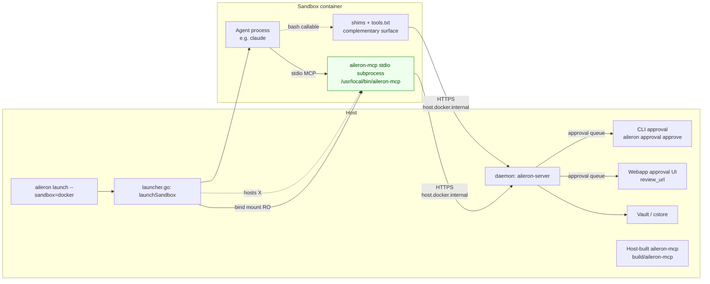
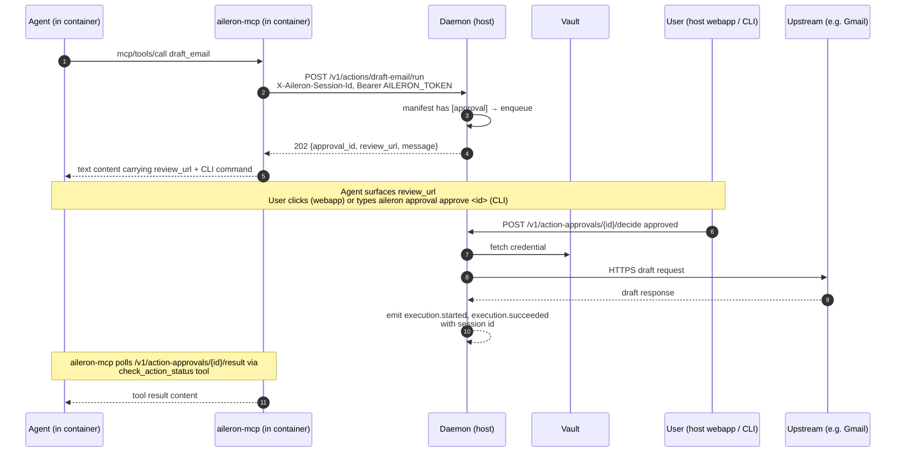
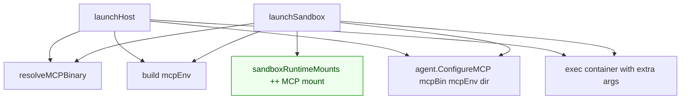
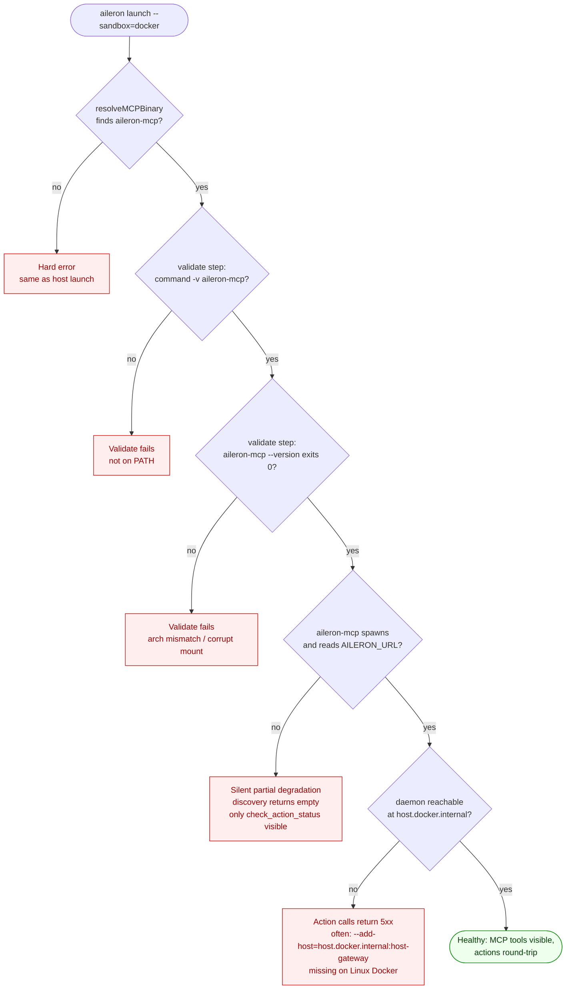

# feat: revive aileron-mcp inside the sandbox container (Path B1)

## Summary

Wire `aileron-mcp` into the v4 Docker sandbox so an agent running inside `aileron launch --sandbox=docker <agent>` sees the same Aileron tool surface it sees on host launch — `aileron-mcp` registered as an MCP server named `aileron`, installed actions and connector operations surfaced as MCP tools, HITL approval round-trips back to the user, and audit events emit with the launch session id. Includes an `integration_sandbox`-tagged E2E test exercising the Google draft-email connector operation end-to-end on a Linux CI runner, plus a manual verification recipe. Ships as a single PR titled `feat(launch): revive aileron-mcp inside sandbox container (#953)`, squash-merged with `--admin --delete-branch` per family conventions.

---

## Problem Frame

`aileron launch <agent>` (host mode) already wires `aileron-mcp` as the agent's `aileron` MCP server: launcher resolves the binary via `resolveMCPBinary`, builds the daemon-pointing env block (`AILERON_URL`, `AILERON_SESSION_ID`, `AILERON_COMMS_URL`, `AILERON_APPROVAL_URL`, `AILERON_TOKEN`), calls `agent.ConfigureMCP(mcpBin, mcpEnv, dir)`, and the agent registers `aileron` per its native mechanism (Claude `--mcp-config`, Codex `~/.codex/config.toml`, Goose `--with-extension`, OpenCode workspace `opencode.json`, Pi `--mcp-config`). The MCP server `mcp__aileron__<snake_case>` tool surface is the contract ratified by [ADR-0008](/adr/0008-intent-matching/).

`aileron launch --sandbox=docker <agent>` does not. The comment at `internal/launch/launcher.go:502-504` explicitly says *"Sandbox launch does not revive aileron-mcp as the container runtime model; container-side shims/proxy bootstrap land in later #796/#801 slices."* That decision was codified in [ADR-0018](/adr/0018-v4-single-binary-runtime/) ("the sandbox runtime does not revive `aileron-mcp`"). It is being reversed by Path B1, recorded on 2026-06-08 in #747 / #801 / #953 and in memory `project_container_mcp_model`: under sandbox launch, Aileron is one MCP server (its own `aileron`), not an MCP gateway aggregating user MCP servers; the user's own MCP servers continue to connect to the agent via the user's config (devcontainer.json / agent-side `mcp.json`).

Two architectural shapes were viable per the issue body:

- **(a) host-reached** — `aileron-mcp` runs on the host; the container reaches it via `host.docker.internal:<port>` (Docker) or `host.containers.internal:<port>` (Podman). Cheapest only if `aileron-mcp` already speaks TCP. It does not — `aileron-mcp` is strictly stdio MCP today (`cmd/aileron-mcp/main.go:361-380`). Option (a) would require a new stdio↔TCP bridge subprocess inside the container, which is a net-new MCP transport surface for marginal gain.
- **(b) in-container subprocess** — `aileron-mcp` is exec'd as a stdio subprocess inside the container; it reaches the daemon over HTTPS via the already-rewritten `AILERON_URL` (`host.docker.internal:<port>` for Docker, `host.containers.internal` for Podman) and authenticates with the already-injected `AILERON_TOKEN`.

(b) wins on three independent grounds: the sandbox launcher already plumbs `AILERON_URL` and `AILERON_TOKEN` into the container env (`internal/launch/launcher.go:332-341`, done speculatively for #796), `aileron-mcp` is stdio-only and matches the agent's MCP-client expectations natively, and the existing `sandboxDiscoveryMounts` pattern (`launcher.go:603-671`) — which mounts `tools.txt` and shim scripts from `os.MkdirTemp` into `/etc/aileron/tools.txt` and `/usr/local/bin/<shim>` — is the obvious shape for read-only-mounting the host-built `aileron-mcp` binary at `/usr/local/bin/aileron-mcp:ro`. No new MCP transport, no new daemon endpoint, no image-side bake required.

Of the five supported agents, four work essentially for free once `launchSandbox` calls `agent.ConfigureMCP` with a container-side `mcpBin` path: Claude (`--mcp-config <json>`) and Pi (shares Claude's mechanism) pass JSON config inline at exec time; Goose (`--with-extension "<env vars> <cmd>"`) passes env+cmd inline at exec time; OpenCode writes `opencode.json` into the launch `dir`, which is the bind-mounted workspace `/home/agent/workspace`. **Only Codex breaks** — its `ConfigureMCP` (`internal/launch/agents/codex.go:56-73`) writes the launcher's host `~/.codex/config.toml`, which the container's Codex never reads. The plan addresses Codex with a deliberate sandbox-mode code path that writes a temp `config.toml` and bind-mounts it into the container at `/home/agent/.codex/config.toml`, matching the existing host-build-→-mount pattern from `sandboxDiscoveryMounts`.

The existing shims + `tools.txt` surface (#796) stays as a complementary non-MCP-native CLI surface for bash callers; the launcher's `isReservedSandboxCommand` guard (`launcher.go:706-713`) is extended to reserve `aileron-mcp` so no future shim collides with the MCP binary path.

The E2E test is the load-bearing acceptance gate: it must launch a real Docker container (CI's `ubuntu-latest` has Docker), wire `aileron-mcp` via the production code path, list MCP tools from the agent inside the container, invoke the Google `draft-email` connector operation through `aileron-mcp` → daemon → action runtime → upstream (mocked at the HTTPS boundary), and assert the round-trip including the HITL approval flow when the action manifest declares `[approval]` and the corresponding audit events (`execution.started` → `execution.succeeded`). The test runs under a new `integration_sandbox` build tag so the existing `integration` shard's runtime isn't extended; it gates on a single sandbox CI job, not the full matrix.

---

## Requirements

Cited verbatim where applicable from issue #953's acceptance criteria; all R-IDs are plan-local.

### Sandbox MCP wiring

- **R1.** `aileron launch --sandbox=docker <agent>` registers `aileron-mcp` as an MCP server named `aileron` in the in-container agent's MCP config. The container-side binary path is `/usr/local/bin/aileron-mcp`; the host-built binary is bind-mounted read-only into the container by the launcher. (Issue AC1.)
- **R2.** From inside the container, the agent's `mcp/list_tools` returns the installed Aileron actions and connector operations under the `mcp__aileron__<snake_case>` prefix, matching the host-launch surface. (Issue AC2.)
- **R3.** A user-installed MCP server in the user's own config (devcontainer.json, agent-side `mcp.json`, or per-agent equivalent) coexists with `aileron-mcp` and works independently — Aileron does NOT aggregate, route, or proxy it. Per memory `project_container_mcp_model`. (Issue AC6.)

### Agent matrix

- **R4.** Claude Code, Pi, Goose, and OpenCode work via the existing `ConfigureMCP` contract under sandbox launch with no agent-specific change beyond the sandbox launcher calling the hook. (Plan addition, derived from research.)
- **R5.** Codex works under sandbox launch via a sandbox-aware `ConfigureMCP` path that writes the generated `config.toml` to a temp file and bind-mounts it into the container at `/home/agent/.codex/config.toml`; the launcher's host `~/.codex/config.toml` is left untouched. (Issue scope: "Codex CLI uses a different MCP-server config mechanism — confirm or extend.")

### HITL + audit parity

- **R6.** A connector action whose manifest declares `[approval]` round-trips end-to-end from inside the container: the agent calls the MCP tool, `aileron-mcp` POSTs `/v1/actions/{name}/run` with `X-Aileron-Session-Id` set to the launch session, the daemon registers the entry in its approval queue, the response surface (webapp via `review_url`, CLI via `aileron approval approve <id>`) is reachable from the host, on approve the daemon executes the action, and `aileron-mcp` surfaces the result back to the agent via the existing `check_action_status` polling. The audit event chain `execution.started` → `execution.succeeded` records the operation with the launch session id. Per [ADR-0009](/adr/0009-user-channel/) — agent is never in the trust path. (Issue AC3, AC4, AC5; corrects issue's `action.executed` to the constants actually emitted in `internal/model/model.go:255-308`.)
- **R6a.** Denial path: when the user denies an approval, `aileron-mcp` surfaces `status: denied` with the reason to the agent; the daemon emits `approval.denied` with the launch session id; no `execution.started` / `execution.succeeded` events emit; the upstream connector spec is not contacted.
- **R6b.** Never-approved path: when the user never decides, the approval entry stays pending; `aileron-mcp`'s `check_action_status` returns `status: pending_approval` on each poll without blocking; no spurious execution events emit. The plan does not introduce a wait-loop or timeout in `aileron-mcp`; polling is poll-on-demand by design (`cmd/aileron-mcp/main.go:847-887`).
- **R6c.** Concurrent actions: two in-flight `[approval]`-gated MCP tool calls are distinguishable by `approval_id`, the audit chain attributes each to its own approval, and approving them in reverse order still emits the right per-call event chain with the same launch session id.

### E2E test + docs

- **R7.** `test/integration/sandbox_mcp_test.go` (build tag `integration_sandbox`) exercises Claude Code inside a Docker container against a test daemon: the agent's MCP server registry includes `aileron`; invoking `mcp__aileron__draft_email` round-trips through `aileron-mcp` → daemon → action runtime → upstream stub → response; the audit chain `execution.started` → `execution.succeeded` lands with the launch session id; if the test fixture declares `[approval]`, the approval queues and can be approved via the daemon API. The test runs in CI on a Linux runner. (Issue AC7.)
- **R8.** A new development doc at `docs/src/content/docs/development/sandbox-mcp-walkthrough.md` documents a manual repro of the E2E flow using a real Claude Code container and a real Google OAuth credential. (Issue: "Add a manual-verification recipe under docs/src/content/docs/development/".)
- **R9.** `docs/src/content/docs/development/sandbox-agent-images.md` updates the per-agent capability matrix to record which agents wire MCP under `--sandbox=docker`. `docs/src/content/docs/development/sandbox-composition.md`'s "What This Does Not Do Yet" section is trimmed to remove "MCP parity" from the gap list.

### Quality gates

- **R10.** [ADR-0024](/adr/0024-sandbox-mcp-parity/) is created and records the architecture decision (in-container subprocess, host-mounted binary). [ADR-0018](/adr/0018-v4-single-binary-runtime/) is amended in place per the pre-MVP ADR convention (memory `feedback_adr_immutable`) — the Decision section that previously said the sandbox runtime does not revive `aileron-mcp` is rewritten with a one-paragraph rationale pointer to ADR-0024 and #953. The ADR landing page (`docs/src/content/docs/adr/index.md`) lists ADR-0024.
- **R11.** `task vet:go` and the full Go test suite (`go test ./...` across `internal/`, `cmd/aileron/`, `cmd/aileron-mcp/`, `cmd/aileron-enclave/`, `sdk/go/`) pass, with coverage on the new launcher and agent code paths above 80% (memory `feedback_check_coverage`). `task generate:api` is clean (no spec edits expected; verifies the plan didn't drift).
- **R12.** `coderabbit review --agent --base main` returns zero findings and `/code-review` passes per repo CLAUDE.md.

---

## Scope Boundaries

In scope: every surface enumerated under Implementation Units below.

### Deferred to Follow-Up Work

- **Image-bake of `aileron-mcp`.** Today's plan mounts the host-built binary at launch (matches `sandboxDiscoveryMounts` for shims). A future PR can bake `aileron-mcp` into `images/sandbox-base/Containerfile` for sealed customer-operated runtimes. ADR-0024 documents the deferral.
- **Per-agent E2E variants** beyond Claude Code. The integration test covers Claude only; Codex/Goose/OpenCode/Pi sandbox MCP correctness is asserted by unit-level tests plus the manual recipe.
- **Tool-discovery hint surface.** No new daemon endpoint is added; `aileron-mcp` continues to list tools via the existing `/v1/actions` surface. Any tool-catalog discovery improvements are out of scope.
- **#802's strategic call** (in-terminal approval TUI). Complementary, separate decision pending.
- **#896 HTTPS proxy / session CA.** Complementary, not a dependency. The sandbox MCP path uses the existing `AILERON_URL` rewrite, not the session CA.
- **Gating shim emission on MCP-capability.** Today both shims (`/usr/local/bin/<shim>`) and the MCP catalog (`mcp__aileron__<tool>`) surface the same actions to the in-container agent. For MCP-capable agents this duplicates the LLM-facing affordance and partially undoes the "MCP catalog O(1) in N connectors" framing (KTD6). A future PR could gate shim emission on whether the launched agent is MCP-capable. Out of scope here per the issue's bias toward keeping shims; flagged so the tradeoff is recorded.

### Outside this product's identity

- **Path B2 (MCP gateway).** Aileron does NOT aggregate, route, or proxy user-installed MCP servers. Re-opening B2 requires a fresh ADR and a named user concern; see memory `project_container_mcp_model`.
- **Retiring the shims + `tools.txt` surface (#796).** The static shims stay as a complementary non-MCP-native CLI surface. The plan extends the reserved-name guard to cover `aileron-mcp` so no shim name can collide with the MCP binary, but does not remove or hide shims.
- **Multi-MCP-server lifecycle management inside the container.** Aileron is not a process supervisor for user-installed MCP servers; user MCP servers connect via their own config.

---

## Key Technical Decisions

### KTD1. Architecture (b): in-container subprocess via host-mounted binary.

`aileron-mcp` runs inside the container as a stdio subprocess of the agent process, reaching the daemon over HTTPS via the already-rewritten `AILERON_URL` (`host.docker.internal:<port>` on Docker, `host.containers.internal` on Podman) and authenticating with the already-injected `AILERON_TOKEN`.

Rationale: `aileron-mcp` is stdio-only today (`cmd/aileron-mcp/main.go:361-380`) and the agent's MCP client expects a stdio child process. Option (a) host-reached MCP would require a new stdio↔TCP bridge subprocess inside the container — a net-new MCP transport surface for marginal value, since the daemon-reachability problem is already solved by the sandbox launcher's existing env rewrite (`internal/launch/launcher.go:332-341`, plumbed for #796). Option (b) reuses the established `sandboxDiscoveryMounts` host-mount pattern (`launcher.go:603-671`) to bind-mount the host-built `aileron-mcp` binary into the container at `/usr/local/bin/aileron-mcp:ro`. The trust model matches host launch: `aileron-mcp` runs as the agent process's child in the same `agent` user namespace, with daemon authority over actions and approvals. ADR-0024 records this decision; ADR-0018 is amended in place to reflect the reversal, and ADR-0008's 2026-06-01 revision note (which currently says the sandbox path does NOT revive `aileron-mcp`) is rewritten to point at ADR-0024.

**Trust-model deltas vs host launch (named, not eliminated).** The plan claims parity with host launch on trust but two surfaces widen:

1. **Daemon network exposure.** Host launch is loopback-only. To be reachable from the container via `host.docker.internal`, the daemon binds either an explicit `host-gateway` interface (Docker's `--add-host=host.docker.internal:host-gateway` since 20.10) or a non-loopback address. Any process on the host with `AILERON_TOKEN` and reachability to the same port gains the same authority `aileron-mcp` does. The token authority is therefore the only post-mount credential. The plan does not introduce token-scoping in this PR; ADR-0024's Consequences section records the widening explicitly so the next reviewer doesn't have to re-derive it.
2. **Binary-mount UID delta.** The host-mounted `aileron-mcp` runs under the container's `agent` UID, not the host user's UID. Read-only mount sidesteps the obvious file-mutation issue. Stated explicitly here so the threat model is documented.

### KTD2. Reuse `Agent.ConfigureMCP(mcpBin, mcpEnv, dir)` unchanged for 4 of 5 agents; add a sandbox-aware code path for Codex.

The existing `ConfigureMCP` contract (`internal/launch/agent.go:38-53`) already handles host launch for all five agents. For sandbox launch:

- **Claude Code** (`agents/claude.go:48-58`) and **Pi** (`agents/pi.go:36-46`) return `--mcp-config <json>` CLI args; the args include the container-side `mcpBin` path verbatim. Works in-container with no code change to the agent.
- **Goose** (`agents/goose.go:65-70`) returns `--with-extension "<env vars> <cmd>"`; the `cmd` is the container-side `mcpBin` path. Works in-container with no code change.
- **OpenCode** (`agents/opencode.go:40-79`) writes `opencode.json` to `dir`. `dir` is the launch directory, which the sandbox launcher already bind-mounts at `/home/agent/workspace`. The file ends up at `/home/agent/workspace/opencode.json` and the in-container OpenCode reads it. Works with no code change.
- **Codex** (`agents/codex.go:56-73`) writes the launcher's host `~/.codex/config.toml`. **This is wrong for sandbox** — the container's Codex reads `/home/agent/.codex/config.toml`, not the host's. The fix (U3) is a sandbox-aware code path in `agents/codex.go` that writes the generated `config.toml` to an `os.MkdirTemp` directory and returns a `Volume` mount the launcher binds at `/home/agent/.codex/config.toml`. Same shape as `sandboxDiscoveryMounts`.

Rationale: minimum-change scope. The CLI-flag agents (Claude, Pi, Goose) carry MCP config inline at exec time and naturally cross the container boundary. The workspace-file agent (OpenCode) is already inside the bind-mounted workspace. Only Codex's host-filesystem assumption needs explicit sandbox handling.

The signature change to `Agent.ConfigureMCP` (adding a mode parameter) is a v0 interface break, acceptable per memory `feedback_no_backwards_compat` (pre-release; no migration shims). All five in-tree implementations are updated in the same PR; `sdk/go/` does not import `internal/launch` (separate module) so the break is contained.

### KTD3. Mount the host-built `aileron-mcp` binary via `sandboxDiscoveryMounts`-style read-only bind-mount; image-bake deferred.

The launcher resolves the MCP binary via the existing `resolveMCPBinary(selfPath)` (sibling-then-PATH lookup, `launcher.go:106-129`). The resolved host path is appended to `sandbox.Mounts` as a read-only bind at `/usr/local/bin/aileron-mcp`. The `sandbox-base` image is not modified.

Rationale: the host-mount pattern is established (`sandboxDiscoveryMounts` does the same for `tools.txt` and shim scripts), zero image rebuild is needed for this PR, and the binary stays in lockstep with the host's `aileron` CLI version — eliminating the version-skew class of bug where an image's baked `aileron-mcp` is older than the host daemon's API surface. The downside (the binary must exist on the host) matches host launch's existing hard error in `resolveMCPBinary` — operators already have it. For sealed customer-operated runtimes (v4.x BYOC, v5 SaaS per memory `project_runtime_first_thesis`), a future PR will bake `aileron-mcp` into the image; ADR-0024's "Future considerations" section names this as the next iteration.

**Trigger conditions for the future image-bake flip.** Host-mount is permanent unless one of these signals fires:

1. The sandbox image needs to run without a host-side `aileron-mcp` available (sealed customer runtimes that don't ship the Aileron CLI on the host).
2. The `aileron-mcp` API surface stabilizes enough that version skew becomes a managed-release decision rather than a per-launch coincidence.
3. v4.x BYOC ships and customer-built host images don't include the binary.

**Architecture-mismatch and devcontainer-collision cases.** Two subtler cases worth naming so they aren't rediscovered during implementation:

- **Cross-arch host:** an arm64 host building a binary that gets bind-mounted into an amd64 container (or vice versa) will pass `command -v` but fail with ENOEXEC on first run. U4's validate step runs `aileron-mcp --version` (not just `command -v`) so the failure surfaces loudly at validate time, not on the first MCP call.
- **Devcontainer override:** if a user-supplied devcontainer image bakes its own `/usr/local/bin/aileron-mcp`, the launcher's read-only bind-mount silently overrides it. This is intentional (the launcher-provided binary is the authoritative version), but the manual recipe (U6) calls it out so operators don't chase a phantom version mismatch.

### KTD4. Audit event names: `execution.started` / `execution.succeeded` / `execution.failed`, NOT `action.executed`.

Issue #953 references `action.executed` as the audit event to assert in the E2E test. The actual constants in `internal/model/model.go:255-308` are `EventTypeExecutionStarted` (`"execution.started"`), `EventTypeExecutionSucceeded` (`"execution.succeeded"`), `EventTypeExecutionFailed` (`"execution.failed"`), emitted from `internal/app/handlers.go:791, 2154-2156`. `connector.proxy.proxied` does exist but fires from the HTTPS data-plane path (#896-tracked), not the action-via-MCP path.

Decision: R6 and the E2E test (U5) assert on the actual emitted event names. The plan does NOT rename constants or introduce a new `action.executed` alias — that would expand scope and break existing audit consumers. The issue body's wording is reconciled in the plan's Requirements section (R6).

### KTD5. Action FQN reconciliation: manifest `draft-email`, MCP tool `draft_email`.

Issue #953 references the Google draft-email operation as `google-mail.draft_email`. The actual action FQN is `github://ALRubinger/aileron-connector-google/actions/draft-email` (kebab manifest name), surfaced to the LLM as `mcp__aileron__draft_email` by `aileron-mcp`'s snake_case mapping (`cmd/aileron-mcp/main.go:955-957`, ratified by [ADR-0008](/adr/0008-intent-matching/)).

Decision: R7 and the E2E test target `draft_email` as the MCP tool name and `actions/draft-email` as the manifest selector. The plan does NOT introduce a `google-mail.draft_email` alias. The E2E test stubs the connector spec and HTTPS upstream rather than depending on the real `aileron-connector-google` repo at test time — the action runtime is exercised, not the Google API.

### KTD6. Keep `tools.txt` + shims as a complementary non-MCP-native surface; extend the reserved-name guard to cover `aileron-mcp`.

Per issue body's implementation-time call (issue: "bias toward keeping them since they're harmless and serve non-MCP-native callers"). MCP tool names (`draft_email`) and shim names (e.g., `gmail`) live in different namespaces by construction. The shims POST to `${AILERON_API_URL%/}/actions/$name/run` (`internal/sandbox/discovery/tools.go:290-307`), which is the same daemon endpoint `aileron-mcp` uses (`cmd/aileron-mcp/main.go:782, 855`); the daemon emits one `execution.*` event per call regardless of which client invoked it, so no double-audit risk exists.

The launcher's `isReservedSandboxCommand` (`launcher.go:706-713`) currently reserves the agent binary name to prevent shims from clobbering it. U4 extends the guard to also reserve `aileron-mcp` so no future shim can collide with the MCP binary path.

**Tradeoff named: LLM-facing surface duplication.** Both shims and the MCP catalog expose the same action operations to the in-container agent. An MCP-capable agent sees `mcp__aileron__draft_email` AND `gmail draft-email`-style bash invocations via `tools.txt`. The "MCP catalog is O(1) in N connectors" framing (memory `project_aileron_way_container_model`) is partially undone for MCP-capable agents because they pay context-window cost for both surfaces. The plan deliberately keeps both today (per the issue's bias) and defers the "gate shim emission on MCP-capability" question to a follow-up — see Scope Boundaries.

### KTD7. ADR-0024 new; ADR-0018 and ADR-0008 amended in place per pre-MVP convention.

[ADR-0018](/adr/0018-v4-single-binary-runtime/)'s Decision section currently codifies that "the sandbox runtime does not revive `aileron-mcp`." [ADR-0008](/adr/0008-intent-matching/)'s 2026-06-01 revision note also says the sandbox path "uses generated HTTPS shims and the Aileron data plane rather than reviving `aileron-mcp` as an in-container runtime model." Path B1 reverses both. Pre-MVP convention (memory `feedback_adr_immutable`) is to amend ADRs in place rather than supersede them.

Decision: a new ADR ([ADR-0024](/adr/0024-sandbox-mcp-parity/)) records the Path B1 architecture choice (in-container subprocess, host-mounted binary, rationale for not picking option (a)), and both prior ADRs are amended in place:

- **ADR-0018**: the paragraph of its Decision section that codifies the no-revive decision is rewritten with a one-paragraph rationale pointer to ADR-0024 and #953.
- **ADR-0008**: the 2026-06-01 revision note's "sandbox path uses generated HTTPS shims … rather than reviving `aileron-mcp`" sentence is rewritten to point at ADR-0024. The rest of ADR-0008 (the canonical-MCP-tooling decision for host launch) stays unchanged.

The ADR landing page (`docs/src/content/docs/adr/index.md`) gains an ADR-0024 entry. ADR-0024 inherits the existing ADR template HTML status block (consistent with ADR-0019, ADR-0020, ADR-0022) and starts at `Status: Accepted`. ADR-0024's "Alternatives Considered" section names two option-(a) variants (unix-socket forwarding via shared mount; sidecar container with shared network namespace) so future re-openers (e.g., v5 SaaS pod design) find the prior consideration recorded.

---

## High-Level Technical Design

### Component topology after this PR

The green node (`aileron-mcp` inside the container) is the only net-new runtime element. The bind-mount from `build/aileron-mcp` → `/usr/local/bin/aileron-mcp` is new launcher behavior. The HTTPS path from container to daemon is already plumbed (#796 speculative env wiring at `launcher.go:332-341`). The shims surface is unchanged; it stays as a complementary bash-callable path.

### Action call → approval sequence (the load-bearing parity case)

The container-boundary crossings are at step 2 (MCP→daemon HTTPS) and at step 6 (user click on the host). The audit emissions in the rectangle annotation are the assertions U5's E2E test verifies.

### Launcher wiring delta

`launchSandbox` (`launcher.go:532-568`) gains the same `resolveMCPBinary` → `build mcpEnv` → `ConfigureMCP` chain that `launchHost` (`launcher.go:496-530`) already has, plus the new MCP-binary mount appended to the existing `sandboxRuntimeMounts` slice.

### Failure-mode decision tree

Three of the five failure modes (H1, M1, M2) fail loudly at launch- or validate-time and produce a clear remediation message. Two are subtler: R1 is silent partial degradation (the MCP server starts but action discovery fails, so the agent sees `check_action_status` but not `draft_email`) — U2's launcher logs the discovery outcome at INFO so it's visible in the launch banner; U4's validate step catches the binary-execution case before R1 can fire. R2 is the Linux Docker `host.docker.internal` gotcha — the manual recipe (U6) documents the `--add-host` flag remediation.

The agent-process spawn lifecycle is best-effort: the agent's MCP client spawns `aileron-mcp` as a stdio child per its own protocol; `aileron-mcp` does its discovery (POST `/v1/actions` listing) once at startup; if the daemon is unreachable at that moment, `aileron-mcp` continues without action tools (existing behavior at `cmd/aileron-mcp/main.go:343-351`). This is the silent-degradation R1 case; the validate step in U4 is the earlier loud gate.

---

## Implementation Units

### U1. Record the architecture decision: ADR-0024 new, ADR-0018 + ADR-0008 amended in place

**Goal.** Create [ADR-0024](/adr/0024-sandbox-mcp-parity/) recording Path B1 (in-container subprocess, host-mounted binary, rationale for not picking host-reached option (a)). Amend [ADR-0018](/adr/0018-v4-single-binary-runtime/) and [ADR-0008](/adr/0008-intent-matching/) in place so their no-revive language is rewritten with a rationale pointer to ADR-0024 and #953. Update the ADR landing page.

**Requirements.** R10.

**Dependencies.** None. Done first so the architecture decision is locked before code lands.

**Files.**

- `docs/src/content/docs/adr/0024-sandbox-mcp-parity.md` (create)
- `docs/src/content/docs/adr/0018-v4-single-binary-runtime.md` (modify — Decision section paragraph that codifies "the sandbox runtime does not revive `aileron-mcp`")
- `docs/src/content/docs/adr/0008-intent-matching.md` (modify — the 2026-06-01 revision note's "sandbox path uses generated HTTPS shims … rather than reviving `aileron-mcp`" sentence)
- `docs/src/content/docs/adr/index.md` (modify — add ADR-0024 entry)

**Approach.**

- Model ADR-0024 on ADR-0019 / ADR-0020 / ADR-0022 shape: HTML `
` status block (Status: Accepted), Context (Phase 1 conversation 2026-06-08, ADR-0018 reversal, the two architecture candidates), Decision (option (b) in-container subprocess via host-mount), Consequences (positive: zero new MCP transport, daemon-reachability already solved; negative: host must have `aileron-mcp` binary, customer-operated sealed runtimes need future image-bake; daemon-network-exposure widening per KTD1 trust-model deltas), Alternatives Considered.
- Alternatives Considered (all rejected): option (a) host-reached + stdio↔TCP bridge — rejected for net-new MCP transport surface; option (a) variant — unix-socket forwarding via shared mount — rejected because the stdio↔socket bridge subprocess problem remains; option (a) variant — sidecar container with shared network namespace — rejected for v4 single-Docker-runtime today (deferred to v5 SaaS pod-design consideration); image-bake — deferred to a follow-up PR with explicit trigger criteria per KTD3.
- Cross-reference [ADR-0008](/adr/0008-intent-matching/) (the MCP-as-canonical-tooling decision this ADR extends to the sandbox path) and [ADR-0009](/adr/0009-user-channel/) (agent-out-of-trust-path; preserved unchanged across host and sandbox).
- Per memory `feedback_adr_cross_links`, every ADR-NNNN reference is a Markdown link to that ADR's page.
- Amend ADR-0018 in place per memory `feedback_adr_immutable` (pre-MVP convention). Rewrite the paragraph that codifies the no-revive decision: replace with a one-paragraph note that records the reversal, points at #953 and ADR-0024, and acknowledges the original rationale (single-binary-runtime simplicity) is preserved at the host-launch level. Do NOT delete or supersede ADR-0018 — it remains the single-binary-runtime authority.
- Amend ADR-0008's 2026-06-01 revision note in place. Rewrite the "sandbox path uses generated HTTPS shims … rather than reviving `aileron-mcp`" sentence to point at ADR-0024. The rest of ADR-0008's body (host-launch MCP, snake_case tool-name shape) stays unchanged.
- Add ADR-0024 entry to `adr/index.md` after the existing ADR-0023 entry, keeping ordering consistent.

**Patterns to follow.** Existing ADR template's HTML status table shape (consistent across ADR-0019, ADR-0020, ADR-0022). ADR-0021's amendment-in-place precedent if any subtleties of the HTML block need referencing.

**Test scenarios.**

- Covers R10. `grep -n "<th>Status</th><td>Accepted</td>" docs/src/content/docs/adr/0024-sandbox-mcp-parity.md` returns one match.
- `grep -n "ADR-0024" docs/src/content/docs/adr/index.md` returns the landing-page entry.
- ADR-0018's Decision section no longer contains the literal "the sandbox runtime does not revive `aileron-mcp`" string; it contains a rationale pointer to ADR-0024 and #953.
- ADR-0008's 2026-06-01 revision note no longer contains "rather than reviving `aileron-mcp`"; it points at ADR-0024.
- `task build:docs` succeeds without broken-link warnings against ADR-0024, ADR-0018, or ADR-0008.

**Verification.** Local docs build passes; rendered ADR-0024 visibly shows Accepted status; ADR-0018 and ADR-0008 read consistently with Path B1.

---

### U2. Sandbox launcher: mount `aileron-mcp` and call `ConfigureMCP`

**Goal.** Make `launchSandbox` resolve the host-built `aileron-mcp` binary, append a read-only bind-mount placing it at `/usr/local/bin/aileron-mcp` inside the container, build the `mcpEnv` block with daemon URLs rewritten for the container runtime, and call `agent.ConfigureMCP(mcpBin, mcpEnv, dir)` with `mcpBin = "/usr/local/bin/aileron-mcp"`. Append the returned extra args to the agent exec command. This single change wires Claude Code, Pi, Goose, and OpenCode end-to-end via their existing `ConfigureMCP` implementations.

**Requirements.** R1, R2, R4.

**Dependencies.** U1 (architecture decision locked before code lands).

**Files.**

- `internal/launch/launcher.go` (modify — `launchSandbox` around `:532-568`; reuse `resolveMCPBinary` from `:106-129`; reuse `MCPServerName` constant from `:38`)
- `internal/launch/launcher_test.go` (modify — extend sandbox-launch fixture at `:202-258` with MCP-wiring assertions per agent)
- `internal/launch/agent.go` (read-only — `ConfigureMCP` contract at `:38-53` stays unchanged)

**Approach.**

- In `launchSandbox`, after the existing sandbox env block (`:332-352`) and before the agent exec, call `mcpBin, err := resolveMCPBinary(selfPath)`. Match `launchHost`'s error handling — missing `aileron-mcp` is a hard error.
- Append a read-only `Mount` entry to the slice returned by `sandboxRuntimeMounts` (or a new sibling `sandboxMCPMounts` helper modeled on `sandboxDiscoveryMounts`) binding the host `mcpBin` path → container `/usr/local/bin/aileron-mcp`.
- Build the container-side `mcpEnv` map: `AILERON_URL = agentEndpointURL` (already host.docker.internal-rewritten in the existing env block), `AILERON_COMMS_URL = agentEndpointURL`, `AILERON_SESSION_ID = sessionID` (same value as the existing `agentEnv` entry), `AILERON_APPROVAL_URL = agentEndpointURL + "/approvals"`. Auth: `AILERON_TOKEN` is already populated in `agentEnv` by the existing block — pass the same value through.
- Call `agent.ConfigureMCP("/usr/local/bin/aileron-mcp", mcpEnv, dir)`. The container-side path is what the agent process inside the container will exec; it does NOT need to exist on the host at this point because the bind-mount makes it appear in the container's filesystem.
- Append the returned extra args to the sandbox agent exec command (same shape as `launchHost`'s append at `:524-528`).
- **`host.docker.internal` reachability on Linux Docker (R-risk5).** Extend `internal/sandbox/container/runtime.go` `runArgs` builder (`:412-457`) to append `--add-host=host.docker.internal:host-gateway` when the runtime is Docker on Linux. Podman's `host.containers.internal` resolves natively; macOS/Windows Docker Desktop handles host.docker.internal automatically. The launcher's existing `containerURLForRuntime` mapping (`launcher.go:420-445`) is already correct; the flag closes the runtime-side gap. Test scenarios in this unit assert the flag appears in the Docker argv on Linux and is absent on macOS/Windows/Podman. **Daemon bind address:** the daemon under test in U5 must bind a reachable address (not 127.0.0.1:0). U5 wires this for the test; production users get the documented manual recipe in U6. No production change to daemon bind defaults in this PR.
- Update `launcher_test.go` to add four per-agent assertions under the sandbox-launch fixture: Claude returns `--mcp-config <json>` args containing `aileron`, `/usr/local/bin/aileron-mcp`, and the rewritten `AILERON_URL`; Goose returns `--with-extension` args with the env block and the container-side cmd; OpenCode writes `opencode.json` into the launch `dir` containing the MCP server config; Pi returns the same shape as Claude. All four assertions verify the resulting structure does NOT clobber any user-provided `--mcp-config` / extension config (test by pre-seeding a user entry and asserting it survives).

**Patterns to follow.** `launchHost` MCP wiring at `launcher.go:506-528` (the exact chain this unit mirrors). `sandboxDiscoveryMounts` at `:603-671` for the host-build-to-container-mount pattern. The `MCPServerName = "aileron"` constant at `:38` (single source of truth for the server name across host and sandbox paths).

**Test scenarios.**

- Covers R1, R2, R4. Sandbox launch with `claude` agent: launcher returns mount entry mapping host `mcpBin` → `/usr/local/bin/aileron-mcp` (read-only); agent extra args include `--mcp-config` with JSON containing `mcpServers.aileron.command = "/usr/local/bin/aileron-mcp"` and the rewritten `AILERON_URL` host (`host.docker.internal` on Docker, `host.containers.internal` on Podman).
- Sandbox launch with `goose` agent: extra args include `--with-extension` with env block carrying `AILERON_URL`/`AILERON_SESSION_ID`/`AILERON_APPROVAL_URL`/`AILERON_TOKEN` and command `/usr/local/bin/aileron-mcp`.
- Sandbox launch with `opencode` agent: `opencode.json` is written into the launch `dir` (which becomes the container's `/home/agent/workspace`); JSON contains `mcp.aileron` server entry pointing at `/usr/local/bin/aileron-mcp`.
- Sandbox launch with `pi` agent: same `--mcp-config` shape as Claude.
- Edge case: missing `aileron-mcp` on host returns a non-zero error from `resolveMCPBinary`; the launcher fails cleanly with the same message host launch uses (matches existing `launcher.go:122-128` hard-error path).
- Edge case: user pre-seeds a `--mcp-config` flag or an `opencode.json` workspace file with a user-installed MCP server; sandbox launch leaves the user entry intact alongside the `aileron` entry. Covers R3 at the unit level; full E2E verification of R3 lives in the manual recipe (R8).
- Covers R6 partial: assertion that `mcpEnv["AILERON_SESSION_ID"]` matches the same value passed to the sandbox-launch session, so end-to-end session-id propagation is structurally sound (the full HITL round-trip is asserted in U5).
- Reserved-name guard: `isReservedSandboxCommand("aileron-mcp")` returns true after U4's extension (cross-unit dependency surfaced here for context, asserted in U4).

**Verification.** `go test ./internal/launch/...` is clean with the new assertions; coverage on `launchSandbox` and the new mount helper above 80% (memory `feedback_check_coverage`).

---

### U3. Codex sandbox MCP support: bind-mount `config.toml` into the container

**Goal.** Add a sandbox-aware code path to `agents/codex.go`'s `ConfigureMCP` so that when sandbox mode is active, the generated `[mcp_servers.aileron]` config is written to an `os.MkdirTemp` directory and the launcher binds it into the container at `/home/agent/.codex/config.toml`, instead of writing to the launcher's host `~/.codex/config.toml`. The host `~/.codex/config.toml` is never touched by sandbox launch.

**Requirements.** R5.

**Dependencies.** U2 (the launcher hook is the consumer of the returned mount entry).

**Files.**

- `internal/launch/agents/codex.go` (modify — `ConfigureMCP` at `:56-73` gains a sandbox-vs-host branch; the existing `removeStaleAileronEntry` at `:121-159` is gated on host mode only)
- `internal/launch/agents/codex_test.go` (modify or create — add sandbox-mode assertions)
- `internal/launch/agent.go` (modify — extend the `ConfigureMCP` signature OR introduce a sibling sandbox-mode hint; see Approach for the decision)
- `internal/launch/launcher.go` (modify — pass the sandbox-mode hint when calling `ConfigureMCP` from `launchSandbox`)

**Approach.**

- **Signature decision.** Two options:
  - (i) Extend `ConfigureMCP` to take a `mode launch.Mode` (or `sandbox bool`) parameter. Cleaner contract; touches all five agents' signatures even though four don't need the value.
  - (ii) Add a sibling method `Agent.ConfigureMCPSandbox(mcpBin, mcpEnv, dir)` that defaults to calling `ConfigureMCP` for the four agents that don't need divergence and is overridden by Codex. Avoids signature churn but introduces method-dispatch ambiguity.

  Pick **(i)** — explicit parameter. The signature change is a one-line edit per agent file and surfaces the host-vs-sandbox split as a first-class concept in the agent contract, which is the right shape going forward (e.g., for future image-bake work the contract will need to know whether `mcpBin` is host-side or container-side). All five agent files get touched but only Codex's implementation branches on the new param.

- In `codex.go`'s sandbox branch: write the generated `config.toml` to `os.MkdirTemp("", "aileron-codex-sandbox-*")`, return a `Volume` mount via the same shape `sandboxDiscoveryMounts` uses (or the helper U2 introduced). The mount target is `/home/agent/.codex/config.toml`.
- The existing `removeStaleAileronEntry` scrubs the host config to remove a prior `aileron` entry before writing the new one. Under sandbox mode, the host config must NOT be touched — the in-container Codex never reads it. Gate `removeStaleAileronEntry` on host mode only.
- Update the `Agent.ConfigureMCP` interface signature in `internal/launch/agent.go` and update each agent's implementation:
  - Claude / Pi: ignore the mode param (their `--mcp-config` JSON travels with the exec command and works in both modes).
  - Goose: ignore the mode param (its `--with-extension` arg travels with the exec command).
  - OpenCode: ignore the mode param (writes into `dir`, which is the workspace bind-mount in sandbox).
  - Codex: branch on the mode param as described above.
- `launchSandbox` calls `agent.ConfigureMCP(mcpBin, mcpEnv, dir, launch.ModeSandbox)`; `launchHost` calls `agent.ConfigureMCP(mcpBin, mcpEnv, dir, launch.ModeHost)`.

**Patterns to follow.** `sandboxDiscoveryMounts`'s `os.MkdirTemp` → return `Volume` mount pattern (`launcher.go:603-671`). Codex's existing host-mode TOML write at `codex.go:60-71` for the file-content shape (sandbox mode reuses the same TOML body, only the destination differs).

**Test scenarios.**

- Covers R5. Sandbox-mode `ConfigureMCP` returns a mount entry mapping a temp host path → `/home/agent/.codex/config.toml`; the temp file's content contains a `[mcp_servers.aileron]` block with `command = "/usr/local/bin/aileron-mcp"` and env vars matching `mcpEnv`.
- Sandbox-mode does NOT modify the launcher's host `~/.codex/config.toml`. Assert by pre-creating a fixture `~/.codex/config.toml` with a known content hash and verifying the file is byte-identical after `ConfigureMCP` returns in sandbox mode.
- Edge case: sandbox mode coexists with a pre-existing in-container `~/.codex/config.toml` shipped via the user's devcontainer config — the bind-mount precedence rules of Docker/Podman mean the launcher-mounted file wins; document this in the manual recipe (R8).
- Host-mode `ConfigureMCP` still writes the host `~/.codex/config.toml` and still calls `removeStaleAileronEntry` (regression coverage — the existing host-mode behavior is preserved unchanged).
- Edge case: `os.MkdirTemp` failure returns an error from `ConfigureMCP`; the launcher surfaces it cleanly.

**Verification.** `go test ./internal/launch/agents/...` passes including the new sandbox-mode Codex tests; host-mode Codex behavior is unchanged (existing tests still pass without modification).

---

### U4. Sandbox validate step: assert `aileron-mcp` presence and reserve the binary name

**Goal.** Extend the sandbox container's validation script to check that `aileron-mcp` is executable at `/usr/local/bin/aileron-mcp` when MCP wiring is active. Extend the launcher's `isReservedSandboxCommand` to reserve the name `aileron-mcp` so no future shim or discovery entry can collide with the MCP binary path.

**Requirements.** R1 (presence check is the in-image guarantee that the MCP wiring landed).

**Dependencies.** U2 (the launcher now mounts the binary; U4 verifies the mount took effect).

**Files.**

- `internal/sandbox/container/runtime.go` (modify — `ValidateOptions` at `:97-106` gains a `RequireMCPBinary bool` field; the `boolArg` chain at `:294-296` gains a fourth positional; the embedded `validationScript` at `:315-363` gains a `${4:-0}` MCP-presence block modeled on the existing proxy-CA check)
- `internal/sandbox/container/runtime_test.go` (modify — add validate-script test for the new positional and presence block)
- `internal/launch/launcher.go` (modify — `isReservedSandboxCommand` at `:706-713` reserves `"aileron-mcp"`; `launchSandbox` passes `RequireMCPBinary: true` into the validate options)
- `internal/launch/launcher_test.go` (modify — assert `isReservedSandboxCommand("aileron-mcp")` returns true)

**Approach.**

- Add `RequireMCPBinary bool` to `ValidateOptions` and a fourth positional to the validate-script argv. The pattern mirrors the existing `requiresShimHTTPClient` and `RequireProxyTrust` positionals (`runtime.go:294-295`).
- In the embedded `validationScript`, add `if [ "${4:-0}" = "1" ]; then command -v aileron-mcp >/dev/null 2>&1 || { echo "aileron-mcp not on PATH; sandbox MCP wiring failed" >&2; exit 1; }; aileron-mcp --version >/dev/null 2>&1 || { echo "aileron-mcp on PATH but not executable in this container (arch mismatch or corrupt mount); sandbox MCP wiring failed" >&2; exit 1; }; fi` after the existing presence blocks. The two-step check catches both the missing-binary case and the cross-arch ENOEXEC case (e.g., arm64 host binary bind-mounted into amd64 container) — `command -v` alone returns 0 for a present-but-unexecutable file. If `aileron-mcp` does not currently support `--version`, add that flag as part of this unit (`cmd/aileron-mcp/main.go`) — the flag is the canonical "binary exec works" smoke; alternatives (`aileron-mcp help`, `aileron-mcp -h`) are acceptable substitutes.
- Extend `isReservedSandboxCommand` to return true for `"aileron-mcp"`. The function is called by `sandboxDiscoveryMounts` (and any future discovery helpers) when materializing shim scripts; reserving the name prevents a future connector spec from registering a shim that would clobber the MCP binary's mount point.
- `launchSandbox` passes `RequireMCPBinary: true` to validate options whenever MCP wiring is active (i.e., always under this PR; a future toggle could disable MCP wiring for testing, but no such toggle exists today).
- Failure mode: validate-script exits non-zero with a clear stderr message ("aileron-mcp not on PATH; sandbox MCP wiring failed"). The launcher surfaces the error verbatim, matching the existing pattern for missing `aileron` and missing `aileron-install-proxy-ca`.

**Patterns to follow.** Existing `boolArg` chain (`runtime.go:294-295`); existing `${N:-0}` toggle blocks in `validationScript:315-363`; existing `isReservedSandboxCommand` reservedness pattern (`launcher.go:706-713`).

**Test scenarios.**

- Covers R1 in-image. Validate script with `${4} = "1"` exits 0 when `aileron-mcp` is on PATH AND `aileron-mcp --version` exits 0; exits 1 with the "not on PATH" stderr message when absent.
- Validate script with `${4} = "1"` exits 1 with the "arch mismatch" stderr message when `aileron-mcp` is on PATH but `--version` returns non-zero (simulated by mounting a non-executable or wrong-arch binary).
- Validate script with `${4} = "0"` skips both checks (regression coverage for the toggle being honored).
- `isReservedSandboxCommand("aileron-mcp")` returns true; `isReservedSandboxCommand("aileron")` still returns true; `isReservedSandboxCommand("gmail")` still returns false.
- `sandboxDiscoveryMounts` rejects a fixture spec that requests a `aileron-mcp` shim with the existing reserved-name error path (no new error message needed; the existing `isReservedSandboxCommand` rejection covers the case).
- Cross-runtime: validate script behavior is identical under Docker and Podman (no runtime-specific path differences; `command -v` is POSIX).

**Verification.** `go test ./internal/sandbox/container/...` and `go test ./internal/launch/...` clean.

---

### U5. E2E integration test: Claude Code in container invokes `draft-email` via MCP

**Goal.** A CI-runnable integration test that launches a sandbox container, wires Claude Code with `aileron-mcp`, invokes the Google `draft-email` connector operation through the MCP path, observes the round-trip including HITL approval (when manifest declares `[approval]`) and audit emission (`execution.started` → `execution.succeeded` with the launch session id). The test is gated behind a new `integration_sandbox` build tag and runs in a dedicated CI job on `ubuntu-latest`.

**Requirements.** R6, R6a, R6b, R6c, R7.

**Dependencies.** U2, U3, U4, U7, U8 (the wiring under test; U7's session-id injection AND U8's daemon-side audit emission on the `RunAction` path are both prerequisite to the audit-attribution assertions).

**Files.**

- `test/integration/sandbox_mcp_test.go` (create — `//go:build integration_sandbox`)
- `test/integration/testdata/sandbox_mcp/draft-email-no-approval.yaml` (create — fixture for the sync 200 path)
- `test/integration/testdata/sandbox_mcp/draft-email-approval.yaml` (create — fixture for the 202 approve path)
- `test/integration/testdata/sandbox_mcp/draft-email-denied.yaml` (create — fixture for the deny path; R6a)
- `test/integration/testdata/sandbox_mcp/draft-email-spec.yaml` (create — fixture connector spec stubbing the upstream HTTPS endpoint)
- `Taskfile.yml` (modify — add a `test:integration:sandbox` task running `go test -tags=integration_sandbox ./test/integration/...`)
- `.github/workflows/ci.yml` (modify — add a CI job that brings up the daemon stack and runs `task test:integration:sandbox` on `ubuntu-latest`)

**Approach.**

- Test shape: a Go `TestMain` that starts the daemon (reuse the existing docker-compose pattern from `.github/workflows/ci.yml:475` if practical, or stand up an in-process daemon via the `internal/app` test helpers if the integration suite already has that pattern). Test body shells out to `aileron launch --sandbox=docker claude` in a subprocess with a custom prompt that exercises the MCP call ("draft an email to alice@example.com about ...").
- **Stubbing strategy.** The test does NOT depend on a real `aileron-connector-google` repo or a real Google OAuth credential. It uses a fixture manifest and connector spec written into `test/integration/testdata/sandbox_mcp/` and registered with the daemon at test setup. The upstream HTTPS endpoint is stubbed via `httptest.NewTLSServer` running on the host; the connector spec points at the stub URL. This isolates the test to the launcher → MCP → daemon → action runtime → spec path under test.
- **Approval branching.** The fixture manifest has two variants: `draft-email-no-approval.yaml` and `draft-email-approval.yaml`. The no-approval variant asserts the sync 200 path; the approval variant asserts the 202 → queue → API-approve → poll-result → completion path. Both variants assert the `execution.started` and `execution.succeeded` audit events land with the launch session id and the correct action FQN (`actions/draft-email`).
- **Claude-Code-in-test.** The test does NOT need a real LLM. Use the headless / scriptable Claude Code mode if available (`claude --print` style) or, if Claude Code can't be scripted from inside a container without an API key, fall back to a smaller proof: launch the container, exec into it as a test helper, invoke `aileron-mcp` directly as a stdio child via the test harness, and assert the MCP-side round-trip. The plan's R7 acceptance is the round-trip itself; the Claude-Code wrapper around it is convenience. **Decision deferred to implementation** as an execution-time unknown — the test must exercise the contract (round-trip via the MCP path), but the exact harness for driving the agent process is allowed to be a test-only subprocess invoking the MCP server directly if Claude Code cannot be scripted cleanly in CI without a real API key.
- New build tag `integration_sandbox` keeps the test out of the existing `integration` shard so the latter's CI runtime stays unchanged. The new CI job runs in **parallel** with `integration-go` (not sequentially) — daemon state lives per-test via the in-process `internal/app` helpers, so no shared-fixture collision exists. The CI job pre-pulls the `ghcr.io/alrubinger/aileron-sandbox-base` image (`docker pull <image-ref>`) before the test step to mitigate `ubuntu-latest` Docker rate limiting (R-risk5); both pre-pull and runtime reference the same image digest. On failure, the job uploads the daemon log artifact.
- The test asserts (R6, R6a, R6b, R6c, R7):
  - **Discovery.** MCP server registry inside the agent process contains `aileron`. (Or: the in-container `aileron-mcp` stdio process responds to `mcp/initialize` correctly when spawned directly by the test harness.) `mcp/list_tools` returns at least one entry with name `draft_email`.
  - **No-approval variant.** `mcp/tools/call draft_email` with valid args receives 200 sync; the stubbed upstream `httptest` server saw exactly one request with the credential injected by the daemon (covers vault flow at the contract level); the **exclusive** audit-event chain for this session id is `[execution.started, execution.succeeded]` and no other event types appear with this session id.
  - **Approval variant.** `mcp/tools/call draft_email` receives 202; `GET /v1/action-approvals` returns the entry with `X-Aileron-Session-Id` matching the launch session (R6, requires U7); `POST /v1/action-approvals/{id}/decide approved` causes the daemon to execute the action; the **exclusive** event chain is `[approval.requested, approval.approved, execution.started, execution.succeeded]`; `aileron-mcp`'s `check_action_status` poll returns the result; the upstream stub saw exactly one request.
  - **Denied variant (R6a).** `POST /v1/action-approvals/{id}/decide` with `approved=false` and a reason; the **exclusive** event chain is `[approval.requested, approval.denied]`; no `execution.*` events emit; the upstream stub saw zero requests; `aileron-mcp`'s `check_action_status` returns `status: denied` with the reason verbatim to the agent.
  - **Never-approved variant (R6b).** The test does NOT call decide. After two `check_action_status` polls (separated by a short delay), the approval entry stays pending; no `execution.*` events emit; no spurious daemon state changes; the test cleans up by deleting the entry before completing.
  - **Concurrency variant (R6c).** Two `mcp/tools/call draft_email` calls with different args. Two distinct `approval_id` values are returned. Approve in reverse order. The **exclusive** event chain attributes each approve→execute pair correctly by `approval_id` and the session id is preserved on both; the upstream stub saw exactly two requests with the right arg payloads.
  - **Session-id attribution.** All events emitted during the test carry the launch session id (`X-Aileron-Session-Id` from R6 / U7's MCP fix); no event with a missing or different session id appears.

**Patterns to follow.** Existing `test/integration/` build-tag pattern (`//go:build integration`). Existing daemon-spinup pattern from `.github/workflows/ci.yml:475`. The action-approval lifecycle JSON shapes in `test/fixtures/action-approvals/`. `action.StubExecutor` (`internal/action/executor.go:76`) as the registration shape for the fixture action runtime.

**Test scenarios.** This unit IS the test. Its acceptance is that the test passes locally (with Docker running) and in CI.

**Execution note.** Start with a failing harness test for the MCP-server-registry assertion before the rest of U2/U3 lands. The test is the load-bearing acceptance gate for the PR (R7); writing it first surfaces any contract gap before the implementation is finished.

**Verification.** `task test:integration:sandbox` exits 0 locally with Docker available; the new CI job passes on `ubuntu-latest`.

---

### U6. Docs: manual verification recipe, agent matrix update, sandbox-composition trim

**Goal.** A new manual-verification recipe page documenting how a human runs the E2E flow with a real Claude Code container and a real Google OAuth credential. Update the sandbox agent capability matrix to note which agents wire MCP under `--sandbox=docker`. Trim `sandbox-composition.md`'s "What This Does Not Do Yet" section so it no longer lists MCP parity as a gap.

**Requirements.** R8, R9.

**Dependencies.** None against U1–U5 (docs-only); sequenced last so it reflects the final shape that landed.

**Files.**

- `docs/src/content/docs/development/sandbox-mcp-walkthrough.md` (create)
- `docs/src/content/docs/development/sandbox-agent-images.md` (modify — per-agent capability matrix entry for `aileron-mcp` registration under `--sandbox=docker`)
- `docs/src/content/docs/development/sandbox-composition.md` (modify — trim the "What This Does Not Do Yet" section's MCP-parity entry)

**Approach.**

- The walkthrough page covers: prerequisites (Docker running, `aileron-connector-google` installed with a real OAuth client, daemon running locally), launch command, expected behavior (Claude Code lists Aileron tools via `/mcp` slash command, drafts an email via the tool, approval surfaces in the webapp at the printed URL, post-approve the draft lands in Gmail's draft folder).
- Troubleshooting section includes:
  - **`mcp__aileron__draft_email` missing from tool list.** Cross-reference U4's validate-step error messages ("not on PATH" vs "arch mismatch"); cross-arch host (e.g., arm64 host, amd64 container) is the most common cause.
  - **Tool-name collision with a user MCP server.** Claude Code's `mcp__<server>__<tool>` convention disambiguates: a user's `draft_email` appears as `mcp__userthing__draft_email` alongside `mcp__aileron__draft_email`. Both work independently; the agent picks based on intent.
  - **Codex: user devcontainer MCP entries masked.** The launcher's bind-mount overrides `/home/agent/.codex/config.toml`, so any user-shipped `[mcp_servers.foo]` entry is silently replaced by Aileron's entry. The plan does NOT promise a Codex multi-config-file workaround (the assumption is unverified — see R-risk6). Document the limitation: users wanting Codex+sandbox with extra MCP servers should manually merge their entries into the pre-launch config or pre-create a wrapper script.
  - **Agent crashed mid-approval.** The daemon executes regardless of agent presence; the result sits in memory keyed by `approval_id` and is dropped on the next daemon restart. The user sees an audit event but no agent-side completion. Either re-launch and re-invoke, or read the audit log directly. This is intentional decoupling; not a bug.
  - **`host.docker.internal` not resolving (Linux).** Docker on Linux requires `--add-host=host.docker.internal:host-gateway` (Docker 20.10+). Recommend adding the flag to the user's launch invocation or via Aileron's launcher config. macOS / Windows Docker Desktop sets this automatically.
- A "Verify coexistence with a user MCP server (R3)" section: add a user-installed MCP server to `~/.config/claude-code/mcp.json`, re-launch under sandbox, confirm both `mcp__aileron__*` and `mcp__<user>__*` tools appear in `/mcp`.
- The sandbox-agent-images matrix gains a column "MCP under sandbox" with values: Claude ✓, Pi ✓, Goose ✓, OpenCode ✓, Codex ✓ (via bind-mount per U3). The doc body explains the four-share-a-mechanism vs Codex-bind-mount distinction in one paragraph.
- The "What This Does Not Do Yet" section currently lists MCP parity as a gap (per memory `project_shell_mediation_descoped` referencing this section). Remove that line; the surrounding section structure stays.
- Cross-link the walkthrough page from the sandbox-composition doc and from the AILERON.md / VISION.md (per repo conventions) if those reference the sandbox flow.

**Patterns to follow.** Existing development docs at `docs/src/content/docs/development/` (`building-from-source.mdx`, `sandbox-connector-specs.md`) for page shape and tone. Per memory `feedback_docs_writing_voice` — no em-dashes, no "it's not just X, it's Y" construction, one thought per sentence.

**Test scenarios.**

- Covers R8, R9. `task build:docs` succeeds without broken-link warnings; the new page renders; the agent-matrix table renders correctly.
- The walkthrough's exact command lines are runnable verbatim (manual smoke; not automated).
- `grep -n "MCP" docs/src/content/docs/development/sandbox-composition.md` no longer shows MCP parity as a "Does Not Do Yet" entry.
- Per memory `feedback_update_readme` — top-level README references the new walkthrough page if the README has a "sandbox usage" section that previously named the MCP gap.

**Test expectation: none -- this unit is documentation; the verification is the docs build and a manual read-through.**

**Verification.** Local `task build:docs` clean; the walkthrough page is reachable from the development docs index; the agent-matrix table renders Codex ✓ alongside the other four agents.

---

### U7. `aileron-mcp`: inject `X-Aileron-Session-Id` header on action and approval-result endpoints

**Goal.** Teach `aileron-mcp` to set `X-Aileron-Session-Id: $AILERON_SESSION_ID` on outbound requests to `/v1/actions/{name}/run` and `/v1/action-approvals/{id}/result`. Today `aileron-mcp` consumes `AILERON_SESSION_ID` only to build comms URLs (`cmd/aileron-mcp/main.go:332, 629-631`) and sets only `Authorization: Bearer` on action and approval-result calls (`:710, :788, :861`). The shims surface (`internal/sandbox/discovery/tools.go:305`) already injects this header; `aileron-mcp` does not, so audit events emitted from MCP-driven actions are missing the launch session attribution. This is a pre-existing bug exposed by R6's parity claim and U5's acceptance assertion that the audit chain carries the session id.

**Requirements.** R6, R6c (concurrency attribution).

**Dependencies.** None against U1–U6 (small targeted change to a single binary). Sequenced after U2 for review ordering — U2 is the visible feature; U7 is the audit-attribution fix the feature requires.

**Files.**

- `cmd/aileron-mcp/main.go` (modify — add header injection at the three action / approval-result `req.Header.Set("Authorization", ...)` sites around lines 710, 788, 861)
- `cmd/aileron-mcp/main_test.go` (modify or extend — add unit tests asserting the header is set when `AILERON_SESSION_ID` is populated and omitted when empty)

**Approach.**

- At each of the three `req.Header.Set("Authorization", "Bearer "+s.aileronToken)` call sites that issue requests to action or approval-result endpoints, add `if s.sessionID != "" { req.Header.Set("X-Aileron-Session-Id", s.sessionID) }`. Use the same header name string (`X-Aileron-Session-Id`) as `internal/sandbox/discovery/tools.go:305` for consistency.
- Do NOT inject the header on comms calls (`/v1/sessions/{sessionID}/comms/*`) — the session id is already in the path there; injecting again is redundant. Verify by reading `cmd/aileron-mcp/main.go:629-631`.
- Match host-launch behavior: this fix improves audit attribution under BOTH host and sandbox launch. The host-launch path silently lost session attribution under the same code path; this PR fixes both. Memory `feedback_regression_tests` applies — add a regression test that fails before the fix and passes after.
- Verify the daemon's read path: `internal/app/handlers.go:1459` (`RunAction`) reads `r.Header.Get("X-Aileron-Session-Id")` and stamps the approval entry with it (`handlers.go:1486`); audit events emitted from `handlers.go:791, 2154-2156` carry the session id via the approval entry. Confirm the same propagation for `/v1/action-approvals/{id}/result` (the daemon's audit emission for the result poll, if any).

**Patterns to follow.** Existing shim pattern at `internal/sandbox/discovery/tools.go:305` for the header name and value shape. Existing `req.Header.Set("Authorization", ...)` placement at the three target sites.

**Test scenarios.**

- Covers R6, R6c. With `AILERON_SESSION_ID = "test-session-123"` set, an action-run request issued by `aileron-mcp` has `X-Aileron-Session-Id: test-session-123` in the header set; a check_action_status request has the same.
- Regression: with `AILERON_SESSION_ID` empty, the header is NOT set (no empty-string injection).
- Comms calls do NOT carry a duplicate `X-Aileron-Session-Id` header (the session id already lives in the path; double injection should not happen).
- Existing `Authorization: Bearer` injection is unchanged (regression coverage for the existing behavior).
- Cross-check with daemon: when both `AILERON_TOKEN` and `AILERON_SESSION_ID` are set in mcpEnv (the normal U2 case), the action-run POST round-trip from `aileron-mcp` to the daemon results in the daemon's `handlers.go:1486` storing the session id on the approval entry, and the corresponding audit event carries the same session id. Asserted at the integration level in U5.

**Verification.** `go test ./cmd/aileron-mcp/...` passes including the new header-injection tests; `task vet:go` clean.

---

### U8. Daemon: emit `execution.*` audit events on the action-via-MCP code path

**Goal.** Add audit emission to the `RunAction` → `executeApprovedAction` code path so MCP-driven actions produce `execution.started` and `execution.succeeded` / `execution.failed` events, mirroring the intent/grant flow's emission at `internal/app/handlers.go:789-795, 2154-2156`. Today the action-via-MCP path (`handlers.go:1405-1524` → `:1554`) executes via `s.executor.Execute` directly with `_ = sessionID` (line 1599 explicitly discards the session id), producing zero audit events. R6's parity claim and U5's exclusive-event-chain assertions are unimplementable without this fix.

**Requirements.** R6, R6a (denial path), R6c (concurrency attribution).

**Dependencies.** None against U1–U7 (daemon-side change). Sequenced after U7 so the session-id header read at `handlers.go:1459` actually carries data the new emissions can stamp.

**Files.**

- `internal/app/handlers.go` (modify — add `emitTraceEvent` calls at start of `executeApprovedAction` for `EventTypeExecutionStarted`, and after `s.executor.Execute` returns for `EventTypeExecutionSucceeded` / `EventTypeExecutionFailed`. Replace `_ = sessionID` at `:1599` with actual use — pass through to `emitTraceEvent`'s `traceID` field or analogous attribution path.)
- `internal/app/handlers_action_approvals.go` (modify — `DecideActionApproval` at `:67-101` should emit `approval.approved` / `approval.denied` matching the intent/grant path at `handlers.go:497, 541`. The two parallel approval systems must converge on the same audit-event vocabulary so external consumers see one taxonomy.)
- `internal/app/handlers_test.go` and/or new `handlers_action_approvals_test.go` (modify or create — unit tests asserting the new emissions land with the right session id and event types)

**Approach.**

- Inspect the intent/grant path's emission shape (`handlers.go:789-795` for `execution.started`; `:2154-2164` for `execution.succeeded` / `execution.failed`). Mirror the payload fields: `EventType`, `IntentID` (or equivalent action-runtime field), `WorkspaceID`, `traceID`. For action-via-MCP, the action FQN is the `name` parameter passed into `executeApprovedAction`; the workspace id is on the loaded manifest; the session id is now passed through (no longer `_ = sessionID`).
- The intent/grant path emits via `s.emitTraceEvent(ctx, intentID, workspaceID, traceID, api.TraceEvent{...})` (`handlers.go:1945`). Reuse the helper.
- For `DecideActionApproval`: emit `approval.approved` at the success branch (analog to `handlers.go:497`); emit `approval.denied` at the deny branch (analog to `:541`). The approval entry already carries the session id (`handlers.go:1486`).
- The plan does NOT introduce a new event-type constant — `EventTypeExecutionStarted` / `EventTypeExecutionSucceeded` / `EventTypeExecutionFailed` / `EventTypeApprovalApproved` / `EventTypeApprovalDenied` already exist in `internal/model/model.go:255-308` and are the right names.
- Add a regression test (per memory `feedback_regression_tests`) that fails before the fix and passes after: invoke `/v1/actions/{name}/run` for a non-approval action, assert the audit table contains `execution.started` and `execution.succeeded` with the request's `X-Aileron-Session-Id`.

**Patterns to follow.** Existing intent/grant emission sites at `handlers.go:789-795, 2154-2164` for shape and helper call form. Existing approval-event emission at `handlers.go:497, 541` for `DecideActionApproval` to mirror.

**Test scenarios.**

- Covers R6, R6a, R6c. `POST /v1/actions/{name}/run` for a no-approval action with `X-Aileron-Session-Id: test-session-1`: audit table contains exactly `execution.started` then `execution.succeeded` for this session id; no other events emit.
- `POST /v1/actions/{name}/run` for an approval-gated action: 202 returned; `POST /v1/action-approvals/{id}/decide approved`: audit table contains `approval.requested` → `approval.approved` → `execution.started` → `execution.succeeded` for the session id.
- `POST /v1/action-approvals/{id}/decide` with `approved=false`: audit table contains `approval.requested` → `approval.denied`; no `execution.*` events emit.
- Failure path: action executor returns an error; audit table contains `execution.started` → `execution.failed`; the failed event carries the error reason.
- Concurrent calls with two distinct session ids each carry their own session id through the emission; no cross-attribution.

**Verification.** `go test ./internal/app/...` clean including the new tests; the regression test fails on `main` before the fix and passes after.

---

## Risks & Dependencies

### Risks

- **R-risk1. `aileron-mcp` host binary version skew under host-mount.** Mounting the host-built binary couples the in-container MCP version to the operator's host installation. A stale host binary against a newer daemon API surface fails the MCP-→-daemon round-trip silently. Mitigation: ADR-0024's "Future considerations" section names image-bake as the next iteration for sealed runtimes; U4's presence check fails fast if the binary is absent; the manual recipe (U6) calls out the version check as a troubleshooting step. Severity: Low for operator-installed runtimes (operator controls both binaries), Medium for shared dev setups.
- **R-risk2. Codex's host `~/.codex/config.toml` reads might be triggered by the host Codex CLI between sandbox launches.** If the user runs both `aileron launch --sandbox=docker codex` and a host-mode Codex session against the same `~/.codex/config.toml`, the host file's `aileron` entry must remain valid for host mode. U3 preserves host-mode behavior unchanged; risk is low. Mitigation: U3's unit test asserts host-mode behavior is bit-preserved when sandbox mode is invoked.
- **R-risk3. Container-side `/home/agent/.codex/config.toml` precedence conflicts with user-shipped devcontainer config.** If the user's devcontainer.json places a `/home/agent/.codex/config.toml` into the image at build time, the launcher's bind-mount overrides it at runtime — the user-shipped entries (other MCP servers, model defaults) are masked. Mitigation: U6's manual recipe documents the precedence rule and recommends users put their own MCP servers in a separate file Codex reads (Codex supports multiple config files), or document that the bind-mount is read-only from the user's perspective and the launcher-generated entry is the one Codex sees. Severity: Medium; surfaces only for Codex+sandbox+user-shipped-config combinations.
- **R-risk4. Reserved-name collision with a future connector that ships an action named `aileron-mcp`.** U4 reserves the name at the shim layer, but an action manifest could theoretically register a tool with the same FQN suffix. Mitigation: action manifests use FQN convention `github://<org>/<repo>/actions/<name>`; the `<name>` `aileron-mcp` is implausible for any third-party connector, and the daemon already namespaces by FQN. Severity: Negligible.
- **R-risk5. E2E test flakiness under CI Docker AND daemon reachability under Linux Docker.** Two distinct concerns:
  - **Rate limiting.** `ubuntu-latest` runners' Docker can rate-limit pulls; the test spinning up a sandbox container per run adds wall-clock cost. Mitigation: U5 specifies a `docker pull <sandbox-base-image-ref>` pre-pull step in the new CI job; the pre-pull and runtime reference the same image digest. If the test runtime exceeds 5 minutes, split it into a separate workflow that doesn't gate every PR.
  - **Daemon reachability.** The daemon binds `127.0.0.1:0` by default (`internal/server/main.go:265-267`). Under Linux Docker, `host.docker.internal` resolves to the host's gateway interface, NOT loopback, even with `--add-host=host.docker.internal:host-gateway`. A loopback-only listener is unreachable from the gateway path. Mitigation: U2's launcher change adds `--add-host=host.docker.internal:host-gateway` to the runtime `runArgs` when the runtime is Docker on Linux (matches the existing platform-detection pattern). AND U5's CI job sets `--bind 0.0.0.0:<port>` on the daemon under test (or equivalent: bind on the Docker bridge gateway IP) so the in-container `aileron-mcp` can actually reach it. macOS and Windows Docker Desktop handle this automatically; the explicit flag is for Linux CI parity. Without these two changes the E2E test fails at the first action call with connection-refused. The host-binding widening compounds with KTD1's trust-model delta (daemon network exposure widens) — production deployments should pair the bind change with a host-firewall rule restricting the port to the Docker bridge interface only.
- **R-risk6. Codex multi-config-file workaround is unverified.** The plan recommends users with both Codex+sandbox and user-installed MCP servers rely on Codex's multi-config-file support to merge entries. Whether Codex actually supports reading additional `~/.codex/*.toml` files (or only the single `~/.codex/config.toml`) is not verified in this plan. Mitigation: U6's manual recipe documents the limitation honestly rather than promising the workaround. If verification surfaces that Codex only reads one config, the manual recipe is updated to recommend manual merge instead.

### Dependencies

- **#954** (shell-mediation rip-out, predecessor PR): MERGED 2026-06-08. The sandbox launch path is clear of the shell-mediation env injection; this plan builds on the post-#954 launcher shape.
- **#796** (shims + `tools.txt`): MERGED. Provides the `sandboxDiscoveryMounts` pattern this plan reuses and the speculative `AILERON_URL` / `AILERON_TOKEN` env wiring this plan consumes.
- **#896** (HTTPS proxy / session CA): complementary, not a dependency. This plan does not use the session CA; daemon traffic from the container uses the existing `host.docker.internal` HTTPS path.
- **#802** (in-terminal approval TUI strategic call): independent. If #802 ships, the approval surface in U6's manual recipe gains an in-terminal option alongside the webapp and CLI; the plan's R6 stays unchanged because tier 4 (webapp) and tier 5 (CLI) are both already shipping.
- **`aileron-connector-google` repo**: NOT a runtime dependency of the plan. U5's E2E test stubs the connector spec; only the manual recipe (U6) requires a real connector installation.

---

## Acceptance Examples

Mapping issue #953's acceptance criteria to plan R-IDs for traceability. The plan's R-IDs are authoritative; the issue's AC numbers are preserved for cross-reference.

- **AE1.** `aileron launch --sandbox=docker claude` starts Claude Code in a Docker container with `aileron-mcp` registered as MCP server `aileron` in Claude Code's MCP config. Covers R1, R4. (Issue AC1.)
- **AE2.** Inside the container, `mcp/list_tools` returns the installed Aileron actions and connector operations. Covers R2. (Issue AC2.)
- **AE3.** Claude Code inside the container invokes the Google draft-email connector operation. Request round-trips through `aileron-mcp` → daemon → vault → upstream stub and returns a result Claude Code receives. Covers R6, R7. (Issue AC3.)
- **AE4.** When the operation manifest declares `[approval]`, the approval queues; the user surface (webapp at `review_url`, CLI via `aileron approval approve <id>`) accepts the approval; the agent receives the result after approval. Same observable behavior as host launch. Covers R6. (Issue AC4.)
- **AE5.** An audit event records the operation with `execution.succeeded` (NOT `action.executed` as the issue body says; see KTD4) payload including the launch session id. Covers R6. (Issue AC5 reconciled.)
- **AE6.** A user-installed MCP server in the user's own config (devcontainer.json / agent-side `mcp.json`) appears in Claude Code's MCP server list alongside `aileron-mcp` and works independently. Covers R3. Verified by manual recipe in U6; structurally asserted at the unit level in U2. (Issue AC6.)
- **AE7.** The integration test runs in CI on a Linux runner. Covers R7. (Issue AC7.)
- **AE8.** `task vet:go`, the full Go test suite, and `coderabbit review --agent --base main` pass. Covers R11, R12. (Issue AC8.)

---

## Sources & Research

### Codebase anchors

- **Host-launch MCP wiring (the parity target).** `internal/launch/launcher.go:496-530` (`launchHost` MCP chain); `:38` (`MCPServerName = "aileron"`); `:106-129` (`resolveMCPBinary`).
- **`ConfigureMCP` contract.** `internal/launch/agent.go:38-53`.
- **Per-agent `ConfigureMCP` implementations.** `internal/launch/agents/claude.go:48-58`; `agents/pi.go:36-46`; `agents/goose.go:65-70`; `agents/opencode.go:40-79`; `agents/codex.go:56-73`.
- **The comment to invert.** `internal/launch/launcher.go:502-504` ("Sandbox launch does not revive aileron-mcp...").
- **Sandbox env wiring (already plumbs `AILERON_URL` and `AILERON_TOKEN`).** `internal/launch/launcher.go:332-352`.
- **Container hostname rewrite.** `internal/launch/launcher.go:420-445` (`containerURLForRuntime`).
- **Host-build-to-container-mount pattern (the shape U2 follows).** `internal/launch/launcher.go:603-671` (`sandboxDiscoveryMounts`).
- **Reserved-name guard.** `internal/launch/launcher.go:706-713` (`isReservedSandboxCommand`).
- **`aileron-mcp` stdio entry and HTTP client.** `cmd/aileron-mcp/main.go:329-330` (env reads), `:361-380` (stdio scanner), `:705-861` (HTTP calls to daemon), `:955-957` (snake_case tool-name mapping), `:790, 863` (W3C `traceparent` injection).
- **Action-run endpoint and approval queue.** `internal/app/handlers.go:1405-1524` (`RunAction`); `:791, 2154-2156` (audit emission); `internal/api/openapi.yaml:2454-2638` (actions); `:1170-1324` (approvals).
- **Audit event constants.** `internal/model/model.go:255-308` (the correct names, vs the issue's `action.executed`).
- **Sandbox container validate step.** `internal/sandbox/container/runtime.go:269-313` (`Validate`); `:315-363` (`validationScript`).
- **`sandbox-base` image (no `aileron-mcp` baked today).** `images/sandbox-base/Containerfile`.
- **Plan precedent shape.** `docs/plans/2026-06-08-001-revert-sandbox-shell-mediation-plan.md`.

### ADRs and strategy

- [ADR-0008](/adr/0008-intent-matching/) — MCP as canonical tooling; the host-launch parity target.
- [ADR-0009](/adr/0009-user-channel/) — agent never in trust path; preserved unchanged.
- [ADR-0018](/adr/0018-v4-single-binary-runtime/) — the "no `aileron-mcp` in sandbox" decision this plan amends.
- [ADR-0024](/adr/0024-sandbox-mcp-parity/) — created by U1.

### Memory / strategic anchors

- `project_container_mcp_model` — B1 vs B2 rationale; the strategic anchor.
- `project_milestone_v4_docker_sandbox` — v4 runtime-first thesis; sandbox MCP parity is a v4 milestone surface.
- `project_aileron_way_container_model` — the container is the default; MCP catalog is O(1) in N connectors.
- `project_shell_mediation_descoped` — #954 context (post-merge state).
- `feedback_adr_immutable` — pre-MVP convention: amend ADRs in place, do not supersede.
- `feedback_adr_cross_links` — every ADR-NNNN reference is a Markdown link.
- `feedback_check_coverage` — coverage > 80% on new code.
- `feedback_pr_workflow` — aileron-specific PR overrides.
- `feedback_use_taskfile_builds` — never `go build`; use `task build:mcp`.
- `feedback_docs_writing_voice` — no em-dashes, one thought per sentence; applies to U1, U6.
- `feedback_regression_tests` — bug fixes require regression tests. (Not strictly applicable to a feature add, but mentioned because U5's E2E is the standing regression gate.)

### Issue cross-references

- #953 — this plan's tracking issue.
- #747 — Milestone v4 parent.
- #801 / #954 — descoped shell-mediation work; predecessor PR.
- #796 — shims + `tools.txt` surface; provides the speculative env wiring and mount pattern this plan consumes.
- #802 — strategic decision pending (in-terminal approval TUI).
- #896 — HTTPS proxy / session CA; complementary.
