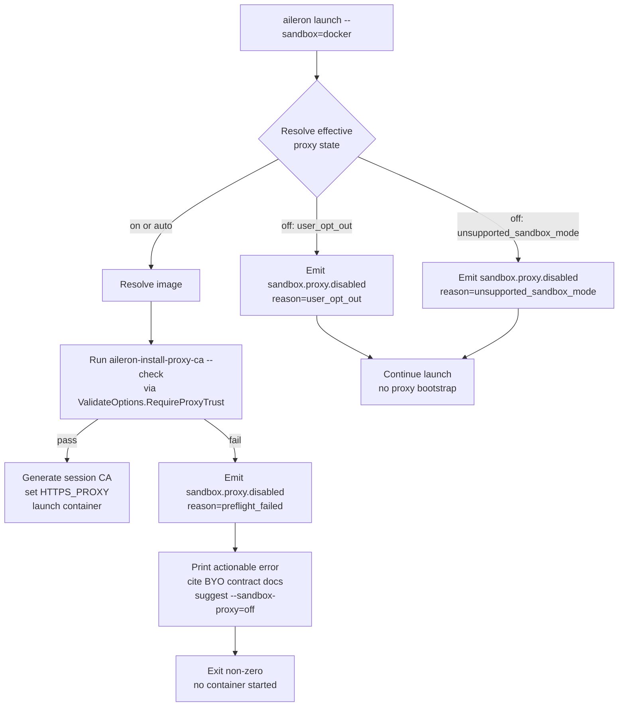

# feat: Finish v4 HTTPS proxy / data-plane mediation (issue #896)

## Summary

Close [issue #896](https://github.com/ALRubinger/aileron/issues/896) by finishing the seven remaining gates on the v4 HTTPS proxy / credential-injection data plane: transparent-proxy request body support (Section A), replacing three 501 fail-closed sites with structured rejections (C), flipping the proxy default-on for `--sandbox=docker` with a fail-fast preflight, `--sandbox-proxy=off` escape hatch, and `sandbox.proxy.disabled` audit event (B), documenting the BYO image proxy contract and extending `aileron sandbox check --agent` to validate it (D), publishing the supported-CLI matrix doc with an automated `curl` integration test (E), reconciling `sandbox.proxy.*` audit events with the [#898](https://github.com/ALRubinger/aileron/issues/898) schema (G), and flipping [ADR-0019](docs/src/content/docs/adr/0019-v4-https-data-plane.md) status from Proposed to Accepted with a PR References section (F).

---

## Problem Frame

The v4 HTTPS data plane shipped across twelve slices on `main` (PRs #906, #913, #914, #916, #918, #920, #921, #923, #930, #931, #935, #939, #940), plus the first audit-schema slice for [#898](https://github.com/ALRubinger/aileron/issues/898). Transparent-proxy CONNECT/TLS interception, daemon-side credential injection, spec matching, and sanitized audit emission are functionally complete. The remaining gates are *finishing* work: a body-plumbing audit on the transparent path, polish on three intentional 501 stubs, the default-on policy implementation the brainstorm settled, a BYO contract docs page and validation hook, a publicly-cited CLI matrix, ADR status reconciliation, and audit-schema conformance verification.

The v4 product claim ("credentialed third-party CLIs run in the container without raw credentials") only holds while the proxy is on. Today it is gated on `AILERON_SANDBOX_PROXY_BOOTSTRAP=1`, so the claim is opt-in. Flipping the default-on policy is the load-bearing change; the other six sections either unblock the flip (D), make it auditable (G), make it discoverable (E), or close out the polish that has been honestly stubbed during the twelve-slice build-out (A, C, F).

---

## Key Technical Decisions

- **Section sequencing: A → D → B → C → E → G → F.** Section A is independent and the lowest-risk finishing item; landing it first banks confidence for the rest. D documents the BYO contract that B's fail-fast preflight error messages must cite, so D ships before B. B is the policy flip and the largest behavior change. C rewrites the remaining 501 sites *after* B because two of the three sites become unreachable in the default-on world and we avoid double-touching them. E publishes the supported-CLI matrix and the `curl` integration test now that B has stabilized the contract. G reconciles `sandbox.proxy.*` audit events with the [#898](https://github.com/ALRubinger/aileron/issues/898) schema. F flips ADR-0019 to Accepted last, because the Accepted state attests to the work the prior units shipped.

- **`sandbox.proxy.disabled` is emitted by the launcher at session-start via a new daemon endpoint.** The reason field carries `user_opt_out`, `preflight_failed`, or `unsupported_sandbox_mode`. Alternative (defer emission to the first proxy request) was rejected: `unsupported_sandbox_mode` has no first proxy request to attach to, and `user_opt_out` should be recorded even when the session never makes a credentialed call. The emission pattern mirrors the existing daemon-side `recordSandboxProxyRejected` infrastructure in `internal/app/handlers_connector_operations.go`.

- **Flag-vs-env precedence: flag > env > default.** When `--sandbox-proxy=on` is set and `AILERON_SANDBOX_PROXY=off` is also set, the flag wins. The env var change does not need to error or warn — the precedence rule is documented and consistent with other launch flags (`--log-level`, `--sandbox`, `--sandbox-build`) that allow flag override.

- **`--sandbox-proxy=auto` is the default value and behaves identically to `on` for `--sandbox=docker`.** `auto` exists as a forward-compat slot. Today it does not introduce image-aware behavior; the fail-fast preflight handles BYO contract mismatches directly. Keeping `auto` in the value space means future image-aware semantics (if ever needed) do not require a flag rename.

- **Preflight uses the existing `aileron-install-proxy-ca --check` helper.** `internal/sandbox/container/runtime.go` already runs this check when `ValidateOptions.RequireProxyTrust` is true. Default-on makes `RequireProxyTrust` true unconditionally for `--sandbox=docker` (subject to opt-out), so the existing validation path becomes the preflight path. No new validation script is added; the existing one is wired into the new default code path and extended to surface a docs-citing error.

- **`AILERON_SANDBOX_PROXY_BOOTSTRAP` is removed, not renamed-with-fallback.** Pre-MVP, no compat shims (`feedback_no_backwards_compat`). The new `AILERON_SANDBOX_PROXY` accepts `on|off|auto`. The old variable, if set, is ignored silently — documented in the release-side rename note, not handled in code.

- **`aileron sandbox check --agent` extension reuses the validation script.** Section D's extension adds proxy-contract validation by setting `RequireProxyTrust: true` on the `ValidateOptions` used by `sandboxCheckValidateFn` in `cmd/aileron/sandbox.go`. No new flag is added — when `--sandbox=docker` runs require the proxy contract, `sandbox check --agent` runs the same script the launcher would run. This was the parent ce-plan's confirmed call-out shape.

- **`curl` is the automated CLI integration test target.** Mirrors the parent ce-plan synthesis call-out. Manual recipes still cover `gh` and `aws`. The automated test follows the `integration_sandbox` build-tag pattern from `internal/app/sandbox_mcp_test.go`.

- **`sandbox.proxy.disabled` event shape conforms to the #898 cross-cut now, not after #898 lands.** This plan emits the event with the agreed schema (session id, source, reason, timestamps, sanitized metadata; no credential bytes) and treats #898 as a documentation cross-cut rather than a blocking dependency. If #898 lands with a different shape later, the rename is a follow-up.

---

## High-Level Technical Design

### Default-on resolution matrix

The launcher resolves the effective proxy state from four inputs: the `--sandbox` value, the `--sandbox-proxy` flag, the `AILERON_SANDBOX_PROXY` env var, and the image's proxy-contract status (from `aileron-install-proxy-ca --check` running in the candidate image during preflight). The matrix below shows the resolution; `sandbox.proxy.disabled` is emitted whenever the effective state is `off`.

| `--sandbox` | `--sandbox-proxy` (default `auto`) | `AILERON_SANDBOX_PROXY` | Image contract | Effective state | Audit |
|---|---|---|---|---|---|
| `docker` / `podman` (Docker mode) | `auto` or `on` | unset or `auto`/`on` | passes preflight | `on` | none |
| `docker` / `podman` | `auto` or `on` | unset or `auto`/`on` | fails preflight | launch refused | `sandbox.proxy.disabled` reason=`preflight_failed` |
| `docker` / `podman` | `off` | any | n/a | `off` | `sandbox.proxy.disabled` reason=`user_opt_out` |
| `docker` / `podman` | `auto` (unset) | `off` | n/a | `off` | `sandbox.proxy.disabled` reason=`user_opt_out` |
| `docker` / `podman` | `on` | `off` | passes preflight | `on` | none (flag wins) |
| `off` | any | any | n/a | `off` | `sandbox.proxy.disabled` reason=`unsupported_sandbox_mode` |
| `off` | `on` | any | n/a | launch refused | `sandbox.proxy.disabled` reason=`unsupported_sandbox_mode` (and exit non-zero) |

### Preflight flow (Section B)

The diagram is the authoritative flow for the section B preflight. Each terminal node corresponds to one or more brainstorm acceptance examples.

### Audit event shape (Sections B + G)

`sandbox.proxy.disabled` carries:

- `event`: `sandbox.proxy.disabled`
- `session_id`: launch session id
- `aileron.proxy.source`: `launcher`
- `reason`: `user_opt_out` | `preflight_failed` | `unsupported_sandbox_mode`
- `sandbox.mode`: the `--sandbox` value (`docker`, `podman`, `off`, etc.)
- `sandbox.image`: resolved image reference (no credentials)
- Standard timestamps + audit-id

No credential bytes, no environment dump, no full image content. The shape mirrors the existing `sandbox.proxy.rejected` event in `recordSandboxProxyRejected` and is intended to dovetail with [#898](https://github.com/ALRubinger/aileron/issues/898)'s `aileron.proxy.source` discriminator.

---

## Requirements

Requirements carry forward from the brainstorm (R1–R15) and add issue-#896-derived requirements (R16–R30) for Sections A, C, D, E, F, G and the global verification gates. Brainstorm R-IDs preserve their numbers; new plan-local requirements continue from R16.

**Default-on policy (carried from brainstorm)**

- R1. `aileron launch --sandbox=docker` enables the HTTPS proxy bootstrap by default with no operator action.
- R2. `--sandbox-proxy=off` disables the proxy bootstrap for the session and proceeds to launch.
- R3. `--sandbox-proxy=on` forces the proxy bootstrap on; if the image cannot meet the contract, preflight fails as in R5.
- R4. `--sandbox-proxy=auto` is the default value and behaves identically to `on` for `--sandbox=docker`.

**Preflight and image contract (carried)**

- R5. When the proxy is requested and the image does not meet the contract, sandbox launch fails before container start with an actionable error naming the missing element and citing the BYO contract documentation.
- R6. The preflight error names `--sandbox-proxy=off` as the operator-side workaround.
- R7. Sandbox launch must not silently fall back from "proxy requested" to "proxy disabled" based on image inspection.

**Audit and observability (carried)**

- R8. When a sandbox session starts with the proxy not in force, Aileron emits a `sandbox.proxy.disabled` event for that session.
- R9. The event carries `reason` ∈ {`user_opt_out`, `preflight_failed`, `unsupported_sandbox_mode`}.
- R10. The event conforms to the [#898](https://github.com/ALRubinger/aileron/issues/898) runtime audit schema (session id, source, result, timestamps, sanitized metadata; no credential bytes).

**Configuration surface and migration (carried)**

- R11. `AILERON_SANDBOX_PROXY_BOOTSTRAP` is renamed to `AILERON_SANDBOX_PROXY` with values `on|off|auto`. The old name is no longer honored.
- R12. For sandbox modes other than `--sandbox=docker`, the proxy is not in force and `sandbox.proxy.disabled` is emitted with reason `unsupported_sandbox_mode`. `--sandbox-proxy=on` against an unsupported mode fails preflight.

**Documentation and ADR (carried)**

- R13. ADR-0019 status flips from Proposed to Accepted, capturing the default-on decision and the fail-fast preflight rationale.
- R14. Sandbox composition and launch-flag documentation describe the default behavior, the `--sandbox-proxy` flag, the `AILERON_SANDBOX_PROXY` env var, and the operator-facing meaning of each preflight failure path.
- R15. Public docs state explicitly that `--sandbox-proxy=off` disables only the transparent HTTPS proxy; spec-shim credential sealing via `/v1/connector-operations/run` continues to hold.

**Transparent-proxy body support (Section A)**

- R16. The transparent forward proxy decrypted path (`handleSandboxForwardProxyDecrypted`) propagates request bodies through `executeSandboxProxyRequest` for `POST`/`PATCH`/`PUT` upstream traffic.
- R17. The decrypted request body read is capped at 1 MiB; oversized bodies fail closed with rejection reason `request_body_too_large` and an audit event.
- R18. Test coverage includes a `POST` with body, an oversized-body rejection, and a `content-type` passthrough case.

**Replace remaining 501 fail-closed sites (Section C)**

- R19. The non-CONNECT proxy site with `Proxy-Authorization` in `handlers_sandbox_forward_proxy.go` is replaced with a structured rejection envelope and a `sandbox.proxy.rejected` audit event citing the docs anchor.
- R20. The CONNECT path 501 site (`sandbox HTTPS forward proxy CONNECT transport is not available`) is either implemented or replaced with a structured rejection envelope. Today it fires only when the operator's session dir is absent or corrupted; the rejection envelope cites the remediation.
- R21. The `connectorOperationNotImplementedMessage` constant emission sites in `handlers_connector_operations.go` are replaced with structured rejections (or removed if the path becomes unreachable in the default-on world); the `tracked by issue #896` strings are removed from production code.

**BYO image proxy contract (Section D)**

- R22. The BYO Image Contract section of `docs/src/content/docs/development/sandbox-agent-images.md` documents the proxy participation contract: `aileron-install-proxy-ca` (or an equivalent helper with the same CLI), the trust-store update mechanism on Debian-family / Alpine / RHEL-family bases, and the mount path `/etc/aileron/proxy/ca.pem`.
- R23. `aileron sandbox check --agent` validates the proxy contract in addition to its existing agent-on-PATH check, by reusing the existing `ValidateOptions.RequireProxyTrust` validation script.
- R24. `images/sandbox-base/bin/aileron-install-proxy-ca` carries a comment block that authors of BYO equivalents can reference for the script's contract.

**Supported-CLI matrix (Section E)**

- R25. `docs/src/content/docs/development/sandbox-proxy-cli-matrix.md` describes how to verify proxy behavior with `curl`, `gh`, and `aws`: installation, `HTTPS_PROXY` configuration, expected `connector.proxy.proxied` audit on a matched call, and expected `sandbox.proxy.rejected` audit on an unmatched call.
- R26. An `integration_sandbox`-tagged Go test exercises `curl` end-to-end through a real proxy-enabled sandbox session against a fake upstream, verifying credential injection and audit emission.

**ADR-0019 status (Section F)**

- R27. ADR-0019 status changes from Proposed to Accepted.
- R28. ADR-0019 gains a References section listing all merged PRs that shipped the twelve slices and the audit-schema slice.

**Audit schema cross-cut (Section G)**

- R29. All `sandbox.proxy.*` audit events (`sandbox.proxy.disabled`, `sandbox.proxy.rejected`, `connector.proxy.proxied`) emit a documented shape consistent with [#898](https://github.com/ALRubinger/aileron/issues/898): session id, `aileron.proxy.source`, connector FQN (when applicable), op name (when applicable), upstream host (not URL), result, audit id, no credential bytes.
- R30. `docs/src/content/docs/guides/observability.md` (existing page; "Sandbox HTTPS data plane" section) is extended with the `sandbox.proxy.disabled` event shape and `reason` field values; the existing documentation of `aileron.proxy.source` and the `connector.proxy.proxied` / `sandbox.proxy.rejected` events is verified against current emission code.

**Global verification gates**

- R31. `task vet:go` is clean.
- R32. The full Go suite (`go test ./...`) is green.
- R33. Coverage on the packages changed by this plan is ≥ 80% (Codecov patch + project pass).
- R34. A manual run of the sandbox MCP walkthrough ([#962](https://github.com/ALRubinger/aileron/issues/962)) succeeds end-to-end against the default-on proxy.
- R35. A manual run of the new sandbox-proxy CLI matrix recipe (R25) succeeds end-to-end with credential injection.

---

## Implementation Units

### U1. Transparent-proxy request body end-to-end test coverage (Section A)

**Goal:** Verify request-body propagation through `handleSandboxForwardProxyDecrypted` for `POST`/`PATCH`/`PUT` upstream traffic remains correct under default-on, and close the end-to-end test-coverage gap. The production wiring (cap, reject reasons, body passthrough) is already in place; function-level tests exist; what is missing is integration coverage of the full CONNECT → TLS interception → body → credential injection → upstream path.

**Requirements:** R16, R17, R18.

**Dependencies:** none.

**Files:**

- `internal/app/handlers_sandbox_forward_proxy.go` (audit/wire `handleSandboxForwardProxyDecrypted` + `readSandboxForwardProxyRequestBody`)
- `internal/app/handlers_sandbox_forward_proxy_test.go` (add POST/body, oversized, content-type tests)

**Approach:**

- The production code path is already in place: `handleSandboxForwardProxyDecrypted` calls `readSandboxForwardProxyRequestBody`, enforces `sandboxForwardProxyMaxRequestBytes = 1 << 20`, maps overruns to rejection reason `request_body_too_large` via `sandboxForwardProxyBodyRejectReason`, and passes `body` + `contentType` through to `executeSandboxProxyRequest`. Function-level tests for the cap, content-type passthrough, and reject-reason mapping also exist. The remaining work is **end-to-end test coverage** — exercising the full transparent-proxy path with bodies in the loop, since the existing `TestSandboxForwardProxy_CONNECT*` cases only use `client.Get`.
- Verify (do not re-implement) that the wiring above remains correct. If any audit reveals a gap, fix it; otherwise the unit collapses to test additions.
- Add end-to-end test fixtures covering: a matched `POST` with a small JSON body that flows through CONNECT/TLS interception, credential injection, and reaches the fake upstream; an end-to-end `POST` with body slightly over 1 MiB that fails closed with rejection reason `request_body_too_large` and emits `sandbox.proxy.rejected`; an end-to-end `PATCH` with `Content-Type: application/json` that passes the content-type through to upstream.

**Patterns to follow:**

- `internal/app/handlers_sandbox_forward_proxy_test.go` existing `TestSandboxForwardProxy_CONNECT*` cases for the proxy setup harness.
- `recordSandboxProxyRejected` and `sandboxForwardProxyBodyRejectReason` for rejection-reason emission.

**Test scenarios:**

- POST with a 1 KiB JSON body matches a connector spec, credential is injected, fake upstream sees the body bytes verbatim. **Covers AE1, R16.**
- POST with a body slightly over 1 MiB fails closed with HTTP 413, rejection reason `request_body_too_large`, and a `sandbox.proxy.rejected` audit. **Covers R17.**
- PATCH with `Content-Type: application/json` is proxied with the same content-type to upstream. **Covers R18.**
- PUT with empty body succeeds (boundary check that body absence is not mistaken for an error).
- POST with a body whose Content-Length header lies (over-reports) — body read fails closed with `request_body_read_failed`.

**Verification:** All three Section A bullets in [issue #896](https://github.com/ALRubinger/aileron/issues/896) pass; `go test ./internal/app/...` green; package coverage holds at the existing threshold.

---

### U2. BYO image proxy contract docs + `sandbox check --agent` extension (Section D)

**Goal:** Document the BYO image proxy contract so preflight errors can cite it, and extend `aileron sandbox check --agent` to validate that contract for any image (not only at launch).

**Requirements:** R22, R23, R24.

**Dependencies:** none (U1 is recommended first for confidence, but there is no technical dependency).

**Files:**

- `docs/src/content/docs/development/sandbox-agent-images.md` (add BYO Proxy Contract subsection)
- `docs/src/content/docs/development/sandbox-composition.md` (cross-link the new subsection)
- `cmd/aileron/sandbox.go` (`runSandboxCheck`, `sandboxCheckValidateFn`)
- `cmd/aileron/sandbox_test.go` (add coverage if it exists; otherwise add a test file)
- `internal/sandbox/container/runtime.go` (only if `ValidateOptions.RequireProxyTrust` wiring needs the validation script unchanged; expected no change)
- `images/sandbox-base/bin/aileron-install-proxy-ca` (add a comment block documenting the contract)

**Approach:**

- The BYO Proxy Contract subsection covers: required helper (`aileron-install-proxy-ca` or an equivalent that accepts `--check` and an install argument), expected mount path (`/etc/aileron/proxy/ca.pem`), trust-store mechanism per base distro (`update-ca-certificates` for Debian-family, equivalent commands for Alpine and RHEL-family), and the rationale (CA must be installable as root once at start; the agent process must drop privileges before continuing). Cross-reference [ADR-0019](docs/src/content/docs/adr/0019-v4-https-data-plane.md).
- `aileron sandbox check --agent` currently runs `Builder.Validate` via `sandboxCheckValidateFn`. Extend the call site to pass `RequireProxyTrust: true` unconditionally when the resolved sandbox runtime is `docker` or `podman`. `sandbox check --agent` is the BYO-validation tool and should always validate the proxy contract for those runtimes; the `--sandbox-proxy=off` opt-out applies to `aileron launch`, not to `sandbox check`. The validation script in `internal/sandbox/container/runtime.go` (existing) does the rest.
- Add a docstring/comment block to `aileron-install-proxy-ca` describing the script's expected behavior (`--check` exit code semantics, install behavior under root, the mount path) so BYO authors can write a drop-in equivalent.

**Patterns to follow:**

- Existing BYO Image Contract sub-section in `docs/src/content/docs/development/sandbox-agent-images.md` for the documentation shape.
- `sandboxCheckValidateFn` in `cmd/aileron/sandbox.go` for the validation call-site shape.
- `internal/sandbox/container/runtime.go` `validationScript` for the existing helper-check logic.

**Test scenarios:**

- `aileron sandbox check --agent claude` against `aileron/sandbox-base` reports `support: ok` and proxy contract pass (positive case).
- `aileron sandbox check --agent claude` against a BYO image without `aileron-install-proxy-ca` reports a contract failure citing the docs page.
- `aileron sandbox check --agent claude` against a BYO image that has `aileron-install-proxy-ca` but no writable trust store reports a contract failure citing the docs page.
- Docs link target resolves (the BYO Proxy Contract subsection anchor is reachable from the preflight error message). **Covers AE2.**

**Verification:** `aileron sandbox check --agent` validates the proxy contract for both the canonical image and BYO images; the BYO Proxy Contract section is published and linked from the preflight error path of U3; the comment block on `aileron-install-proxy-ca` is in place.

---

### U3. Default-on flip, `--sandbox-proxy` flag, `sandbox.proxy.disabled` audit (Section B)

**Goal:** Implement the brainstorm's policy: default-on proxy for `--sandbox=docker`, fail-fast preflight that refuses to launch when the image can't meet the contract, `--sandbox-proxy=off` escape hatch, `sandbox.proxy.disabled` audit event with reason, env var rename.

**Requirements:** R1–R15 (carried from brainstorm).

**Dependencies:** U2 (preflight error must cite the BYO contract docs page).

**Files:**

- `cmd/aileron/main.go` (`launch` flag block — add `--sandbox-proxy` flag)
- `cmd/aileron/main_test.go` (extend launch flag tests)
- `internal/launch/launcher.go` (sandbox proxy bootstrap call sites and `sandboxProxyBootstrapActive`)
- `internal/launch/launcher_test.go` (default-on / opt-out / preflight cases)
- `internal/launch/proxy_bootstrap.go` (`sandboxProxyBootstrapEnv`, `sandboxProxyBootstrapEnabled`, `prepareSandboxProxyBootstrap`)
- `internal/launch/proxy_bootstrap_test.go` (rename env tests; add resolution-matrix tests)
- `internal/launch/sandbox_proxy_disabled.go` (new file — `sandbox.proxy.disabled` audit emission helper)
- `internal/launch/sandbox_proxy_disabled_test.go` (new)
- `internal/api/openapi.yaml` (new daemon endpoint for the disabled audit event)
- `internal/app/handlers_sandbox_proxy_disabled.go` (new — daemon-side handler)
- `internal/app/handlers_sandbox_proxy_disabled_test.go` (new)
- `internal/app/app.go` (route registration)
- `docs/src/content/docs/development/sandbox-composition.md` (document the new default behavior)

**Approach:**

- Add `--sandbox-proxy` to `launchFlags` in `cmd/aileron/main.go` with values `on|off|auto` and default `auto`. Propagate via `launch.LaunchConfig`.
- Rename `sandboxProxyBootstrapEnv` constant from `AILERON_SANDBOX_PROXY_BOOTSTRAP` to `AILERON_SANDBOX_PROXY`. Replace `sandboxProxyBootstrapEnabled` with a resolution function that takes (`--sandbox-proxy` flag value, env var value, `--sandbox` value) and returns one of: `on`, `off` with reason, or `error` for invalid combinations (`--sandbox-proxy=on` against `--sandbox=off`).
- Default for `--sandbox=docker` with both flag and env unset: `on`. The existing `prepareSandboxProxyBootstrap` early-return on `!sandboxProxyBootstrapEnabled()` flips meaning.
- When the resolved effective state is `off`, call the launcher-side `sandbox.proxy.disabled` audit helper before returning. Helper POSTs to a new daemon endpoint that records the event via the existing audit infrastructure.
- When the resolved state is `on`, the existing `RequireProxyTrust: true` validation already runs as part of launcher setup. Extend the validation script's failure handling so the launcher captures the failure and emits `sandbox.proxy.disabled` with reason `preflight_failed` *before* exiting non-zero. The actionable error printed to stderr cites the BYO Proxy Contract docs anchor from U2 and names `--sandbox-proxy=off`.
- Update `launcher_test.go` to cover the resolution matrix from the HTD section above.

**Patterns to follow:**

- `--sandbox` flag handling in `cmd/aileron/main.go` for default value + propagation through `LaunchConfig`.
- `recordSandboxProxyRejected` in `internal/app/handlers_connector_operations.go` for the daemon-side audit emission shape.
- `internal/launch/proxy_bootstrap.go` `applySandboxProxyBootstrapEnv` for env-mutation pattern.

**Execution note:** Start with a failing integration test that asserts the default-on behavior for `aileron launch --sandbox=docker` against `aileron/sandbox-base`. This catches drift in the resolution matrix earlier than per-helper unit tests.

**Test scenarios:**

- Default Docker launch with compliant image proxies as expected, no `sandbox.proxy.disabled` event. **Covers AE1.**
- Default Docker launch with non-compliant BYO image fails preflight before container start; emits `sandbox.proxy.disabled` reason=`preflight_failed`; stderr cites the BYO contract docs page and `--sandbox-proxy=off`. **Covers AE2, R5, R6.**
- `--sandbox-proxy=off` launches with no bootstrap; emits `sandbox.proxy.disabled` reason=`user_opt_out`. **Covers AE3.**
- `--sandbox-proxy=on` against non-compliant BYO image fails preflight the same way as default-on. **Covers AE4.**
- Non-Docker sandbox mode emits `sandbox.proxy.disabled` reason=`unsupported_sandbox_mode`; `--sandbox-proxy=on --sandbox=off` fails preflight. **Covers AE5, R12.**
- Legacy `AILERON_SANDBOX_PROXY_BOOTSTRAP=1` is ignored; only `AILERON_SANDBOX_PROXY` governs. **Covers AE6, R11.**
- Flag-vs-env precedence: `--sandbox-proxy=on AILERON_SANDBOX_PROXY=off` → on; `--sandbox-proxy=off AILERON_SANDBOX_PROXY=on` → off.
- `--sandbox-proxy=off` with a session that runs a generated connector shim still credential-seals through `/v1/connector-operations/run` (no raw credential in container). **Covers AE7, R15.**
- Daemon-side `sandbox.proxy.disabled` handler rejects malformed payloads (missing session id, invalid reason, etc.) without recording.

**Verification:** All seven brainstorm acceptance examples pass; `task vet:go` clean; coverage on changed packages ≥ 80%; manual run of `aileron launch --sandbox=docker claude` against `aileron/sandbox-base` succeeds with proxy on by default.

---

### U4. Replace remaining 501 fail-closed sites with structured rejections (Section C)

**Goal:** Replace the three remaining honest-stub 501 sites with structured rejection envelopes + audit events, or remove them when the default-on flip makes them unreachable.

**Requirements:** R19, R20, R21.

**Dependencies:** U3 (default-on may make some sites unreachable; landing C after B avoids rework).

**Files:**

- `internal/app/handlers_sandbox_forward_proxy.go` (the two 501 sites)
- `internal/app/handlers_sandbox_forward_proxy_test.go`
- `internal/app/handlers_connector_operations.go` (the `connectorOperationNotImplementedMessage` site, the `data_plane_not_implemented` reject reason)
- `internal/app/handlers_connector_operations_test.go`

**Approach:**

- **Non-CONNECT proxy with Proxy-Authorization (line 61).** Today this is a 501 stub that triggers when a non-CONNECT request reaches the proxy handler with valid auth. After U3's default-on, this site is still reachable for clients that send absolute-form proxy URLs without CONNECT. Replace with a `sandbox.proxy.rejected` audit (source `transparent_connect_tls`, reason `non_connect_proxy_request_unsupported`) and a 403 envelope citing the docs page for "proxy clients must use CONNECT for HTTPS interception."
- **CONNECT path with missing session CA (line 85).** Today this fires when `sandboxForwardProxyCertificate` fails to load the session CA — only possible if the operator's session dir is absent or corrupted (an operator-side error, not an agent-side one). Replace with a `sandbox.proxy.rejected` audit (reason `session_ca_unavailable`) and a 500 envelope pointing to runbook docs (the session-dir layout in ADR-0019).
- **`connectorOperationNotImplementedMessage` and `data_plane_not_implemented` (line 22, line 542).** After U3, the early-return for non-proxyable operations may become the only path that emits these. Audit each call site: if reachable, replace the message text with a structured rejection envelope (`reason: "operation_not_proxyable"` with the matched-but-not-proxyable case); if unreachable, delete the constant and dead code path. Either way, remove all `tracked by issue #896` strings from production code.

**Patterns to follow:**

- `recordSandboxProxyRejected` and `recordSandboxProxyUnresolvedRejected` for the audit emission shape.
- `writeSandboxForwardProxyError` for the envelope shape.

**Test scenarios:**

- Non-CONNECT absolute-form proxy request with valid `Proxy-Authorization` returns 403 with the documented reason and emits `sandbox.proxy.rejected` reason=`non_connect_proxy_request_unsupported`. **Covers R19.**
- CONNECT against a session whose CA file is missing returns 500 with the documented reason and emits `sandbox.proxy.rejected` reason=`session_ca_unavailable`. **Covers R20.**
- A spec-shim request for a non-proxyable operation kind returns a structured rejection envelope with `reason: "operation_not_proxyable"` (or the path is shown unreachable and the constant deleted). **Covers R21.**
- No `tracked by issue #896` string remains in `internal/app/*.go` after this unit (grep assertion in test or `task vet:go` extension).

**Verification:** All three Section C bullets in issue #896 pass; rejection envelopes return actionable reasons; `tracked by issue #896` is gone from production code.

---

### U5. Supported-CLI matrix doc + automated `curl` integration test (Section E)

**Goal:** Publish the user-facing documentation for verifying proxy behavior with common CLIs, and land one automated `integration_sandbox`-tagged test that exercises `curl` end-to-end through a real proxy-enabled sandbox session.

**Requirements:** R25, R26.

**Dependencies:** U3 (the docs and test exercise the default-on flow).

**Files:**

- `docs/src/content/docs/development/sandbox-proxy-cli-matrix.md` (new)
- `docs/src/content/docs/development/index.md` (link the new page)
- `internal/app/sandbox_proxy_curl_integration_test.go` (new, `integration_sandbox` build tag)
- `Taskfile.yml` (extend the integration task target if needed)

**Approach:**

- The docs page covers three CLIs (`curl`, `gh`, `aws`) with one section each: install command (per OS), `HTTPS_PROXY` setup (most CLIs respect the env var; document the exceptions), CA-trust configuration (curl `--cacert`, gh nothing extra, aws `AWS_CA_BUNDLE`), an example call that should succeed (matched against an installed connector spec) and a sample audit excerpt showing `connector.proxy.proxied`, and an example that should fail (unmatched upstream) with the `sandbox.proxy.rejected` audit excerpt.
- The automated `curl` test follows the shape of `internal/app/sandbox_mcp_test.go`: build tag `integration_sandbox`, host-subprocess fallback when sandbox runtime unavailable, real `curl` invocation against an httptest.Server fake upstream registered as an installed connector op, assertion on the request's `Authorization: Bearer` header value (proves credential injection) and on the emitted `connector.proxy.proxied` audit. The integration test does not require a real sandbox runtime to pass on developer laptops; it does require Docker/Podman for full coverage in CI.

**Patterns to follow:**

- `docs/src/content/docs/development/sandbox-mcp-walkthrough.md` for the docs page shape.
- `internal/app/sandbox_mcp_test.go` for the `integration_sandbox` test pattern.

**Test scenarios:**

- The automated `curl` integration test passes when run with `-tags=integration_sandbox`. It verifies: (a) `curl` honors `HTTPS_PROXY`; (b) the proxy injects credentials at the boundary; (c) the upstream sees the credentialed request without the container holding the credential; (d) the `connector.proxy.proxied` audit event is emitted with the correct source. **Covers R26.**
- The docs page builds cleanly via `task docs:build` (or equivalent).
- Each docs example (curl, gh, aws) has both a success and a failure case documented with audit excerpts. **Covers R25.**

**Verification:** The docs page is published; `task test -- -tags=integration_sandbox` runs the new test green on a Docker-equipped host; `gh` and `aws` walkthroughs in the docs are reproducible manually against the canonical sandbox image.

---

### U6. Audit-schema reconciliation with #898 (Section G)

**Goal:** Confirm all `sandbox.proxy.*` events emitted by this plan conform to the [#898](https://github.com/ALRubinger/aileron/issues/898) runtime audit schema, document the shapes in the observability concepts page, and post a cross-reference summary to #898.

**Requirements:** R10, R29, R30.

**Dependencies:** U3, U4 (G reconciles events whose final shape is established by U3 and U4).

**Files:**

- `docs/src/content/docs/guides/observability.md` (extend the existing "Sandbox HTTPS data plane" section with the new `sandbox.proxy.disabled` event and its `reason` field; the page already documents `connector.proxy.proxied`, `connector.proxy.rejected`, `sandbox.proxy.rejected`, and the `aileron.proxy.source` discriminator)
- `internal/app/handlers_connector_operations.go` (verify, no functional change expected)
- `internal/app/handlers_sandbox_forward_proxy.go` (verify, no functional change expected)
- `internal/launch/sandbox_proxy_disabled.go` (verify, from U3)

**Approach:**

- Catalog every `sandbox.proxy.*` event and `connector.proxy.proxied` event the codebase emits. For each: extract the schema (fields, types, sources, allowed values) into a doc table.
- Cross-reference with [#898](https://github.com/ALRubinger/aileron/issues/898)'s scope. If #898 has landed by the time this unit ships, align field names exactly. If #898 has not landed, post the event shapes to #898 as a working schema so #898's eventual decision can confirm or rename.
- The new event documentation lands in the existing `docs/src/content/docs/guides/observability.md` page, extending the "Sandbox HTTPS data plane" section already present. Add `sandbox.proxy.disabled` and its `reason` field values (`user_opt_out`, `preflight_failed`, `unsupported_sandbox_mode`) to that section; verify the existing field tables for `aileron.proxy.source` and the `connector.proxy.proxied` / `sandbox.proxy.rejected` events still match the live shapes.

**Patterns to follow:**

- Existing audit-emission shapes from `recordSandboxProxyRejected` (the canonical example).
- ADR-0019's audit-shape language for the doc tone.

**Test scenarios:**

- For each event family, a test asserts the emitted shape includes the documented required fields and excludes credential material. **Covers R29.**
- A "shape conformance" test runs through all emission sites and verifies no field violations against the documented schema (a small Go test with a struct describing the schema; events validate against it).
- The extended `guides/observability.md` page renders and the new `sandbox.proxy.disabled` section is reachable from the docs index. **Covers R30.**

**Verification:** Every `sandbox.proxy.*` and `connector.proxy.proxied` event has a documented shape; #898 cross-reference is posted; the observability docs page is published.

---

### U7. ADR-0019 status flip to Accepted + References section (Section F)

**Goal:** Reconcile ADR-0019 to reflect what shipped: status Proposed → Accepted, add a References section listing the merged PRs that shipped each slice, document the default-on decision and the fail-fast preflight rationale in the Decision section.

**Requirements:** R13, R27, R28.

**Dependencies:** U3, U2 (Accepted state attests to both the policy decision and the BYO contract); U6 (Accepted state attests to audit-schema documentation).

**Files:**

- `docs/src/content/docs/adr/0019-v4-https-data-plane.md`

**Approach:**

- Edit the meta table: `Status: Proposed` → `Status: Accepted`. Update `Date` to the merge date of this unit's PR.
- Extend the Decision section with a short paragraph capturing the default-on policy, the fail-fast preflight, and the `sandbox.proxy.disabled` audit event with reason. Cite this plan and the brainstorm requirements doc as references.
- Add a References section at the bottom listing the shipped PRs by slice (per the table in the issue: #906, #913, #914, #916, #918, #920, #921, #923, #930, #931, #935, #939, #940, plus the PRs from this plan).
- If any slices beyond 12 ship as part of this plan that aren't yet in the journal, add them.

**Patterns to follow:**

- The existing meta-table format in `0019-v4-https-data-plane.md`.
- Reference-section format from other Accepted ADRs in `docs/src/content/docs/adr/`.

**Test scenarios:**

- Test expectation: none — docs-only change, no behavioral surface. (Per the test-scenarios contract, this is a pure docs change without behavioral risk; the value is reviewed in the PR rather than asserted in tests.)

**Verification:** ADR-0019 status is `Accepted`; References section is complete; the doc builds and renders correctly.

---

## Scope Boundaries

### In scope

- Issue #896 Sections A, B (implementation), C, D, E, F, G plus the global verification gates.
  - **Section B** (requirements R1–R15) is carried from the brainstorm origin at `docs/brainstorms/2026-06-09-v4-sandbox-proxy-default-on-requirements.md`.
  - **Sections A, C, D, E, F, G** (requirements R16–R35) extend the plan beyond the origin brainstorm to finish all seven remaining gates tracked in issue #896.
- All R1–R35 above.

### Deferred to Follow-Up Work

- `sandbox.proxy.disabled` emission via OpenTelemetry exporter (orthogonal — depends on [#828](https://github.com/ALRubinger/aileron/issues/828) telemetry track).
- Image-aware `auto` semantics (today `auto` ≡ `on` for `--sandbox=docker`; if a use case for per-image detection emerges, the value space already accommodates it).
- Honoring the old `AILERON_SANDBOX_PROXY_BOOTSTRAP` env var post-rename — pre-MVP, no compat shims.
- Beyond-`curl` automated CLI integration tests for `gh` and `aws` — manual recipes only for now (R25).

### Outside this product's identity

- Shell-layer mediation. [#801](https://github.com/ALRubinger/aileron/issues/801) was descoped 2026-06-08 via PR #954; [ADR-0021](docs/src/content/docs/adr/0021-v4-shell-layer-mediation.md) is Withdrawn. Do not re-architect the proxy assuming shell mediation is coming.
- Launch TUI ([#802](https://github.com/ALRubinger/aileron/issues/802)).
- Env-var-only CLIs that cannot honor `HTTPS_PROXY` — documented unsupported per ADR-0019 Consequences.
- Sandbox MCP parity ([#953](https://github.com/ALRubinger/aileron/issues/953)) — complementary, not blocking; the proxy mediates outbound HTTPS regardless of whether the agent reaches the boundary via an MCP-routed tool call (Path B1) or a connector shim.
- Image-bake of `aileron-mcp` for sealed runtimes ([#957](https://github.com/ALRubinger/aileron/issues/957)) and per-route caveat token scoping ([#958](https://github.com/ALRubinger/aileron/issues/958)).
- Cloud / hosted topology. v4 is customer-operated; v4.x BYOC and v5 SaaS are tracked separately.

---

## Risks & Dependencies

- **`#898` shape drift (G).** If [#898](https://github.com/ALRubinger/aileron/issues/898) lands a schema that renames fields this plan documents, U6 needs a follow-up rename. Mitigated by treating U6 as a cross-reference rather than a blocker, and by emitting the events with the proposed shape that #898's scope already anticipates.
- **BYO image breakage on default-on (B).** Operators with custom images that don't yet have the proxy contract will see their next `aileron launch --sandbox=docker` fail. This is the *intended* failure mode (the brainstorm explicitly rejected silent fallback), but the operator-facing experience must be actionable: the preflight error must cite a published docs page (U2) and surface `--sandbox-proxy=off`. Mitigated by sequencing D before B and by the actionable-error requirement (R5, R6).
- **Sandbox runtime availability for the `curl` integration test (E).** The `integration_sandbox` build tag depends on Docker or Podman being available in CI. Mitigated by mirroring the host-subprocess fallback in `internal/app/sandbox_mcp_test.go`.
- **Coverage threshold on the launcher (B).** The launcher changes in U3 are state-machine-heavy (flag × env × image × sandbox-mode resolution). Reaching ≥ 80% honestly may require subtle test design. Mitigated by table-driven tests of the resolution matrix from the HTD section.

Dependencies between units:

- U2 → U3 (BYO docs must exist before B's preflight error cites them).
- U3 → U4 (some 501 sites may become unreachable after default-on).
- U3 → U5 (CLI matrix exercises default-on behavior).
- U3 + U4 → U6 (audit-schema cross-cut reconciles events whose final shape is established by U3 and U4).
- U2 + U3 + U6 → U7 (ADR Accepted state attests to all of policy, contract, and schema).

---

## Documentation Plan

- BYO Image Contract subsection in `docs/src/content/docs/development/sandbox-agent-images.md` (U2).
- Sandbox composition docs updated for default-on, `--sandbox-proxy` flag, `AILERON_SANDBOX_PROXY` env var, preflight failure paths (U3).
- New page `docs/src/content/docs/development/sandbox-proxy-cli-matrix.md` (U5).
- Extension of the existing "Sandbox HTTPS data plane" section in `docs/src/content/docs/guides/observability.md` with the new `sandbox.proxy.disabled` event shape and `reason` field (U6).
- ADR-0019 updated to Accepted with Decision-section addendum and References (U7).

---

## Operational / Rollout Notes

- This plan changes the default behavior of `aileron launch --sandbox=docker` for every operator. Communicate the change in the release notes for whichever release ships U3, with the BYO docs link (U2) and the `--sandbox-proxy=off` opt-out prominent.
- The env var rename (R11) means operators with `AILERON_SANDBOX_PROXY_BOOTSTRAP=1` in their shell config silently get the new default (which is the same effective behavior, since they were already on). Operators with `AILERON_SANDBOX_PROXY_BOOTSTRAP=0` (a value that was never honored anyway, since the gate was truthy-only) get the new default-on. Document both cases.
- The `sandbox.proxy.disabled` event is a new audit shape; downstream audit consumers that strict-validate event names will see a new event type. The observability docs page (U6) is the canonical reference.

---

## Open Questions

### Deferred to implementation

- **Exact preflight error message wording.** The shape is fixed (cites docs URL, names missing contract element, suggests `--sandbox-proxy=off`); the literal string is implementation choice and docs review.
- **Where in `docs/src/content/docs/guides/observability.md` the new `sandbox.proxy.disabled` content lands.** The existing "Sandbox HTTPS data plane" section is the natural home; exact subsection placement is U6's call during implementation.
- **Whether the Section C "non-CONNECT proxy with Proxy-Authorization" site is reachable enough to need the structured rejection.** If client behavior research during U4 shows the site is unreachable in practice, deletion is preferable to a no-op rejection envelope.

---

## Sources & Research

- [Issue #896](https://github.com/ALRubinger/aileron/issues/896) — tracking issue with the seven remaining sections this plan closes.
- [Issue #898](https://github.com/ALRubinger/aileron/issues/898) — runtime audit schema cross-cut.
- [Issue #747](https://github.com/ALRubinger/aileron/issues/747) — Milestone v4 umbrella; "architectural disciplines" intent that makes default-on the right policy.
- Brainstorm requirements doc: `docs/brainstorms/2026-06-09-v4-sandbox-proxy-default-on-requirements.md` (origin for Section B).
- [ADR-0019](docs/src/content/docs/adr/0019-v4-https-data-plane.md) — canonical decision journal for the twelve shipped slices; U7 flips it to Accepted.
- `internal/launch/proxy_bootstrap.go` — opt-in gate (`AILERON_SANDBOX_PROXY_BOOTSTRAP`), session CA generation, `HTTPS_PROXY` injection.
- `internal/launch/launcher.go` — `sandboxProxyBootstrapActive`, `RequireProxyTrust` wiring.
- `internal/app/handlers_sandbox_forward_proxy.go` — transparent CONNECT/TLS interception; the two 501 sites (lines 61, 85).
- `internal/app/handlers_connector_operations.go` — daemon request boundary; `connectorOperationNotImplementedMessage` (line 22); `recordSandboxProxyRejected` (line 558); `recordSandboxProxyUnresolvedRejected` (line 638).
- `internal/sandbox/container/runtime.go` — `ValidateOptions.RequireProxyTrust`, `validationScript`, existing `aileron-install-proxy-ca --check` invocation.
- `cmd/aileron/main.go` (launch flag block, lines 82–125) — pattern for adding `--sandbox-proxy`.
- `cmd/aileron/sandbox.go` (`runSandboxCheck`, `sandboxCheckValidateFn`) — call site to extend in U2.
- `internal/app/sandbox_mcp_test.go` — `integration_sandbox` build-tag pattern for U5.
- `images/sandbox-base/bin/aileron-install-proxy-ca` — proxy-CA install helper (canonical implementation).
- `docs/src/content/docs/development/sandbox-mcp-walkthrough.md` — shape model for the CLI matrix docs page (U5).
- Shipped PRs (chronological): #906, #913, #914, #916, #918, #920, #921, #923, #930, #931, #935, #939, #940 (referenced in U7).
