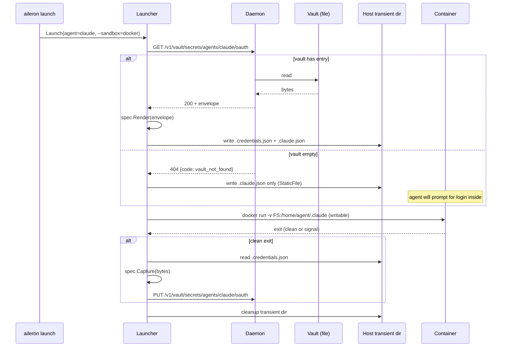
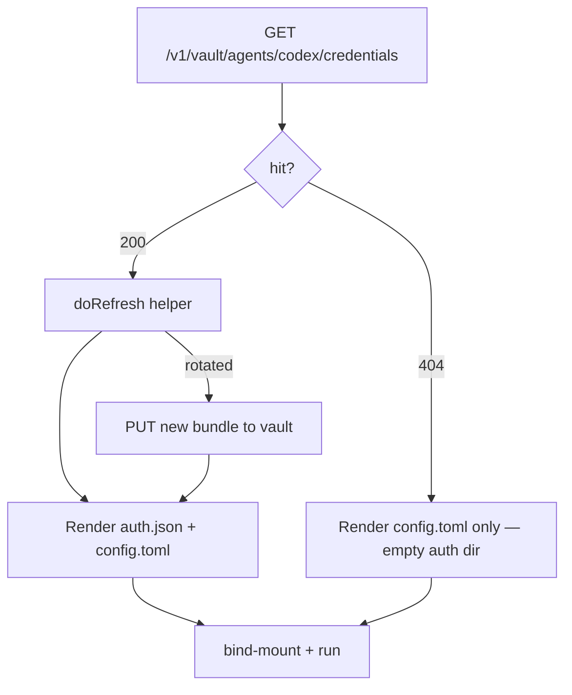

# feat: Vault-backed agent auth injection for Claude and Codex sandbox launches

## Summary

Extend the `Agent` interface with a bidirectional `AuthSpec` descriptor (Render + Capture) so the launcher materializes vault entries as in-container credential files at launch, and snapshots the credential files back to vault on clean exit. Wire Claude Code and Codex CLI to the new contract; ship a new daemon HTTP endpoint that brokers vault credential reads/writes from the launcher per ADR-0011/0012; and write the ADR + docs page that pin the design. Seeding is exclusively in-container: first launch with an empty vault prompts the user to log in inside the sandbox (paste-the-code OAuth fallback for Claude, device-auth for Codex); Capture seeds the vault on clean exit; every subsequent launch is silent.

---

## Problem Frame

Sandbox launches today land in a fresh `/home/agent/.claude/` (or `/home/agent/.codex/`) every time, triggering each agent's first-launch wizard on every invocation. Subscription auth — the dominant auth mode for both Claude Code and Codex CLI — has no path through the launcher. The vault (`internal/vault/spi.go`) already enumerates `oauth_refresh_token` and `api_key` as `Metadata.Type` values, but nothing in `internal/launch/` consults it. The brainstorm at `docs/brainstorms/2026-06-10-vault-backed-agent-auth-injection-requirements.md` settles the user-facing shape: the vault is durable, the container is ephemeral, and a writable bind-mount is the conduit between them. This plan resolves the implementation: a new `AuthSpec` contract, a daemon-brokered vault read/write API, per-agent specs for Claude and Codex, and a thin CLI seam for explicit imports.

---

## Key Technical Decisions

- **`AuthSpec` is a bidirectional descriptor returned by a new `Agent.AuthSpec()` method.** Render (vault → in-container bytes / env) and Capture (in-container bytes → vault) are both first-class. Capture makes the in-container login flow self-bootstrapping and doubles as the rotation-persistence mechanism. Brainstorm-pinned.

- **Vault access from the launcher goes through a new daemon HTTP endpoint, not direct file open.** Adds `GET/PUT /v1/vault/secrets/{path}` to `internal/api/openapi.yaml`, regenerated via `task generate:api`. Matches ADR-0011 (vault is the daemon's trust boundary) and ADR-0012 (daemon owns the unlocked vault); avoids the "second vault-opener" problem that would arise if the launcher independently held a KEK. Plan-pinned (see origin call-out).

- **Codex pre-launch refresh factors a generic `doRefresh` helper out of `internal/credential/oauth2_resolver.go`; Codex owns its envelope and persistence.** The existing resolver's contract is structurally incompatible with Codex's `auth.json` envelope (resolver expects `Metadata.Type == "oauth2"` and the `OAuth2Token` shape; Codex uses `oauth_refresh_token` with `{auth_mode, tokens, last_refresh}`). U5 factors the HTTP refresh primitive out of the resolver into a reusable helper, and Codex's `PreLaunchRefresh` calls that helper, marshals its own envelope, and persists via the daemon client per Option A. Plan-pinned.

- **Capture fires only on clean container exit.** `sandboxcontainer.Builder.Run` returning a nil error gates the Capture pass. Forcible termination (SIGKILL, runtime crash) skips Capture without error; the vault retains the prior credential and the next launch self-heals via the agent's own refresh or the launcher's pre-launch hook. Brainstorm-pinned.

- **Two-doc ADR arrangement.** New ADR-0025 carries the `AuthSpec` contract and the in-container-login-plus-capture lifecycle. One-paragraph amendment to ADR-0024 documents the `cli_auth_credentials_store = "file"` emission as a follow-on to the sandbox MCP parity work. Plan-pinned.

- **In-container login + Capture is the single seeding path in v1.** Host-side credential import (`--import-from-host` and the `aileron auth` CLI subcommand) is deferred entirely until requirements are clearer. First launch with an empty vault triggers the agent's normal interactive login inside the sandbox (paste-the-code for Claude, device-auth for Codex); Capture seeds the vault on clean exit; subsequent launches are silent. This keeps v1 minimal, eliminates the host-OS extraction matrix (Linux file read, macOS Keychain shell-out, Windows file read), and removes the consent-gate UX surface entirely. The trade-off — macOS / Linux / Windows users with an existing host CLI install pay one paste-the-code dance per agent per machine — is a small, one-time cost that lands on a surface (the in-container terminal) where consent is explicit by construction.

- **Sandbox-only in v1.** Host-launch parity is architecturally clean to extend later but not part of this plan. Brainstorm-pinned.

- **In-container login via the agent's own paste-the-code OAuth fallback is the universal seeding path.** No vendor cooperation required, no Aileron-initiated OAuth dance, works across topologies. Brainstorm-pinned.

---

## Requirements

R-IDs are grouped by concern. They map to brainstorm requirements R1–R24 via the `origin:` link in frontmatter; the plan splits per-agent specs (origin R12–R14) and seeding paths (origin R15–R22) into finer grains where implementation needs them.

### Contract

- R1. The `Agent` interface gains `AuthSpec() AuthSpec` returning a static descriptor of the agent's auth bindings.
- R2. `AuthSpec` carries `EnvBindings`, `FileBindings`, and `StaticFiles` slices.
- R3. Each `EnvBinding` declares `VaultPath`, `Required`, and `Render(vault.Secret) (map[string]string, error)`.
- R4. Each `FileBinding` declares `VaultPath`, `ContainerPath`, `Mode fs.FileMode`, `Required`, `Render(vault.Secret) ([]byte, error)`, and `Capture([]byte) (vault.Secret, error)`.
- R5. Each `StaticFile` declares `ContainerPath`, `Mode fs.FileMode`, and `Content []byte` for in-container state that is constant per agent and not vault-backed.
- R6. The contract is independent of seeding: Render and Capture never know whether the bytes arrived via an in-container login + Capture, a manual `aileron vault put`, or any future seeding path.

### Daemon vault secret API

- R7. `internal/api/openapi.yaml` defines `GET /v1/vault/agents/{name}/credentials` returning `{value: base64, metadata: {type, environment, labels}}` and `PUT /v1/vault/agents/{name}/credentials` accepting the same envelope. The path is scoped to the `agents/` namespace at the routing layer; non-agent vault paths are unreachable through this endpoint.
- R8. The handler implementation is mounted under the same auth posture as existing vault routes. The daemon returns named error envelopes in the response body (`{code: "vault_not_found"}` for missing entries — Render uses this as the "vault empty" signal — and `{code: "vault_locked"}` for a locked vault) so the launcher discriminates the two cases by code, not status alone. Status codes: `404` for `vault_not_found`, `423 Locked` for `vault_locked` (matches the existing convention in `internal/app/handlers.go:889`).
- R9. `internal/launch/daemon_client.go` gains `GetAgentCredentials(ctx, name)` and `PutAgentCredentials(ctx, name, secret)` thin wrappers that surface the named error codes from R8 as typed Go errors (e.g., `vault.ErrCredentialUnavailable` for `vault_locked`).

### Launch lifecycle

- R10. On launch, the launcher resolves each `EnvBinding`'s vault path via the daemon client; on hit, runs `Render` and merges the result into the in-container env via `composeAgentEnv`. On `404` with `Required=true`, the launch fails with an error naming the missing path and the seeding command to run.
- R11. On launch, the launcher resolves each `FileBinding`'s vault path; on hit, runs `Render`, writes the bytes to a host-side transient directory (`os.MkdirTemp`), and adds a writable `sandboxcontainer.Volume` mounting that directory at the binding's parent path. On `404` with `Required=true`, the launch fails; on `404` with `Required=false`, the bind-mount source is empty.
- R12. `StaticFile` entries are written to the same per-agent transient directory unconditionally (no vault lookup) and bind-mounted into the container alongside the file bindings.
- R13. The launcher fires Capture on clean container exit (`Builder.Run` returns `nil`) or on SIGINT/SIGTERM after best-effort graceful container termination. For each `FileBinding`: read the host-side file; **schema-validate** the bytes against the binding's expected envelope shape before any vault write; if validation fails, log at warn with the file path and skip the PUT (do not overwrite vault with garbage from a partial-write or downgrade-agent run). On valid bytes, GET the current vault entry and **compare `expiresAt` (or equivalent freshness signal); only PUT if the captured envelope is fresher** (cheapest non-clobber pattern for concurrent-launch races). On any Capture failure, the launcher surfaces a one-line stderr warning naming the failure class and the recovery (vault-write failures: rerun the launch; schema-parse failures: the file path is in the warning so the user can inspect or re-login) — not just session-log warn. Capture stays non-fatal so the session completes, but users see the failure mode in real-time.
- R14. The transient host-side directory is removed by the existing `defer cleanupMounts()` machinery so plaintext credentials do not outlive the launch.
- R15. Forcible termination (`Builder.Run` returns non-nil error) skips Capture; the prior vault entry is retained.

### Claude AuthSpec

- R17. Claude's `AuthSpec` declares a `FileBinding` at `agents/claude/oauth` rendering `/home/agent/.claude/.credentials.json` (mode `0600`) carrying the full credential envelope (`{claudeAiOauth: {...}}`). Claude on startup walks its auth precedence chain (`cloud vars → ANTHROPIC_AUTH_TOKEN → ANTHROPIC_API_KEY → apiKeyHelper → CLAUDE_CODE_OAUTH_TOKEN → subscription OAuth file`) and lands on the rendered file.
- R18. Claude's `AuthSpec` declares a `StaticFile` at `/home/agent/.claude.json` (mode `0644`) with `{"hasCompletedOnboarding": true, "installMethod": "native"}`.
- R19. v1 ships FileBinding only for Claude — no EnvBinding. The file path delivers equivalent silent-first-launch UX and preserves v4 milestone scope (#747 lists "env-var credential injection into the agent container" as out of scope). EnvBinding becomes a v4.x candidate only if a follow-up surface (read-only sandbox filesystem, CI/CD topology) makes the file path unreliable. R16 intentionally omitted; the gap is preserved per the U-ID stability convention.

### Codex AuthSpec

- R20. Codex's `AuthSpec` declares a `FileBinding` at `agents/codex/oauth` rendering `/home/agent/.codex/auth.json` (mode `0600`) carrying the `auth_mode=chatgpt` envelope.
- R21. Codex's `AuthSpec` declares a pre-launch refresh hook that calls a generic `doRefresh(httpClient, refreshToken, clientID, tokenURL) (newAccess, newRefresh, expiresIn, err)` helper (factored out of `internal/credential/oauth2_resolver.go`) against `https://auth.openai.com/oauth/token`. Codex owns its `auth.json` envelope marshaling and persistence: on successful refresh, the hook writes the new bundle to vault via the daemon client **before** Render runs. If the post-refresh vault PUT fails, the launch is aborted with a non-zero exit and a clear error naming the orphan-token risk and the recovery (the refresh token is still valid for retry against the vendor). Silent-degrade is explicitly rejected — AE6's "rotated bundle is in vault before container start" is a hard invariant. User-facing errors strip the raw provider response body (which can include token hints per RFC 6749 §5.2) and surface only HTTP status + a safe summary string; the raw body is logged at debug level only with `access_token`/`refresh_token`/`id_token`/`code` redacted.
- R22. The Codex sandbox `config.toml` generation (`internal/launch/agents/codex.go:mergeCodexMCPBlock`) is extended to emit `cli_auth_credentials_store = "file"` at the top level so the in-container Codex resolves auth from `auth.json` instead of trying a non-existent keyring.

### Seeding

- R23. **In-container login + Capture is the sole v1 seeding path.** When `aileron launch <agent> --sandbox=docker` runs against an empty vault, the launcher proceeds with bind-mounts unpopulated (only `StaticFile` entries are written); the in-container agent performs its normal interactive login (paste-the-code OAuth fallback for Claude, device-auth for Codex); Capture on clean exit seeds the vault. Every subsequent launch renders the vault-stored credential into the bind-mount and starts silently.
- R24. **Manual seeding via existing CLI is documented but not extended.** Power users with an exported credential envelope can populate the vault via the existing `aileron vault put agents/<agent>/oauth --from-file <path>` command — the schema is documented in `docs/development/sandbox-agent-auth.md`. No new `aileron auth` subcommand ships in v1.

R25–R29 intentionally omitted; the host-import scope they covered (`--import-from-host` for Linux, macOS, Windows; cross-platform extraction package) is deferred entirely until requirements are clearer. Per the R-ID stability convention, the gap is preserved.

### Bootstrap UX

- R30. First launch with empty vault prints `[launcher] no credentials in vault for <agent> — agent will prompt for login` to stderr, then proceeds to start the container with the bind-mount source empty (only `StaticFile` entries written). The agent's own interactive login runs in the terminal the user already has open.
- R31. Capture failures during exit are surfaced to stderr per R13 with recovery instructions. No other launcher status lines change.

### Documentation

- R32. New ADR at `docs/src/content/docs/adr/0025-vault-backed-agent-auth.md` records the `AuthSpec` contract, lifecycle, and key alternatives considered.
- R33. One-paragraph in-place amendment to `docs/src/content/docs/adr/0024-sandbox-mcp-parity.md` documents the `cli_auth_credentials_store = "file"` emission as part of ADR-0024's mechanism, cross-linked to ADR-0025.
- R34. New developer doc at `docs/src/content/docs/development/sandbox-agent-auth.md` documents the vault path scheme (`agents/<name>/<purpose>`), per-agent envelope schemas, the in-container-login-then-snapshot flow, the manual seeding option via `aileron vault put`, and the recovery path (`aileron vault delete agents/<agent>/oauth && relaunch`). Indexed in `docs/src/content/docs/development/index.md` with `order: 10`.

---

## High-Level Technical Design

The launcher's sandbox path gains three new responsibilities — Render before container start, optional pre-launch refresh, Capture on clean exit — wrapped around the existing `Builder.Run` invocation. The vault is reached through the daemon, not directly. Visual:



For Codex, the pre-launch refresh slots between the `GET` and `Render`:



The `AuthSpec` descriptor shape (directional, not a literal Go signature — implementation may iterate):

```text
AuthSpec {
  EnvBindings:  [ { VaultPath, Required, Render(Secret) → map[string]string } ]
  FileBindings: [ { VaultPath, ContainerPath, Mode, Required,
                    Render(Secret) → []byte, Capture([]byte) → Secret,
                    PreLaunchRefresh?(Secret, daemon) → Secret } ]
  StaticFiles:  [ { ContainerPath, Mode, Content []byte } ]
}
```

`PreLaunchRefresh` is optional and per-binding so only Codex carries the refresh hook today; Claude self-refreshes inside the container.

---

## Implementation Units

### U1. AuthSpec contract and Agent interface extension

- **Goal:** Land the descriptor types and the new `Agent.AuthSpec()` method so every existing agent compiles against the new interface returning a zero-value `AuthSpec{}` (no behavior change yet).
- **Requirements:** R1–R6
- **Dependencies:** None
- **Files:**
  - `internal/launch/authspec.go` (new) — `AuthSpec`, `EnvBinding`, `FileBinding`, `StaticFile` types
  - `internal/launch/agent.go` — add `AuthSpec() AuthSpec` method to the `Agent` interface; document it in the interface comment
  - `internal/launch/agents/claude.go`, `codex.go`, `goose.go`, `opencode.go`, `pi.go` — add `func (X) AuthSpec() launch.AuthSpec { return launch.AuthSpec{} }` placeholder; subsequent units fill in Claude and Codex
  - `internal/launch/agent_test.go`, `launcher_test.go`, `launcher_internal_test.go` — update `testAgent`, `scriptAgent`, `emptyBinaryAgent`, `namedBinaryAgent` fixtures to satisfy the interface
  - `internal/launch/authspec_test.go` (new) — table-driven tests for `EnvBinding.Render` / `FileBinding.Render` / `FileBinding.Capture` shape contracts using synthetic specs
- **Approach:** Define the descriptor types first as plain data structs with function-valued fields. `Render` and `Capture` take `vault.Secret` / `[]byte` and return the corresponding shape. `PreLaunchRefresh` is a separate optional field on `FileBinding` typed as `func(vault.Secret, RefreshDeps) (vault.Secret, error)` where `RefreshDeps` carries the daemon client and HTTP client. Add the interface method last so the compile breakage drives the fixture updates.
- **Patterns to follow:** `MCPMount` struct and the existing `Agent` method comments (`internal/launch/agent.go:40-91`). Test conformance pattern: identity-style tests like `TestClaude_Identity` in `internal/launch/agents/claude_test.go`.
- **Test scenarios:**
  - Happy path: a synthetic `EnvBinding` with a Render returning `{"X": "1"}` produces the expected map.
  - Happy path: a synthetic `FileBinding` Render/Capture round-trip on the same bytes returns a `Secret` equal to the input.
  - Edge: empty `AuthSpec{}` is a valid zero value; reading fields on it does not panic.
  - Edge: nil `Render` / `Capture` funcs surface as a validation error from a helper before the launcher tries to use them.
  - Conformance: every concrete `Agent` implementation in `internal/launch/agents/` returns a non-panicking `AuthSpec` (even if empty).
- **Verification:** `task test:go` passes with no skipped tests. `go build ./...` succeeds.

### U2. Daemon vault secret HTTP API

- **Goal:** Add `GET/PUT /v1/vault/agents/{name}/credentials` to the daemon so the launcher can read and write agent credential entries without opening the vault file itself. The endpoint is namespace-scoped at the routing layer so non-agent vault paths are unreachable through it.
- **Requirements:** R7, R8, R9
- **Dependencies:** None (U1 and U2 can be implemented in parallel; the spec and handler don't import the `AuthSpec` types — only U3 wires them together).
- **Files:**
  - `internal/api/openapi.yaml` — add `/v1/vault/secrets/{path}` paths with `get` and `put` operations; define `VaultSecret` schema (`{value: base64, metadata: {type, environment, labels}}`); reuse existing security scheme
  - `internal/api/gen/server.gen.go` — regenerated via `task generate:api` (never hand-edited per repo CLAUDE.md)
  - `internal/app/handlers_local_vault_secrets.go` (new, or extend existing `internal/app/handlers_local_vault.go`) — implement `GetVaultSecret` and `PutVaultSecret` handlers; return `404` on `vault.IsNotFound`, `423 Locked` on `vault.ErrCredentialUnavailable` (matches the existing convention in `internal/app/handlers.go:889`)
  - `internal/app/handlers_local_vault_secrets_test.go` (new) — handler tests using `vault.NewMemVault()`
  - `internal/launch/daemon_client.go` — add `GetAgentCredentials(ctx, name string) (vault.Secret, error)` and `PutAgentCredentials(ctx, name string, secret vault.Secret) error`; the client surfaces the named error codes from R8 as typed Go errors (`vault.ErrNotFound` for `vault_not_found`, `vault.ErrCredentialUnavailable` for `vault_locked`) so the launcher discriminates by code rather than HTTP status alone
  - `internal/launch/daemon_client_test.go` — fake-server tests for the two new client methods including the named-error-code discrimination cases
- **Approach:** Spec-first per repo convention. The path is namespace-scoped at the spec layer (`/v1/vault/agents/{name}/credentials`) which eliminates the multi-segment encoding concern entirely — `{name}` is a single segment. The handler reads from / writes to the daemon's already-unlocked `vault.Vault` instance at the internal path `agents/{name}/oauth` (the URL `credentials` suffix is a stable API word; the vault-side path stays `oauth` so existing `aileron vault list`-style tooling continues to surface entries). Error envelopes are named in the response body (`{code: "vault_not_found"}` / `{code: "vault_locked"}`) so future status-code changes don't break launcher discrimination. Base64 the binary `Value` for JSON safety.
- **Patterns to follow:** Existing daemon handlers in `internal/app/` (e.g., `handlers_local_vault.go` for `GetLocalVaultStatus` and `UnlockLocalVault`) for posture, auth, and error envelope shape. Path-param plumbing in `internal/launch/daemon_client.go`'s existing methods. Locked-vault status convention: `internal/app/handlers.go:889` uses `423 Locked` with code `"vault_locked"`.
- **Test scenarios:**
  - Happy path: `PUT` credentials for `claude`, `GET` them back, body matches.
  - Edge: `GET` for an agent with no entry returns `404` with body `{code: "vault_not_found", ...}`.
  - Edge: arbitrary path attempts outside the agents namespace are unreachable (routing-layer check) — included as a contract assertion.
  - Error: `GET` while the vault is locked returns `423` with body `{code: "vault_locked", ...}` and the launcher client surfaces `vault.ErrCredentialUnavailable`.
  - Error: `PUT` with a body missing `value` returns `400` from the generated validation.
  - Auth: requests without the daemon bearer token return `401` (covered by existing middleware; verify by including a missing-token case).
  - Contract: both error codes (`vault_not_found`, `vault_locked`) round-trip through the daemon client and emerge as distinct typed Go errors — a regression test that prevents future status-code conflation.
- **Verification:** `task generate:api` produces a clean diff (committed). `task test:go` passes. The handler tests do not rely on a real HTTP server — use the generated `ServerInterface`-against-`httptest` pattern already in use.

### U3. Launcher Render and Capture lifecycle

- **Goal:** Wire `AuthSpec` into `Launch` so vault entries materialize into the container at start and snapshot back to vault on clean exit, using the daemon client from U2 for vault access.
- **Requirements:** R10–R15, R30, R31
- **Dependencies:** U1, U2
- **Files:**
  - `internal/launch/launcher.go` — add `prepareAuthSpec(ctx, agent, daemonClient, sessionLog) (envAdditions map[string]string, mounts []sandboxcontainer.Volume, captureFn func(error), cleanup func(), err error)` helper; call it from `Launch` between session registration and `launchSandbox`; merge `envAdditions` into `agentEnv`; append `mounts` to `proxyBootstrap.Mounts`; pass `captureFn` to `launchSandbox` to invoke after `Builder.Run`
  - `internal/launch/authspec_runtime.go` (new) — extracted Render and Capture orchestration so `launcher.go` stays focused; this is where the bind-mount source `os.MkdirTemp("", "aileron-agent-auth-*")` lives, mirroring `sandboxDiscoveryMounts` (`launcher.go:717`)
  - `internal/launch/authspec_runtime_test.go` (new) — unit tests with an in-memory daemon client fake driving Render + Capture through a `MemVault`
  - `internal/launch/launcher.go` (Capture call site) — Capture fires only when `runErr == nil` after `result, runErr := launchSandbox(...)`; logs at warn on Capture errors and continues
- **Approach:** Render iterates `spec.EnvBindings` first (cheap, no FS work), then `spec.FileBindings` (host-side temp dir + write + add mount), then `spec.StaticFiles` (same temp dir). Create the host-side transient directory with explicit `0700` permissions (`os.MkdirTemp` followed immediately by `os.Chmod(dir, 0o700)`) — `MkdirTemp` inherits the process umask, which on shared hosts may leave the directory group-readable while plaintext OAuth tokens sit inside. Mount the entire transient agent-auth dir at the binding's parent (`/home/agent/.claude/`), not per-file; this keeps the agent's directory layout intact and lets Claude write `.credentials.json.tmp` rename dance work. **Codex consolidation:** for Codex the bind-mount is at `/home/agent/.codex/` and the same writable transient dir holds both `auth.json` (file binding) and the generated `config.toml` (R22 patch); Codex's `ConfigureMCP` returns no separate mount under `ModeSandbox` because a directory mount at `/home/agent/.codex/` would mask any file mount underneath. **Bind-mount writability under Linux host-UID vs container `agent`-UID mismatch:** audit how the existing `sandboxDiscoveryMounts` pattern (`launcher.go:717`) makes its mount in-container-writable and copy that mechanism; if the existing pattern doesn't write to its mount, fall back to chowning the transient dir to the container's `agent` UID (resolved by reading the image's `USER` directive at build time and exporting a constant). Document the chosen mechanism in U3; add a test scenario that exercises an in-container write to the bind-mount under a runtime that exposes UID mapping. **Capture lifecycle wiring:** `prepareAuthSpec` returns `(envAdditions, mounts, captureFn, cleanup, err)`. The auth-spec `cleanup` is **NOT** folded into `launchSandbox`'s existing `defer cleanupMounts()` — it is deferred at `Launch` scope so capture runs first, cleanup second. `Launch` calls `captureFn` after `launchSandbox` returns nil (clean exit) **and** after the SIGINT/SIGTERM handler best-effort terminates the container (graceful-shutdown salvage path). `launchSandbox` signature is unchanged. **SIGINT/SIGTERM handler:** install a `signal.NotifyContext`-shaped handler at `Launch` start; on signal, send `docker stop`/`podman stop` to the container (best-effort, bounded wait), then if the host-side credentials files exist and parse, run Capture and PUT to vault before exit. The Capture pass iterates `spec.FileBindings` only; for each: read the host-side file; schema-validate the bytes against the binding's expected envelope (skip+warn if invalid); GET the current vault entry and compare freshness signal (`expiresAt` or equivalent); PUT only if captured is fresher; surface vault-write and schema-parse failures to stderr with recovery instructions (not just session-log warn).
- **Execution note:** Implement the Render lifecycle test-first. The contract is small enough to write the table-driven tests before the code — happy path, vault-empty path, required-but-missing path, bind-mount creation failure, capture-after-clean-exit, capture-skipped-after-error.
- **Patterns to follow:** `sandboxDiscoveryMounts` (`internal/launch/launcher.go:717`) is the canonical "host-side temp dir + cleanup func + bind-mount" pattern. `composeAgentEnv` (`internal/launch/launcher.go:452`) for env merging. Test seam convention: `var prepareAuthSpecFn = prepareAuthSpec` for `launcher_test.go` to swap.
- **Test scenarios:**
  - Covers AE3. Happy path: vault entry at `agents/claude/oauth` round-trips through Render to a host-side file at the binding's `ContainerPath`; mount entry points the right source at the right target.
  - Covers AE4. Static file path: `StaticFile` entries are written regardless of vault state.
  - Happy path: env binding alone produces `envAdditions` and no mounts.
  - Edge: empty `AuthSpec` produces empty additions, empty mounts, a no-op capture, and a no-op cleanup.
  - Edge: vault `404` with `Required=false` → empty bind-mount source, no error.
  - Error: vault `404` with `Required=true` → error from `prepareAuthSpec`, launch does not start container.
  - Error: bind-mount source `MkdirTemp` failure → error returned, no partial mount registered.
  - Covers AE5. Capture after clean exit: post-run file content differs from rendered content → `PutVaultSecret` is called with the updated `Secret`; check happens via the in-memory daemon client fake's recorded calls.
  - Covers AE7. Capture skipped on non-nil run error: vault entry is unchanged; cleanup still runs.
  - Cleanup: transient host dir is removed in both clean-exit and error-exit branches.
- **Verification:** Unit tests pass with `task test:go`. Coverage of `authspec_runtime.go` exceeds 80%. The launcher integration test (existing `launcher_test.go` with stub agents) still passes — agents returning zero-value `AuthSpec{}` see no behavior change.

### U4. Claude AuthSpec implementation

- **Goal:** Implement Claude's `AuthSpec` so sandbox launches of Claude Code use vault-stored credentials, write the onboarding stub, and snapshot rotations back. v1 ships the FileBinding path only (no EnvBinding) per the v4 milestone scope.
- **Requirements:** R17–R19
- **Dependencies:** U1, U3
- **Files:**
  - `internal/launch/agents/claude.go` — replace the placeholder `AuthSpec()` with the full descriptor: one `FileBinding` for `.credentials.json`, one `StaticFile` for `.claude.json`
  - `internal/launch/agents/claude_auth.go` (new) — Render and Capture funcs plus the schema types for the `.credentials.json` envelope; isolating these keeps `claude.go` short and gives the schema its own test file
  - `internal/launch/agents/claude_auth_test.go` (new) — unit tests for the Render/Capture funcs with synthetic envelopes
  - `internal/launch/agents/claude_test.go` — add identity-style assertion that `AuthSpec()` returns the expected two-element shape (one `FileBinding`, one `StaticFile`)
- **Approach:** The credential envelope is documented in the brainstorm (`{"claudeAiOauth": {accessToken, refreshToken, expiresAt, scopes}}`). Render for the file binding returns the raw `Secret.Value` as-is (vault holds the exact bytes Claude writes). Capture takes the file bytes and returns a `Secret` whose `Value` is those exact bytes plus `Metadata{Type: "oauth_refresh_token"}`. Claude reads `.credentials.json` from its documented precedence chain (subscription OAuth file path) and talks to `claude.ai` directly using the embedded `accessToken`; mid-session rotation rewrites the file in-place, which Capture picks up at exit.
- **Patterns to follow:** Existing `Claude` struct in `internal/launch/agents/claude.go`. Test posture in `claude_test.go`.
- **Test scenarios:**
  - Covers AE3. Identity: `AuthSpec()` returns one `FileBinding` and one `StaticFile`, both with the documented vault and container paths and modes.
  - Covers AE3. File Render happy path: returns the input bytes byte-for-byte.
  - Covers AE5. Capture happy path: input bytes round-trip to a `Secret` whose `Value` equals the input; metadata `Type` is `"oauth_refresh_token"`.
  - Covers AE4. StaticFile shape: `.claude.json` content is exactly `{"hasCompletedOnboarding": true, "installMethod": "native"}`, mode `0644`.
  - Edge: Capture on a malformed envelope (missing `claudeAiOauth` wrapper) surfaces a schema-validation error from R13/U3's pre-PUT validation; vault is not overwritten.
  - Edge: Render on an empty `Secret.Value` returns an error rather than writing a zero-byte file the agent would mishandle.
- **Verification:** Unit tests pass; `TestClaude_Identity` and the new `TestClaude_AuthSpec` tests both pass.

### U5. Codex AuthSpec implementation with pre-launch refresh and config.toml patch

- **Goal:** Implement Codex's `AuthSpec` including the pre-launch token refresh and the `cli_auth_credentials_store = "file"` config emission.
- **Requirements:** R20, R21, R22
- **Dependencies:** U1, U3, U4 (precedent for per-agent auth file layout)
- **Files:**
  - `internal/launch/agents/codex.go` — replace placeholder `AuthSpec()` with the full descriptor; extend `mergeCodexMCPBlock` (or factor a sibling helper) to emit `cli_auth_credentials_store = "file"` as a top-level key in sandbox mode
  - `internal/launch/agents/codex_auth.go` (new) — Render + Capture + PreLaunchRefresh funcs and the `auth.json` schema types
  - `internal/launch/agents/codex_auth_test.go` (new) — unit tests for Render/Capture and the refresh hook (using `httptest.NewServer` to stand in for `auth.openai.com`)
  - `internal/launch/agents/codex_test.go` — assert the new top-level `cli_auth_credentials_store` line appears in sandbox-mode config; preserve the existing "sandbox doesn't touch host config" assertion
- **Approach:** Render and Capture are byte-identity over the `auth.json` envelope (`{auth_mode, tokens: {access_token, refresh_token, id_token, account_id}, last_refresh}`). **Codex transient-dir consolidation:** under `ModeSandbox`, both `auth.json` and the generated `config.toml` (R22) are written into the same writable transient directory that `prepareAuthSpec` creates for Codex; `ConfigureMCP` therefore returns no separate sandbox mount for Codex — the auth-spec mount covers both files. The host `~/.codex/config.toml` is still never touched under `ModeSandbox`. **PreLaunchRefresh implementation:** Codex's hook calls a generic `doRefresh(httpClient, refreshToken, clientID, tokenURL) (newAccess, newRefresh, expiresIn, err)` helper factored out of `internal/credential/oauth2_resolver.go` (the existing resolver's `OAuth2Token` shape and `Metadata.Type == "oauth2"` check are incompatible with Codex's envelope — factoring the HTTP primitive preserves the parts worth reusing without inheriting the shape mismatch). The `client_id` and `token_url` (`https://auth.openai.com/oauth/token`) are package-level constants in `codex_auth.go`; verify the `client_id` against the live Codex install during implementation. On successful refresh, marshal the new bundle in `auth.json` shape and PUT to vault via the daemon client passed in `RefreshDeps` **before** rendering. If the post-refresh vault PUT fails, the launcher aborts the launch with non-zero exit and a clear error naming the recovery — silent-degrade is explicitly rejected (AE6 invariant). User-facing errors strip the raw provider response body and surface only HTTP status + safe summary; raw body logged at debug only with token-field redaction. **`cli_auth_credentials_store` emission:** extend `mergeCodexMCPBlock` to append `cli_auth_credentials_store = "file"` as a top-level key (outside any `[mcp_servers.*]` block); preserves the existing block-level merge logic.
- **Patterns to follow:** `internal/credential/oauth2_resolver.go` — the `Resolver` struct and its `Resolve` method already encode rotation, clock-drift, and persistence (`oauth2_resolver.go:48-115`). For the config emission, the existing line-oriented `mergeCodexMCPBlock` (`agents/codex.go:125`) is the right shape — extend it rather than introducing a TOML library dependency.
- **Test scenarios:**
  - Identity: `AuthSpec()` returns one `FileBinding` with the documented vault and container paths and a non-nil `PreLaunchRefresh`.
  - File Render happy path: round-trips the envelope bytes.
  - File Capture happy path: round-trips bytes to a `Secret` with `Metadata{Type: "oauth_refresh_token"}`.
  - Covers AE6. PreLaunchRefresh happy path: with a still-valid access token, returns the same `Secret`; no rotation, no `PUT`.
  - Covers AE6. PreLaunchRefresh refresh path: with an expired access token and a valid refresh token, calls the stub auth server, receives a new bundle, persists via the daemon client fake, returns the new `Secret`.
  - PreLaunchRefresh error path: stub server returns `400 invalid_grant` → `ErrOAuth2RefreshFailed` propagates with a clear "re-import or re-login" message; daemon client `PUT` is NOT called.
  - Config emission: sandbox-mode `ConfigureMCP` produces a `config.toml` that contains `cli_auth_credentials_store = "file"` as a top-level key.
  - Config preservation: existing `[mcp_servers.aileron]` and `[mcp_servers.aileron.env]` blocks render correctly alongside the new top-level key.
- **Verification:** Unit tests pass. The existing `TestCodex_ConfigureMCP_SandboxMode_*` family still passes plus the new top-level-key assertion.

U6, U7, U8 intentionally omitted — the host-import package, `aileron auth` CLI subcommand, and auto-import-on-first-launch wiring are deferred to a follow-up. Per the U-ID stability convention, the gaps are preserved. The v1 seeding story is "in-container login on first launch, Capture seeds the vault, every subsequent launch is silent" per R23. The Bootstrap UX status line in R30 lands inside U3's `prepareAuthSpec` (no separate unit needed).

### U9. ADRs and developer documentation

- **Goal:** Land the decision records and the developer-facing how-to.
- **Requirements:** R32, R33, R34
- **Dependencies:** U1 (contract shape settled), U3 (lifecycle settled)
- **Files:**
  - `docs/src/content/docs/adr/0025-vault-backed-agent-auth.md` (new) — full ADR using the existing template (Context, Decision, Consequences, Alternatives Considered). Cross-link ADR-0011, ADR-0023, ADR-0024 as Markdown links per the project's ADR linking convention
  - `docs/src/content/docs/adr/0024-sandbox-mcp-parity.md` — amend in place: add a short paragraph under "Consequences" or "Future considerations" noting the `cli_auth_credentials_store = "file"` emission, with a link to ADR-0025
  - `docs/src/content/docs/adr/index.md` — add ADR-0025 row to the index table
  - `docs/src/content/docs/development/sandbox-agent-auth.md` (new) — operator-facing doc covering vault path scheme, per-agent envelope formats (Claude and Codex), the in-container login + snapshot flow, manual seeding via `aileron vault put`, recovery (`aileron vault delete agents/<agent>/oauth && relaunch`), and a one-paragraph note that host-side credential import (`--import-from-host` for any platform) is deferred to a follow-up. Frontmatter: `title`, `description`, `order: 10`
  - `docs/src/content/docs/development/index.md` — add link entry for the new doc
- **Approach:** Mirror the structural shape of `docs/src/content/docs/adr/0024-sandbox-mcp-parity.md` for ADR-0025. The Alternatives Considered section names the three forks resolved during planning: bidirectional descriptor vs render-only contract; daemon-API vs direct file open vault access; Aileron-initiated OAuth vs in-container-login-plus-capture seeding. The developer doc mirrors `sandbox-mcp-walkthrough.md` for tone: terse, link-heavy, contract-first, worked examples. Apply user-memory voice rules: no em-dashes, no "not just X, Y", one thought per sentence.
- **Patterns to follow:** ADR template in existing ADR files. Doc page structure in `sandbox-mcp-walkthrough.md` and `adding-an-agent.md`.
- **Test scenarios:** Not feature-bearing. `Test expectation: none — documentation unit.` Use `task docs:build` or the equivalent Starlight build target if it exists to verify the new pages render without broken links.
- **Verification:** Astro/Starlight build succeeds; all internal links resolve; the ADR index lists ADR-0025; the development index lists the new page.

---

## Output Structure

```
internal/launch/
  authspec.go                  (new)
  authspec_test.go             (new)
  authspec_runtime.go          (new)
  authspec_runtime_test.go     (new)
  agent.go                     (modify — add AuthSpec() method)
  launcher.go                  (modify — prepareAuthSpec hook)
  daemon_client.go             (modify — GetVaultSecret/PutVaultSecret)
  agents/
    claude.go                  (modify — AuthSpec() impl, FileBinding only)
    claude_auth.go             (new)
    claude_auth_test.go        (new)
    codex.go                   (modify — AuthSpec() impl + config.toml patch)
    codex_auth.go              (new)
    codex_auth_test.go         (new)

internal/api/
  openapi.yaml                 (modify — agent credentials endpoints)
  gen/server.gen.go            (regenerated)

internal/app/
  handlers_local_vault_secrets.go      (new)
  handlers_local_vault_secrets_test.go (new)

docs/src/content/docs/
  adr/
    0024-sandbox-mcp-parity.md (amend in place)
    0025-vault-backed-agent-auth.md (new)
    index.md                   (modify — ADR-0025 row)
  development/
    sandbox-agent-auth.md      (new)
    index.md                   (modify — link entry)
```

---

## Acceptance Examples

Carried verbatim from the origin brainstorm. The plan's test scenarios above reference these via `Covers AE<N>` annotations.

- AE1. Covers R23, R30. Given an empty vault, when the user runs `aileron launch claude --sandbox=docker`, then the launcher prints `[launcher] no credentials in vault for claude — agent will prompt for login`, the container starts with empty `/home/agent/.claude/` (only the StaticFile entries written), the user completes the paste-the-code login inside the container, and on container exit `aileron vault list` shows `agents/claude/oauth`.
- AE3. Covers R11, R17. Given a vault entry at `agents/claude/oauth`, when the user runs `aileron launch claude --sandbox=docker`, then `/home/agent/.claude/.credentials.json` exists inside the container at startup with mode `0600` and contents matching the rendered vault entry; Claude does not prompt for login.
- AE4. Covers R12, R18. Given any launch of Claude in sandbox mode, then `/home/agent/.claude.json` exists with `hasCompletedOnboarding: true` regardless of vault state; the agent does not display the theme picker.
- AE5. Covers R13. Given a launch where Claude rotates its access token mid-session, when the container exits cleanly, then the vault entry at `agents/claude/oauth` reflects the new `expiresAt` and (if rotated) the new refresh token.
- AE6. Covers R21, R22. Given a vault entry at `agents/codex/oauth` whose refresh token is still valid but whose access token is expired, when the user runs `aileron launch codex --sandbox=docker`, then the launcher's pre-launch hook exchanges the refresh token and renders the fresh `auth.json` into the container; Codex starts and talks to OpenAI without an interactive prompt; the rotated bundle is in vault before container start.
- AE7. Covers R15. Given a launch that is killed with `docker kill`, then the next launch with an unchanged vault either succeeds (vault credential still valid) or triggers a refresh-then-launch, without any user-visible state loss or vault corruption.

AE2 (auto-import) and AE8 (macOS Keychain dialog) intentionally omitted; the host-import scope they covered is deferred to a follow-up. Per the AE-ID stability convention, the gaps are preserved.

---

## Scope Boundaries

### In this plan

- `AuthSpec` descriptor on the `Agent` interface (R1–R6).
- Daemon vault credentials HTTP API (R7–R9).
- Render + Capture launch lifecycle, sandbox mode only (R10–R15).
- Claude AuthSpec implementation, FileBinding + StaticFile only (R17–R19).
- Codex AuthSpec implementation including pre-launch refresh (R20, R21).
- Codex sandbox `config.toml` emission of `cli_auth_credentials_store = "file"` (R22).
- In-container login + Capture as the sole v1 seeding path (R23).
- Manual seeding via the existing `aileron vault put` CLI is documented (R24).
- Bootstrap UX status line (R30, R31).
- ADR-0025 (new), ADR-0024 amendment, and `docs/development/sandbox-agent-auth.md` (R32–R34).

### Deferred to follow-up work

- **Host credential import (`--import-from-host`) for all platforms.** Linux file read, macOS Keychain shell-out, Windows file read, the `internal/launch/auth/` package, the `aileron auth` CLI subcommand, and auto-import-on-empty-vault wiring are all deferred until v1 ships and real users surface an ask. The in-container login path covers bootstrap sufficiently; this is convenience-tier work, not capability-tier.
- **Claude `EnvBinding` for `CLAUDE_CODE_OAUTH_REFRESH_TOKEN`.** Out of v4 milestone scope per #747; revisit when a CI / read-only-filesystem topology makes the FileBinding insufficient.
- **API-key vault binding via the same `AuthSpec` shape.** Additive; the contract supports it without change. Ships when the fleet/cloud/CI story justifies the work.
- **Host-launch parity for `AuthSpec`.** The contract extends cleanly to host launch; the launcher path is a separate, smaller PR.
- **Goose, OpenCode, Pi per-agent `AuthSpec` implementations.** v1 ships zero-value `AuthSpec{}` for these three; per-agent specs land as separate v1.x issues modeled on U4/U5.
- **Codex Linux keyring extraction via `secret-tool` / libsecret.** Users in keyring mode migrate to file mode (`cli_auth_credentials_store = "file"`); revisit if file-mode migration friction is reported.
- **Per-agent rotation telemetry** (event when Capture overwrites an existing vault entry). Defer to a telemetry pass.

### Outside this plan's scope

- Aileron-initiated OAuth (Aileron running the dance with the vendor's auth server). Vendor client-ID policy is unresolved for both Claude and Codex; parked indefinitely.
- Aileron interposing on the agent's LLM traffic for subscription auth. Codex ChatGPT-mode sessions don't honor `OPENAI_BASE_URL`; gateway-routing for subscription users is a separate concern from credential injection.
- Distributed locking for concurrent-launch writeback. v1 uses last-writer-wins; refresh tokens survive the race because both writers exchanged the same upstream token. Revisit only if observed in practice.

---

## System-Wide Impact

- **Daemon API surface.** New `GET/PUT /v1/vault/agents/{name}/credentials` endpoints are public on the daemon's HTTP server. The same auth posture (bearer token) applies as the existing vault endpoints. The endpoint is namespace-scoped at the routing layer — only `agents/<name>/oauth`-equivalent vault paths are reachable; arbitrary vault paths are unreachable through this surface. This bounds the blast radius of a stolen daemon bearer token: a holder can read/write agent credentials but cannot reach connector OAuth tokens, future bindings, or arbitrary secrets via this endpoint.
- **Vault contents.** Two new well-known vault paths land: `agents/claude/oauth` and `agents/codex/oauth`. The path scheme (`agents/<name>/<purpose>`) is documented in ADR-0025 so future agents extend it cleanly.
- **Generated code.** `internal/api/gen/server.gen.go` regenerates. Per repo CLAUDE.md the spec is the source of truth and the gen file must not be hand-edited.
- **Sandbox bind-mount surface.** Each launched agent gains one writable host-side transient directory bind-mounted into the container at the agent's home subdirectory (`/home/agent/.claude/` or `/home/agent/.codex/`). This is in addition to the existing workspace and discovery mounts.
- **CLI surface.** New top-level `auth` subcommand. The `aileron` help output gains one entry.
- **Documentation.** New ADR (one of the few v4-era ADRs that adds a new contract surface to the launcher); the developer index gains one entry.

---

## Risks & Dependencies

### Risks

- **macOS Keychain dialog UX.** *Moot in v1 — host-import deferred entirely. No `security` shell-out happens. Re-add this Risk when the host-import follow-up lands.*
- **Token rotation race during the launcher's pre-launch refresh.** If two `aileron launch codex --sandbox=docker` invocations run nearly simultaneously and both observe an expired access token, both will attempt to refresh against OpenAI. The vendor invalidates the prior refresh token on rotation in some configurations. Mitigation: `internal/credential/oauth2_resolver` already handles this with the `OnRotate` callback writing through; the daemon's vault write is the single point of serialization. Last-writer-wins is acceptable per brainstorm.
- **OpenAPI path-param encoding for `/` in paths.** `agents/claude/oauth` includes slashes that must survive path-param encoding. Some generators handle this poorly. Mitigation: write the spec with `style: simple, explode: false`; verify against the generator with a multi-segment path test; fall back to two path params (`{name}/{purpose}`) if needed.
- **Schema drift in vendor credential files.** Anthropic or OpenAI may change the on-disk envelope shape with a CLI update. Mitigation: the Capture/Render funcs validate the envelope shape and surface a clear error if it changes; integration tests against the pinned Tier 1 image (#965) catch drift early.
- **Bind-mount writability on SELinux hosts.** SELinux contexts on RHEL-family systems may block bind-mounted file writes without `:Z`. Mitigation: not pre-engineered in v1; instrument and document if it surfaces. Existing brainstorm Dependencies section flags this.
- **Linux host-UID vs container `agent`-UID mismatch.** On Linux Docker (and rootless Podman with namespace UID mapping), the host operator's UID (typically 1000) almost never matches the container's `agent` system UID. Bind-mounted host paths owned by the host UID become EPERM-on-write from inside the container, so Claude's mid-session rotation silently fails and Capture reads an unchanged file. macOS/Windows Docker Desktop are unaffected (their VFS shim handles UID translation). Mitigation in U3: copy whatever mechanism `sandboxDiscoveryMounts` uses to make its mount in-container-writable; chown-to-`agent`-UID fallback if needed; tested via the U3 test scenario that exercises an in-container write.
- **Ctrl-C and other graceful interrupts mid-session.** Ctrl-C on the host sends SIGINT to `aileron launch`, which terminates the container ungracefully. Without intervention, `Builder.Run` returns non-nil and Capture is skipped — the user reports "I logged in but Aileron lost my credentials." Mitigation in U3: install a SIGINT/SIGTERM handler that best-effort stops the container, then runs Capture if the host-side credential file exists and parses cleanly. SIGKILL and runtime crashes still skip Capture; the vault retains the prior credential.
- **Capture overwriting vault with corrupt or partial bytes.** `Builder.Run == nil` only means the container process exited 0, not that the in-container agent left a valid credentials file. Partial writes (disk-full mid-rename), orphan `.tmp` files, or EOF-on-exit-0 sessions can produce host-side files that parse poorly or not at all. Mitigation in R13/U3: schema-validate the captured bytes before any vault write and skip the PUT with a stderr warning if validation fails. Schema validation is one JSON parse plus a field check; cost is negligible, downside of skipping is the user re-logging in next launch.
- **Vault `vault_not_found` semantics drift.** The "vault entry missing" signal is the `{code: "vault_not_found"}` envelope from the daemon API. If a future daemon change conflates "vault missing" with "vault locked", the launcher's fall-through to in-container login would mistakenly fire when the user just needs to unlock. Mitigation: the daemon API uses named error codes in the response body (R8) rather than status alone; the launcher discriminates by code; U2 contract tests pin both codes against the same handler.

### Dependencies

- ADR-0023 (vault-centric encryption) and ADR-0024 (sandbox MCP parity) — settled.
- `internal/credential/oauth2_resolver.go` — already in tree; reused by U5.
- Tier 1 sandbox images (#965) — the in-container `claude` / `codex` binaries must honor the credential file shapes documented in the per-agent specs.
- Cross-compile of `aileron-mcp` for the sandbox container (#966) — settled, merged.

---

## Alternative Approaches Considered

These are the "how" alternatives the plan rejected, with rationale.

- **Render-only contract (no Capture).** Considered: ship the descriptor with Render bindings only; bootstrap is `aileron vault put` manually; rotation persistence is the user's problem. Rejected: rotation persistence is the load-bearing simplification of the in-container snapshot model; without Capture, every rotation drops on container exit and the user has to re-import every few hours. Render-only would technically work but discards most of the value.
- **Direct vault file open from the launcher (Option B from the synthesis).** Considered: have the launcher call `OpenLocalVault` on its own, avoiding the new daemon HTTP API. Rejected at user confirmation in favor of Option A. Rationale: matches ADR-0011/0012 daemon-as-trust-boundary; avoids the second-vault-opener problem; one source of truth for the unlocked vault.
- **Per-agent capture hook on `Agent`.** Considered: instead of a descriptor, give `Agent` a `Capture(ctx, hostPath) error` method and let each agent implement its own capture lifecycle. Rejected: the descriptor approach keeps the contract declarative and the per-agent code small; the lifecycle is fixed (read file at known path → vault put) and shouldn't be pluggable per agent.
- **TOML library for the `cli_auth_credentials_store = "file"` emission.** Considered: pull `BurntSushi/toml` (already in deps) into `mergeCodexMCPBlock` and re-emit the whole config from a parsed AST. Rejected: the existing line-oriented merge is fit for purpose; the new top-level key is a single line append. Smallest viable change.
- **`aileron auth <agent> --import-from-host` CLI subcommand.** Considered for v1. Rejected and deferred — the entire host-import surface is now follow-up work. Notes preserved for the follow-up: when the CLI lands, `aileron auth <agent> --import-from-host` reads more naturally than `aileron import claude` and leaves room for future `aileron auth claude --logout`, `aileron auth claude --status` without changing the noun-verb relationship.

---

## Documentation / Operational Notes

- **New ADR-0025 + amendment to ADR-0024.** Both land in this PR (U9).
- **`docs/src/content/docs/development/sandbox-agent-auth.md`.** Operator-facing recovery doc; includes a "first launch on a new machine" walkthrough.
- **Recovery path.** Documented at `aileron vault delete agents/<agent>/oauth && aileron launch <agent> --sandbox=docker` — the next launch starts empty and the in-container agent prompts for login; Capture seeds the vault again on exit. This is the standard "I want to start over" path; document it explicitly.
- **No deployment changes.** The daemon API addition is automatically picked up by the existing server; no new ports, no new TLS config, no new env vars on the daemon binary.
- **No telemetry in v1.** A future pass may add events for "capture seeded vault on first launch", "capture rotated credential", "schema-validation skip" but is out of scope.
- **Composition with v4 HTTPS data plane (#896).** This plan stores refresh tokens in the vault and hands them to the agent via `AuthSpec` Render (env binding for Claude, file binding for both agents). When #896 lands and the daemon proxies credentialed network calls, the `AuthSpec` contract stays unchanged; the env-binding Render adapts to return vault-binding references rather than raw access tokens, and the daemon-side proxy bears the credential. The current shape is a transitional posture that #896 narrows, not a competing topology. Document this in ADR-0025's "Alternatives Considered / Future composition" section so #896's owners inherit the framing.
- **Follow-up work — Goose, OpenCode, Pi `AuthSpec` implementations.** This plan ships per-agent specs only for Claude and Codex; the other three agents in the launch registry (`goose.go`, `opencode.go`, `pi.go`) receive a zero-value `AuthSpec{}` placeholder from U1 and remain "first-launch wizard every time" in sandbox mode. The dev doc flags this explicitly so users see "Claude/Codex work silently, the others still prompt" with a stated reason. Filing per-agent v1.x issues (one per agent) is the natural follow-up — each is a small, independent unit modeled on U4/U5.

---

## Open Questions

### Resolve before implementation

- None blocking. The three deferred doc-review questions (v4 milestone scope on env-var credential injection; macOS Keychain compile-time constants; auto-import consent gate) were all resolved on 2026-06-10:
  - **v4 milestone scope:** dropped Claude's `EnvBinding`; ship FileBinding only (see R19). Preserves v4 milestone scope without UX degradation.
  - **macOS Keychain compile-time constants:** moot — the entire host-import surface (Linux + macOS + Windows + auto-import + the `aileron auth` CLI subcommand) is deferred to a follow-up. macOS Keychain extraction is not part of v1.
  - **Auto-import consent gate:** moot — auto-import does not ship in v1. First launch is always an explicit in-container OAuth dance the user runs themselves; subsequent launches are silent via vault-rendered credentials.

### Deferred to implementation

- **OpenAPI path-param encoding for multi-segment paths.** If `style: simple` doesn't work cleanly with the generator for `agents/claude/oauth`, fall back to `GET /v1/vault/secrets/{namespace}/{name}/{purpose}` (three params). Decided during U2.
*(Removed: "Exact macOS Keychain service names" — moot in v1 since host-import is deferred.)*
- **Whether `mergeCodexMCPBlock` extension or a new sibling helper emits `cli_auth_credentials_store`.** Decided during U5; the cleaner shape may emerge from looking at the code rather than choosing in advance.

---

## Sources / Research

- **Brainstorm:** `docs/brainstorms/2026-06-10-vault-backed-agent-auth-injection-requirements.md` — full verified findings on Claude Code and Codex CLI auth surfaces, ADR cross-links, and cloud-bootstrap discussion.
- **Existing OAuth refresh pattern (reused by U5):** `internal/credential/oauth2_resolver.go:48-115` — `Resolver` with `Resolve` method handling rotation, persistence, and clock-drift.
- **Existing bind-mount lifecycle pattern (mirrored by U3):** `internal/launch/launcher.go:717` — `sandboxDiscoveryMounts` host-side temp dir with cleanup func.
- **Existing env merging (extended by U3):** `internal/launch/launcher.go:452` — `composeAgentEnv`.
- **Container runtime contract (mounts):** `internal/sandbox/container/runtime.go` — `Builder.Run` with `Volume{Source, Target, ReadOnly}`.
- **Vault SPI:** `internal/vault/spi.go` — `Vault` interface, `Secret`, `Metadata.Type`.
- **In-memory vault for testing:** `internal/vault/mem.go` — `NewMemVault()` used in all unit tests touching vault.
- **CLI dispatch precedent:** `cmd/aileron/main.go:78` (switch dispatch), `cmd/aileron/vault.go:24` (`runVault`), `cmd/aileron/sandbox.go:18` (`runSandbox`).
- **ADR amendment precedent:** ADR-0024 amends ADR-0018 in place under the user-memory rule "ADRs editable until MVP ships."
- **Documentation conventions:** `docs/src/content/docs/development/adding-an-agent.md`, `sandbox-mcp-walkthrough.md` — tone, frontmatter shape, link conventions.
- **Repository CLAUDE.md.** OpenAPI spec is source of truth; testing philosophy (test the contract, not internals); Conventional Commits; pre-PR review workflow.
- **Issue:** [#969](https://github.com/ALRubinger/aileron/issues/969) — origin issue with verified external findings.

---

## Deferred / Open Questions

### From 2026-06-10 doc review

All three deferred findings were resolved on 2026-06-10:

- ~~**v4 milestone scope: env-var credential injection.**~~ *Resolved — dropped Claude's `EnvBinding`; ship FileBinding only (R19).*
- ~~**macOS Keychain service/account values as compile-time constants.**~~ *Resolved — moot. Host-import scope (including macOS Keychain) entirely deferred to a follow-up; not part of v1.*
- ~~**Auto-import explicit consent gate on first launch.**~~ *Resolved — moot. Auto-import does not ship in v1; first launch is an explicit in-container OAuth dance.*

The plan has no remaining blocking open questions. All deferred-to-implementation items below are research/judgment calls the implementer makes during the unit they apply to.
