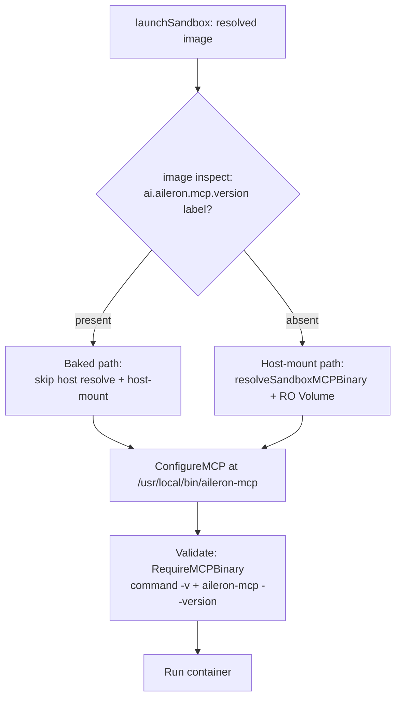

# feat: bake aileron-mcp into the sandbox-base image

## Summary

The v4 sandbox MCP wiring that landed in #953 (ADR-0024, Path B1) bind-mounts the **host-built** `aileron-mcp` binary into the container at launch (`launcher.go` `launchSandbox`). That works for the v4 default topology where the operator has the Aileron CLI on the host, but it cannot work for **sealed customer-operated runtimes** that ship the sandbox image without a host CLI to mount from.

This plan bakes `aileron-mcp` into the **published** `ghcr.io/alrubinger/aileron-sandbox-base` image via a multi-stage Go builder stage, stamps a version label onto the image, and teaches `launchSandbox` to **skip the host-mount when the image already provides the binary** (detected via the label). The host-mount path stays as the fallback for the v4 default topology and for any image without the label (local Tier 0 dev builds, Tier 1 devcontainer images, Tier 2 BYO images). `aileron sandbox check` gains an in-image binary validation, and the walkthrough documents the version-skew failure mode.

This is the image-bake flip deferred in ADR-0024 ("Alternatives Considered → Image-bake (deferred)"), triggered by criterion 1: the sandbox image needs to run without a host-side `aileron-mcp`.

---

## Problem Frame

**Today (host-mount, ADR-0024).** `launchSandbox` resolves the host `aileron-mcp` (`resolveSandboxMCPBinary`, preferring a cross-compiled `aileron-mcp-linux-<arch>` sibling) and appends a read-only `Volume{Source: hostBin, Target: /usr/local/bin/aileron-mcp}` to the container mounts. The validate step asserts the binary is present and execs (`aileron-mcp --version`). The image itself is never modified.

**Gap.** A sealed customer-operated runtime ships only the image. There is no host `aileron-mcp` to resolve, so `resolveSandboxMCPBinary` returns a hard error and launch fails. The in-container agent has no MCP path to Aileron's tools.

**This change.** The published image carries `aileron-mcp` at `/usr/local/bin/aileron-mcp` plus a `ai.aileron.mcp.version=<version>` label. At launch, the launcher inspects the resolved image for that label:

- **Label present** → the image provides the binary. Skip the host-mount entirely. Skip host-binary resolution (so missing host `aileron-mcp` is no longer fatal). The validate/`--version` smoke check still runs against the in-image binary.
- **Label absent** → fall back to today's host-mount path unchanged.

**Boundary.** Scope is `aileron-mcp` only — not `aileron-cli` or `aileron-server`. Multi-arch is in scope (the published image is already `linux/amd64,linux/arm64`); cross-arch *operator demand beyond those two* is out of scope.

---

## Requirements Traceability

Carried from issue #957 "Scope" checklist:

- **R1** — `aileron-mcp` is baked into `images/sandbox-base/Containerfile`, version-pinned to the Aileron CLI release the image is part of. → U1
- **R2** — `launchSandbox` skips the host-mount when the image already provides `aileron-mcp` (detect via image label), keeping host-mount as the fallback for v4 default topology. → U3, U4
- **R3** — `aileron sandbox check` validates the in-image binary's `--version` (or accepts managed-release skew). → U5
- **R4** — The version-skew failure mode is documented in `docs/src/content/docs/development/sandbox-mcp-walkthrough.md`. → U6
- **R5** — ADR-0024's "Future considerations" gets a follow-up note referencing this issue when shipped. → U6
- **R6** — The published image build (`.github/workflows/sandbox-base.yml`) produces the baked, labeled, multi-arch image. → U2

---

## Key Technical Decisions

### KTD1 — Multi-stage Go builder, not CI pre-build + COPY

The Containerfile gains a `golang` builder stage that compiles `aileron-mcp` for the build's `$TARGETARCH` and copies the result into the final Alpine stage. Version is injected via `--build-arg AILERON_VERSION` into the same `-X .../version.Version` ldflag `task build:mcp` already uses.

**Rationale.** buildx already drives the multi-arch matrix (`platforms: linux/amd64,linux/arm64`); a `$TARGETARCH`-aware builder stage gets per-arch-correct binaries for free, with no separate cross-compile matrix, artifact upload/download, or COPY-by-arch logic. The whole recipe stays in one file. The builder stage is discarded, so the final image carries only the binary. Alternative (CI pre-builds both arches and COPYs by arch) keeps the build context small but splits the recipe across CI steps and adds matrix wiring; rejected for the maintenance cost. See Alternatives.

### KTD2 — Build context becomes the repo root for the published build

The Go builder stage needs `go.mod`, `go.sum`, and the source tree, so `.github/workflows/sandbox-base.yml` changes `context: images/sandbox-base` → `context: .` with `file: images/sandbox-base/Containerfile`. A `.dockerignore` keeps the context lean (exclude `build/`, `docs/`, `webapp/node_modules`, `.git`, etc.).

**Rationale.** This is the cost of KTD1 and it is small and localized (one CI field plus a `.dockerignore`). The **local Tier 0 build path is deliberately unaffected** (KTD3), so `baseBuildArgs` / `findBaseContext` in `internal/sandbox/container/runtime.go` do **not** change.

### KTD3 — Bake the published image only; local Tier 0 stays host-mount

The published `ghcr.io` image bakes. The locally-built Tier 0 base image (`baseBuildArgs`, context `images/sandbox-base`) stays **unbaked** and continues to host-mount in dev.

**Rationale.** Directly satisfies the issue trigger (sealed runtimes) while preserving ADR-0024's version-lockstep benefit for the v4 default topology and keeping local base builds fast. The detection seam (KTD4) makes this clean: unbaked local images simply have no label and take the host-mount fallback, exactly as today. Opt-in local baking is a deferred follow-up (see Scope Boundaries), not a blocker — the detection logic is unit-testable with a fake runner returning a label, and integration can pull the published image.

### KTD4 — Detect via OCI image label, not env

Detection reads the image label `ai.aileron.mcp.version` via the runtime's `image inspect` (the same `Runner` seam `imageExists` already uses: `runner.Run(ctx, runtime, []string{"image","inspect", ...})`). A `--format '{{ index .Config.Labels "ai.aileron.mcp.version" }}'` query returns the baked version, or empty for an unlabeled image.

**Rationale.** A label travels with the image across registries and pulls; an env var would have to be threaded through every launch path and could drift from the actual image contents. ADR-0024 names "image label or env" — label is the robust choice. The label value (the version string) doubles as the input to the skew check (U5), so detection and version reporting share one source.

### KTD5 — Reuse the existing validate smoke check against the in-image binary

The validate script already asserts `command -v aileron-mcp` and `aileron-mcp --version` exit 0 when `RequireMCPBinary` is set (`runtime.go` validation script, arg `$4`). When the host-mount is skipped, the launcher still passes `RequireMCPBinary: true` but **without** appending the host-binary `Volume`. The same smoke check now validates the **baked** binary. No new validation surface.

### KTD6 — Version-skew is surfaced, not silently accepted

`aileron sandbox check` compares the in-image `ai.aileron.mcp.version` label (and/or the in-container `aileron-mcp --version`) against the host CLI `version.Version`. On mismatch it emits a **warning** (not a hard failure) that names both versions and points at the managed-release model. ADR-0024's lockstep guarantee does not hold for baked images, so skew is an expected operational state for sealed runtimes, not an error — but an unexpected skew in the v4 default topology is worth surfacing.

---

## High-Level Technical Design

Launch-time MCP-binary provisioning decision (directional, not implementation spec):

The MCP binary **path inside the container** (`/usr/local/bin/aileron-mcp`, `sandboxMCPBinPath`) is identical on both branches — `ConfigureMCP` and the validate smoke check are unchanged. The only difference is whether a host `Volume` is appended to the mount list and whether host-binary resolution runs. This keeps the agent-registration and validation surfaces branch-agnostic.

---

## Implementation Units

### U1. Bake aileron-mcp into the Containerfile

**Goal:** Add a multi-stage Go builder to `images/sandbox-base/Containerfile` that compiles `aileron-mcp` per `$TARGETARCH` and installs it at `/usr/local/bin/aileron-mcp`, plus the `ai.aileron.mcp.version` label.

**Requirements:** R1

**Dependencies:** none

**Files:**
- `images/sandbox-base/Containerfile` (modify)
- `.dockerignore` (create or modify — keep repo-root context lean)

**Approach:**
- Add a `FROM golang:<pinned> AS mcp-builder` stage. Use buildx's `TARGETARCH`/`TARGETOS` build args; build with `CGO_ENABLED=0 GOOS=$TARGETOS GOARCH=$TARGETARCH go build -ldflags "-s -w -X github.com/ALRubinger/aileron/internal/version.Version=${AILERON_VERSION} -X .../version.Commit=${AILERON_COMMIT}" -o /out/aileron-mcp ./cmd/aileron-mcp`.
- Declare `ARG AILERON_VERSION` / `ARG AILERON_COMMIT` (default `dev`).
- In the final Alpine stage, `COPY --from=mcp-builder /out/aileron-mcp /usr/local/bin/aileron-mcp` and `chmod 0755`. Keep ownership root, mode world-executable (matches the proxy-CA helper install).
- Add `LABEL ai.aileron.mcp.version="${AILERON_VERSION}"` (and optionally `ai.aileron.mcp.baked="true"`). The label must be in the final stage so it lands on the published image.
- Reserve a build arg toggle is NOT needed here (local Tier 0 build does not use this stage path per KTD3 — see U2 note: only the CI build passes the repo-root context that makes the builder stage reachable; the local build context lacks the source, so guarding is via context, documented in the Containerfile comment).

**Patterns to follow:** existing `task build:mcp` ldflags (`Taskfile.yml` `build:mcp`); existing `COPY` + `chmod 0755` for `aileron-install-proxy-ca` in the Containerfile.

**Test scenarios:**
- Covers R1. Build the image locally with `docker buildx build --build-arg AILERON_VERSION=0.0.test -t base:test -f images/sandbox-base/Containerfile .` and assert `docker run --rm base:test aileron-mcp --version` prints `0.0.test`.
- Assert `docker inspect --format '{{ index .Config.Labels "ai.aileron.mcp.version" }}' base:test` returns `0.0.test`.
- Assert the binary is at `/usr/local/bin/aileron-mcp`, mode `0755`, and on `PATH` (`docker run --rm base:test command -v aileron-mcp`).
- Edge: build with no `AILERON_VERSION` arg → label and `--version` report `dev` (default), not empty.

**Verification:** A locally-built image runs `aileron-mcp --version` and carries the version label; CI's existing sandbox-base smoke step (U2) stays green.

---

### U2. Publish the baked, labeled, multi-arch image in CI

**Goal:** Update `.github/workflows/sandbox-base.yml` so the published image is built from the repo-root context with the version build args, and extend the smoke test to assert the baked binary.

**Requirements:** R6 (supports R1)

**Dependencies:** U1

**Files:**
- `.github/workflows/sandbox-base.yml` (modify)

**Approach:**
- Change both `docker/build-push-action` steps: `context: images/sandbox-base` → `context: .`, keep `file: images/sandbox-base/Containerfile`.
- Pass `build-args` for `AILERON_VERSION` (from the tag ref / `git describe`) and `AILERON_COMMIT` (`github.sha`). For tag pushes use the tag; for `workflow_dispatch`/PR use a `dev`-ish identifier consistent with `version.BaseImage`'s `latest` fallback.
- Add the `ai.aileron.mcp.version` label through the build arg in the Containerfile (U1) rather than `metadata-action` `labels:` (the value must match the actually-compiled binary). Leave the existing OCI title/description labels in `metadata-action`.
- Extend the smoke step: after the existing bash check, assert `docker run --rm "$IMG" aileron-mcp --version` exits 0 and the printed version is non-empty; assert the label is present via `docker inspect`.
- Note the `paths:` trigger filter currently only fires on `images/sandbox-base/**` and the workflow file. Since the build now depends on Go source, decide whether to widen the PR `paths:` trigger (e.g. add `cmd/aileron-mcp/**`, `internal/version/**`) so source changes that affect the baked binary rebuild the image on PR. Document the decision inline.

**Patterns to follow:** existing two-step build (multi-arch push + single-arch `load: true` smoke) in the same file.

**Test scenarios:**
- Covers R6. CI on a `v*` tag push: the pushed image (both arches) carries the label and `aileron-mcp --version` matches the tag. (Validated by the in-workflow smoke step; the multi-arch push itself is asserted by the action's success.)
- The single-arch smoke load asserts `aileron-mcp --version` exits 0 and version is non-empty.
- Existing bash/`which bash` smoke assertions still pass (no regression to the substrate).
- `Test expectation: the build-context and build-arg wiring are exercised by the workflow run itself; no separate unit test.`

**Verification:** A tag build pushes a multi-arch image whose `aileron-mcp --version` equals the tag and whose label is set; the PR smoke build passes.

---

### U3. Add image-label detection to the container runtime

**Goal:** Add a helper in `internal/sandbox/container` that reports the baked `aileron-mcp` version (or empty) for a resolved image, using the existing `Runner` seam.

**Requirements:** R2

**Dependencies:** none (can land before U4)

**Files:**
- `internal/sandbox/container/runtime.go` (modify — add exported `BakedMCPVersion` / `InspectLabel` helper)
- `internal/sandbox/container/runtime_test.go` (modify — table tests with a fake `Runner`)

**Approach:**
- Add a method on `Builder` (or a package function taking a `Runner`) that runs `image inspect --format '{{ index .Config.Labels "ai.aileron.mcp.version" }}' <image>` and returns the trimmed stdout. Empty string (or inspect error) → "not baked".
- Mirror `imageExists`'s shape (`runner.Run(ctx, runtimeName, []string{"image","inspect", ...})`). Capture stdout via a buffer rather than `io.Discard`.
- Keep the label key as a package const (e.g. `MCPVersionLabel = "ai.aileron.mcp.version"`) so U1's Containerfile string and the Go code share one documented constant reference (Containerfile can't import it, so cross-reference in a comment).

**Patterns to follow:** `Builder.imageExists` (`runtime.go:308`), `ResolveRuntime` runner seam.

**Test scenarios:**
- Happy path: fake `Runner` returns `0.0.42\n` → helper returns `0.0.42`.
- Edge: runner returns empty/whitespace → helper returns `""` (not baked).
- Error path: runner returns a non-nil error (image not present / inspect failed) → helper returns `""` and does not propagate the error as fatal (callers treat "can't determine" as "not baked", preserving host-mount fallback).
- Assert the exact `image inspect --format` args passed to the runner (contract of the inspect call).

**Verification:** `go test ./internal/sandbox/container/...` passes; helper returns the label value for a labeled fake and empty otherwise.

---

### U4. Branch launchSandbox on baked-vs-host-mount

**Goal:** In `launchSandbox`, when the resolved image is baked (U3 helper returns non-empty), skip host-binary resolution and skip appending the host-mount `Volume`; otherwise keep today's host-mount path. `ConfigureMCP` and `RequireMCPBinary` validation stay identical on both branches.

**Requirements:** R2

**Dependencies:** U3

**Files:**
- `internal/launch/launcher.go` (modify `launchSandbox`, and the parallel block in `validateSandbox`)
- `internal/launch/launcher_internal_test.go` (modify — add baked-image cases)

**Approach:**
- Before the `resolveSandboxMCPBinary` + mount-append block (`launcher.go:725-734`), call the U3 helper for `plan.Image` via the runtime. If it reports baked:
  - Do **not** call `resolveSandboxMCPBinary` (so a missing host binary is no longer fatal on sealed runtimes).
  - Do **not** append the host `Volume{Target: sandboxMCPBinPath}`.
  - Still call `ConfigureMCP(sandboxMCPBinPath, ...)` — the container path is unchanged.
- Apply the same skip in `validateSandbox` (`launcher.go:260-273`), which currently always resolves + mounts the host binary. The baked image is validated in-place; `RequireMCPBinary: true` stays.
- Keep the reserved-command guard (`sandboxMCPBinName`) unchanged — `aileron-mcp` stays reserved regardless of source.
- Thread the runtime/`Runner` needed for inspection. `launchSandbox` already has `plan.Runtime`; reuse the same runner construction the builder uses. Guard against the inspect call adding launch latency by only running it once per launch (result reused by both `validateSandbox` and `launchSandbox` if practical, or accept two cheap inspects — note the choice).

**Patterns to follow:** existing host-mount block in `launchSandbox` (`launcher.go:718-734`) and `validateSandbox` (`launcher.go:260-273`); `Mode`-aware `ConfigureMCP` call.

**Test scenarios:**
- Covers R2 (baked). Baked image (fake inspect returns a version): assert NO host-mount `Volume` with target `/usr/local/bin/aileron-mcp` is added, `resolveSandboxMCPBinary` is not required (test passes even with no host binary present), and `ConfigureMCP` is still called with `sandboxMCPBinPath`.
- Covers R2 (fallback). Unbaked image (fake inspect returns empty): assert today's behavior — host binary resolved and read-only `Volume` appended; missing host binary is a hard error with the existing remediation hint.
- Edge: inspect errors (image not yet pulled) → treated as unbaked → host-mount path (no launch break).
- Integration-ish: assert `RequireMCPBinary: true` is set on the validate options in BOTH branches (the smoke check must run against baked and mounted binaries alike).

**Verification:** `go test ./internal/launch/...` passes; a baked image launches with no host binary on `PATH`; an unbaked image still host-mounts.

---

### U5. Validate in-image binary + surface version skew in `sandbox check`

**Goal:** `aileron sandbox check` validates the in-image `aileron-mcp` and warns on version skew between the baked binary and the host CLI version.

**Requirements:** R3

**Dependencies:** U3

**Files:**
- `cmd/aileron/sandbox.go` (modify `runSandboxCheck` / `sandboxCheckValidateFn`)
- `cmd/aileron/sandbox_test.go` (modify)

**Approach:**
- After the existing validate run (`sandboxCheckValidateFn`), if the resolved image is baked (U3 helper), compare the label version against `version.Version`.
  - Match → print an OK line noting the baked version.
  - Mismatch → print a **warning** (non-fatal) naming both versions and the managed-release model. Do not exit non-zero solely on skew (sealed-runtime skew is expected).
- Ensure `sandbox check` already sets `RequireMCPBinary` where appropriate, or set it so the in-image `--version` smoke runs for baked images. (Today `sandboxCheckValidateFn` builds `ValidateOptions` without `RequireMCPBinary`; baked images should exercise it.)
- Keep the host-CLI-skew comparison out of `aileron launch` itself (launch stays quiet); surfacing skew is a `check`-time concern.

**Patterns to follow:** `runSandboxCheck` flag/usage handling (`sandbox.go:152-211`), `sandboxCheckError` formatting, `version.Version` usage already imported in `sandbox.go`.

**Test scenarios:**
- Covers R3. Baked image, label == host version → check reports OK with the version; exit 0.
- Baked image, label != host version → check prints a skew warning naming both versions; exit 0 (warning, not failure).
- Unbaked image → no skew warning; behavior unchanged from today.
- Validate failure (binary missing/ENOEXEC) is still surfaced via the existing validate error path (exit non-zero) — distinct from the skew warning.

**Verification:** `go test ./cmd/aileron/...` passes; `sandbox check` against a baked image reports the version and warns on injected skew without failing.

---

### U6. Document version-skew + close ADR-0024 follow-up

**Goal:** Document the version-skew failure mode in the walkthrough and add the ADR-0024 "Future considerations" follow-up note.

**Requirements:** R4, R5

**Dependencies:** U1–U5 (document the shipped behavior)

**Files:**
- `docs/src/content/docs/development/sandbox-mcp-walkthrough.md` (modify — add a version-skew section under Troubleshooting; update the "Run" steps to note baked-image launches skip the host-mount)
- `docs/src/content/docs/adr/0024-sandbox-mcp-parity.md` (modify — "Future considerations" → image-bake bullet gets a "shipped in #957" note; optionally a short status line)

**Approach:**
- Walkthrough: new troubleshooting subsection "Baked image version skew" — explain that sealed-runtime images carry their own `aileron-mcp` (host-mount skipped, detected via `ai.aileron.mcp.version`), that `aileron sandbox check` warns when the baked version differs from the host CLI, and that skew is expected/managed for sealed runtimes but worth investigating in the v4 default topology. Note that `task build:cli && task build:mcp` host siblings are still required for the **default** (unbaked-local) flow.
- Keep the writing voice rules: no em-dashes, no "not just X, Y", one thought per sentence (per project docs conventions).
- ADR-0024: the deferred image-bake bullet under "Future considerations" / "Alternatives Considered" gets a follow-up note linking #957 as the shipped flip. Per the ADR-editing convention, amend in place (pre-MVP).

**Patterns to follow:** existing Troubleshooting subsections in the walkthrough (`### host.docker.internal not resolving`, etc.); existing ADR cross-link style (every ADR-NNNN is a Markdown link).

**Test scenarios:** `Test expectation: none -- documentation only.` Verify by `task build:docs` (or the docs lint) succeeding and the new section rendering; confirm no em-dashes and all ADR references are links.

**Verification:** Walkthrough has a version-skew section; ADR-0024 references #957 as shipped; docs build passes.

---

## Scope Boundaries

### In scope
- Baking `aileron-mcp` into the published multi-arch `sandbox-base` image (amd64 + arm64).
- Launcher detection + host-mount skip via image label.
- `sandbox check` in-image validation + skew warning.
- Walkthrough + ADR-0024 documentation.

### Outside this change
- Image-bake of `aileron-cli` or `aileron-server` — this issue is `aileron-mcp` only.
- Multi-architecture bakes **beyond** the existing amd64/arm64 published set (track separately if cross-arch operator demand surfaces).

### Deferred to Follow-Up Work
- **Opt-in local Tier 0 baking** — a build-arg/flag that bakes the locally-built base so devs exercise the baked path end-to-end without pulling the published image. Default-off; not needed to satisfy the issue (KTD3).
- **Token scoping** — ADR-0024's per-route caveat token follow-up; unchanged by this work.
- **Gating shim emission on MCP-capability** — ADR-0024 follow-up; orthogonal.
- **Widening the version-skew warning into `aileron launch`** — kept to `sandbox check` for now (KTD6).

---

## Risks & Dependencies

- **Build context growth.** Switching CI to `context: .` ships the whole repo to the builder. Mitigation: `.dockerignore` (U1) excluding `build/`, `docs/`, `node_modules`, `.git`, test fixtures. Risk is slower CI context upload, not correctness.
- **Builder Go version drift.** The baked binary's Go toolchain (builder stage `FROM golang:<pinned>`) must track the repo's Go version. Mitigation: pin to the repo's Go version (per `feedback_upstream_deps` — stay close to upstream; bump the toolchain rather than the binary). Add a comment tying it to `go.mod`.
- **Label trust.** Detection trusts the `ai.aileron.mcp.version` label. A hand-built image could lie. Acceptable: a baked binary that fails to exec is still caught by the `RequireMCPBinary` `--version` smoke check at validate time, so a false label degrades to a clear validate failure, not a silent broken launch.
- **PR-trigger coverage.** The `sandbox-base.yml` `paths:` filter may not rebuild on Go-source changes that affect the baked binary (U2 decision point). If not widened, a source change could ship an image whose baked binary lags until the next tag.
- **Two inspect calls.** `validateSandbox` and `launchSandbox` both need the baked check; accept two cheap `image inspect` calls or thread one result through (U4 note).

---

## Alternatives Considered

- **CI pre-build both arches + COPY-by-`TARGETARCH`** (vs KTD1 multi-stage builder). Keeps the build context small (`images/sandbox-base`) and avoids shipping Go source, and aligns with the `aileron-mcp-linux-<arch>` artifacts `task build:mcp` already produces. Rejected because it splits the recipe across a CI cross-compile matrix + artifact upload/download + Containerfile COPY logic, where buildx's `$TARGETARCH` gives per-arch correctness in one file. Reconsider if repo-root context cost becomes a real CI bottleneck.
- **Env-based detection** (vs KTD4 label). An `AILERON_MCP_BAKED=1` env on the image or launch. Rejected: an env doesn't travel as reliably as an OCI label and can drift from actual image contents; the label value also feeds the skew check.
- **Bake local Tier 0 too** (vs KTD3 published-only). Gives local-dev parity with the baked path. Deferred to follow-up rather than rejected: it adds launcher/`baseBuildArgs` context-switching complexity for a dev convenience the detection unit tests + published-image integration already cover.

---

## Sources & Research

- Issue #957 (this plan's tracking issue); parent #747 (Milestone v4 umbrella); follows #953 / PR #956.
- `docs/src/content/docs/adr/0024-sandbox-mcp-parity.md` — host-mount decision, "Alternatives Considered → Image-bake (deferred)", trigger criteria, version-lockstep rationale, trust-model deltas.
- `internal/launch/launcher.go` — `launchSandbox` (host-mount block), `validateSandbox`, `resolveSandboxMCPBinary`, `sandboxMCPBinPath`/`sandboxMCPBinName` consts.
- `internal/sandbox/container/runtime.go` — validation script (`RequireMCPBinary`, `aileron-mcp --version` smoke), `imageExists`/`Runner` inspect seam, `baseBuildArgs`/`findBaseContext` (local Tier 0 context).
- `.github/workflows/sandbox-base.yml` — published multi-arch build + smoke test.
- `cmd/aileron/sandbox.go` — `runSandboxCheck` / `sandboxCheckValidateFn`.
- `Taskfile.yml` `build:mcp` — ldflags + cross-compile shape the builder stage mirrors.
- `internal/sandbox/composition/composition.go` — `BaseImage(version)` tag resolution / `latest` fallback.
